# Mandate-19 — Evidence (ảnh + số + công thức, map mục "Phải nộp")

> Mỗi mục: **ảnh đính kèm** (`img/`), **số đối chiếu** từ `README.md`, và **công thức tính** để
> mentor kiểm chứng lại được. Ảnh Grafana chụp bằng headless browser trên cửa sổ thời gian
> chính xác của từng run (time range hiện trên góc phải mỗi ảnh, giờ VN = UTC+7).

Cụm: develop `ecommerce-develop-dev-eks` (458), ns `techx-develop`. Node cố định **3 app + 1 ops**.

**⚠️ Đọc số cho đúng:** số trong bảng README là **client-side** (locust, theo từng bậc user);
số trên dashboard Grafana là **server-side** (span-based, gộp mọi route trong cửa sổ). Hai nguồn
độc lập nên lệch nhẹ là bình thường (vd p95 @40u: locust 33ms vs dashboard 48ms) — cùng bậc,
cùng kết luận; không so 1:1 từng con số.

---

## E1+E2 — RPS đỉnh giữ SLO trước–sau (catalog flow, nút thắt frontend)

| Ảnh | Cửa sổ (VN) | Nội dung |
|---|---|---|
| 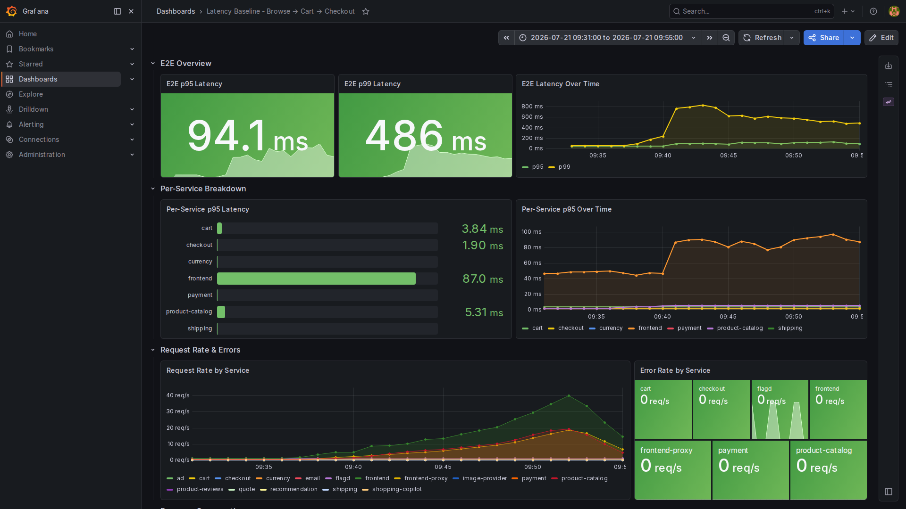 | 21/07 09:35–09:51 | BEFORE (frontend limit 200m): p95 94.1ms, p99 486ms cuối bậc 40u |
| 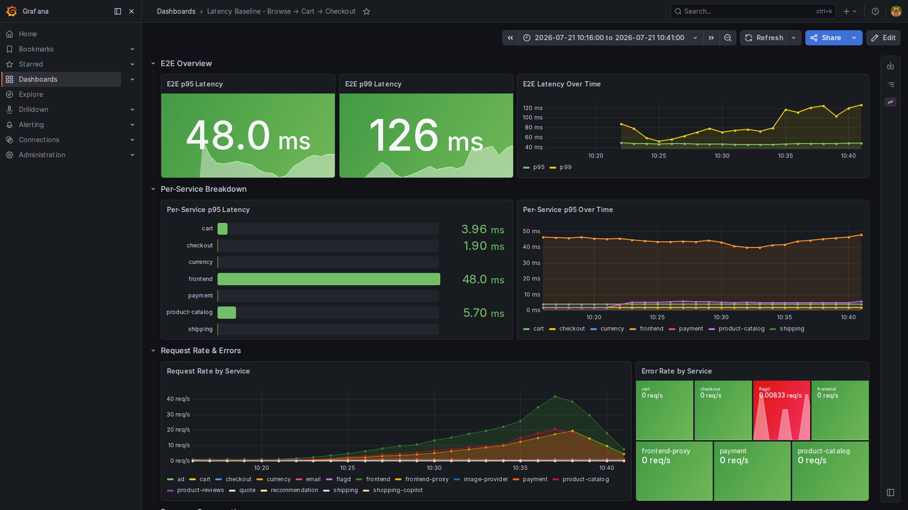 | 21/07 10:20–10:37 | AFTER (limit 500m): p95 48ms, p99 126ms — tail sập rõ |

**Số đối chiếu (locust @40u):** throttle frontend **9.3% → 2.1%** (↓4.4×), p99 **341 → 122ms**
(↓2.8×), p100 810 → 260ms, rps 19.8 → 19.9 (đã tuyến tính — cải thiện nằm ở tail, không phải rps).

**Công thức:** `cải thiện p99 = 341/122 = 2.8×` · `throttle = throttled_periods/periods` (PromQL
hiện trong ảnh E4).

## E3 — requests-per-node tăng, NODE KHÔNG ĐỔI (ràng buộc cốt lõi #19)

| Ảnh | Nội dung |
|---|---|
| 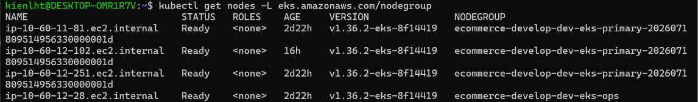 | `kubectl get nodes -L eks.amazonaws.com/nodegroup` chụp 21/07 15:15 — GIỮA chuỗi run: 3 node primary (AGE 2d22h, và 12-102 tạo 23h đêm 20/07 — đều TRƯỚC mọi run) + 1 node ops. Bằng chứng identity: không node nào sinh thêm trong ngày đo. |
| 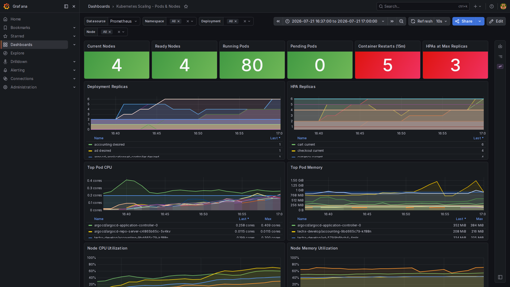 | Dashboard K8s trong lúc test trần checkout AFTER: **Nodes 4/4 phẳng**, HPA scale pod (cart→6, checkout→4) — pod nở, node không nở. |

**Công thức density (checkout flow, SLO<1s, 3 node app):**

```
requests-per-node BEFORE = 27 rps / 3 node ≈ 9 rps/node
requests-per-node AFTER  = 76.3 rps / 3 node ≈ 25.4 rps/node   (×2.8, node không đổi)
```

Ghi chú ảnh k8s: 2 ô đỏ là ngưỡng màu mặc định của dashboard — "HPAs at Max = 3" là hành vi
ĐÚNG khi ép hệ tới trần; "Restarts = 5" đã truy Prometheus: là product-reviews (~5) + jaeger (~2),
KHÔNG service nào thuộc chain checkout đang đo (xem mục lỗi có sẵn bên dưới).

## E4 — Nút thắt thông lượng: tìm thấy + nới (deliverable "1 bottleneck")

| Ảnh | Nội dung |
|---|---|
| 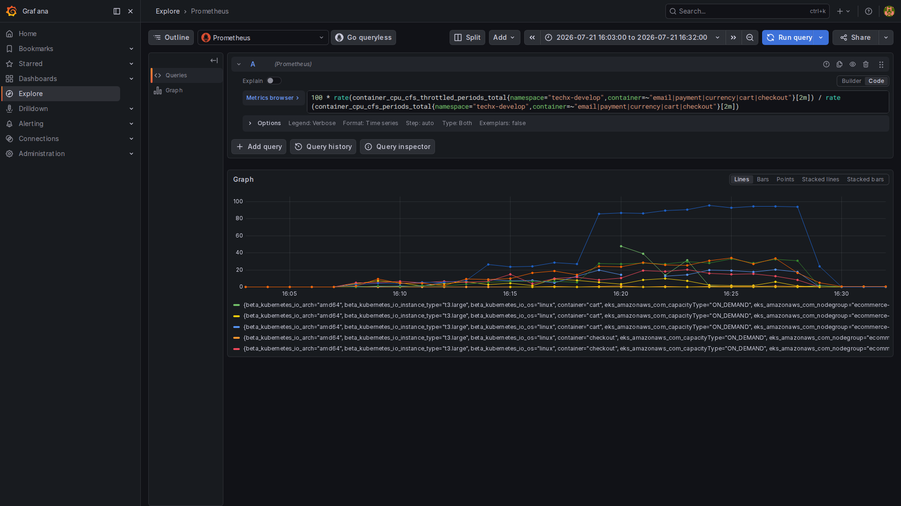 | Explore + PromQL hiện nguyên văn: throttle **email leo ~95%** @60u (payment 34%, currency 29% cùng khung) — nút thắt chain checkout |
| 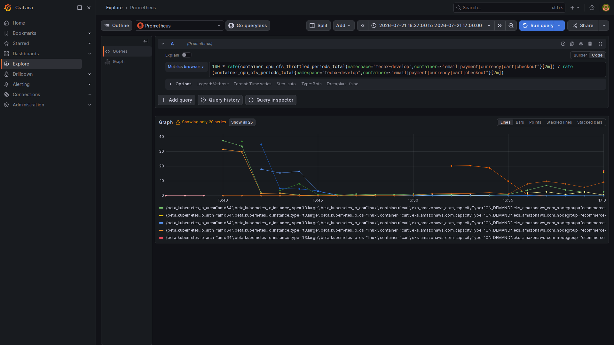 | Cùng query, sau khi nới limit (16:40 rollout): throttle **sập về <10%** toàn chain |
| 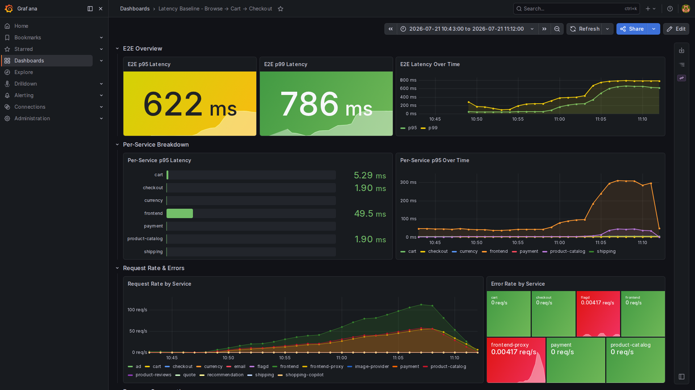 | Phase 3 (frontend ghim 1 pod): trần per-pod — @120u p95 622ms server-side, vẫn <1s |

**Số đối chiếu:** email **95.7% → 6.7%** (limit 100m→400m), payment 34.2→4.6%, currency 29.1→8.6%,
cart 13→3.1%, checkout 12.9→1.6%. Phase 3: **RPS_per_pod_at_SLO ≈ 20 rps/pod** (56.2 rps @120u / ~3
tương đương... xem README Phase 3); nút thắt frontend = concurrency SSR, không phải CPU (83m/500m,
throttle 5.2% tại bậc gãy cảnh báo 200ms).

**PromQL (in trên ảnh):**
```
100 * rate(container_cpu_cfs_throttled_periods_total{namespace="techx-develop",container=~"email|payment|currency|cart|checkout"}[2m])
    / rate(container_cpu_cfs_periods_total{namespace="techx-develop",container=~"email|payment|currency|cart|checkout"}[2m])
```

## E5 — Trần checkout TRƯỚC–SAU (before/after thứ hai — luồng ra tiền)

| Ảnh | Cửa sổ (VN) | Nội dung |
|---|---|---|
| 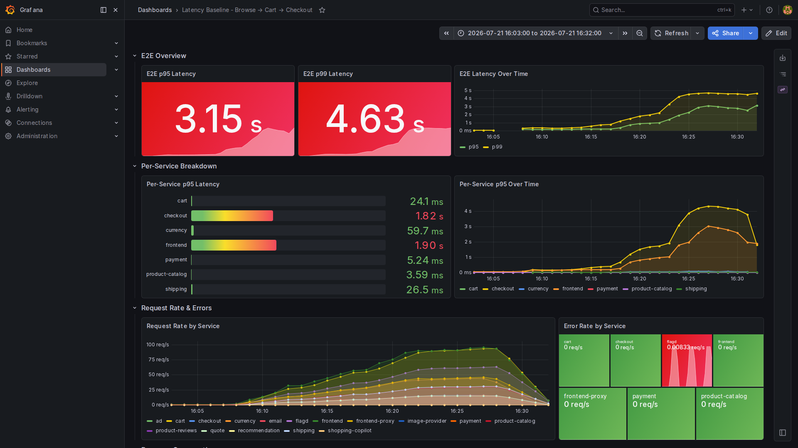 | 21/07 16:03–16:32 | BEFORE: p95 3.15s / p99 4.63s đỏ — gãy SLO ở 40–60u |
| 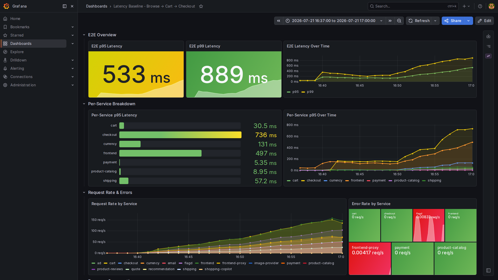 | 21/07 16:37–17:00 | AFTER: p95 **533ms** / p99 889ms — khớp locust 532/844ms @60u |

**Công thức trần:**
```
Trần BEFORE (SLO<1s) = 26.9 rps (@20u; 40u gãy p95 1118ms)  ≈ 27 rps
Trần AFTER  (SLO<1s) = 76.3 rps (@60u p95 532ms, vẫn ✅)
Nâng trần = 76.3/26.9 ≈ 2.8× — không thêm node, chỉ nới limit 5 service + HPA checkout-path
```

## E6 — Demo xuống mềm (YC4: shed browse, checkout được bảo vệ, hệ không sập)

| Ảnh | Cửa sổ (VN) | Nội dung |
|---|---|---|
| 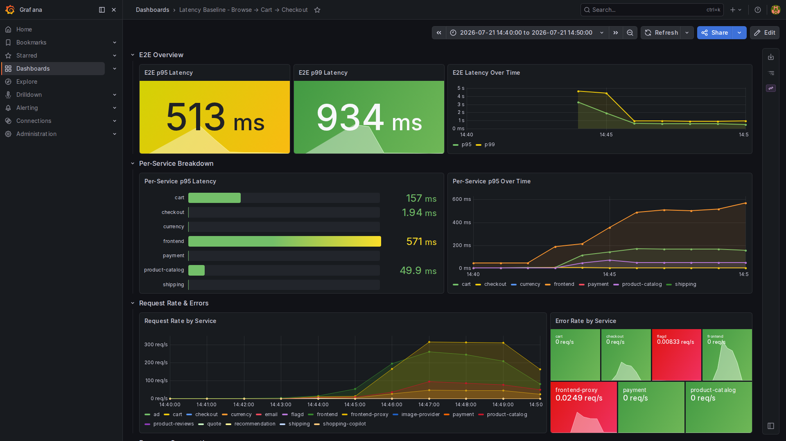 | 21/07 14:40–14:50 | Flood ~300+ req/s: E2E p95 513ms, frontend p95 571ms — **giữa flood vẫn <1s** |
| 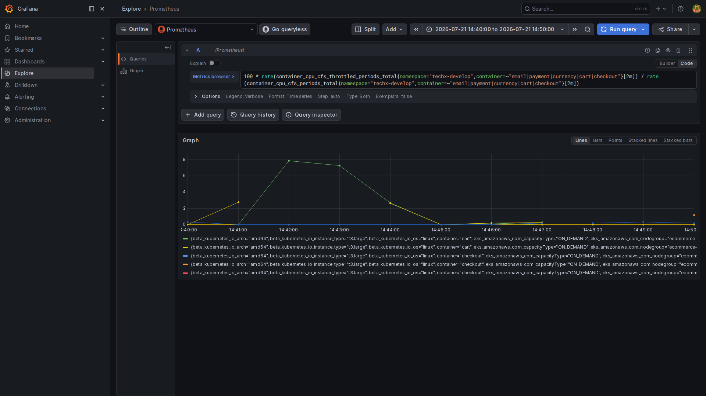 | nt | checkout throttle ≈ **0%** suốt flood (cart nhói 8% một nhịp) — checkout-path không bị bóp |
| 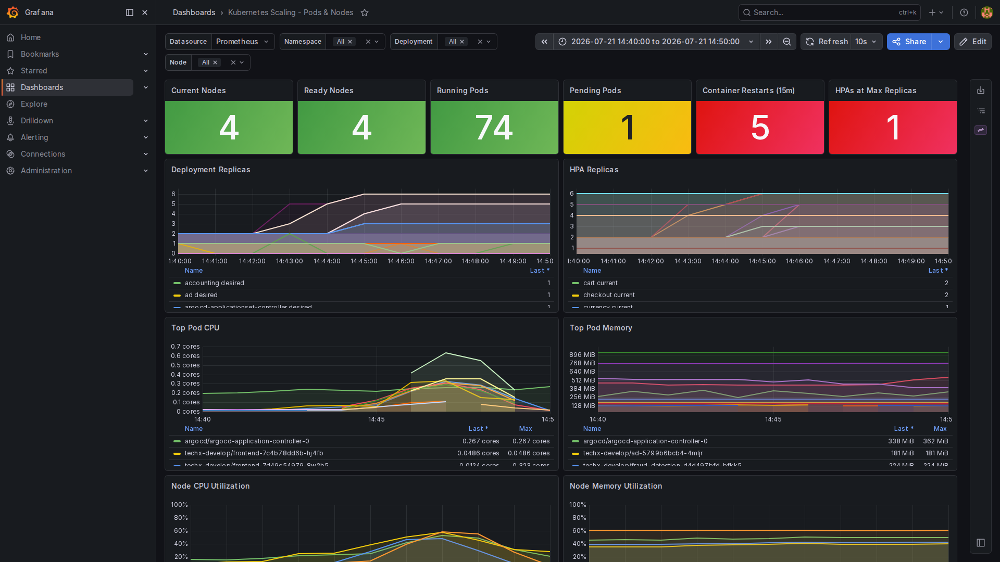 | nt | Node 4/4, 74 pod Running, Pending 1 thoáng qua — **hệ không sập, node không nở** (ảnh này minh họa vế "không sập" nhìn từ hạ tầng, không phải bằng chứng scaling) |

**Số shed (locust demo 631 rps, 120s — bảng README):**
```
% shed browse = 45378 / 64448 = 70.4%   (bucket rl_browse 80 rps/pod × 2 pod)
% shed cart   = 0 / 10803     = 0%      (route checkout-path KHÔNG rate-limit — ưu tiên tuyệt đối)
```
Cơ chế: Envoy local_ratelimit per-pod, route `/api/cart|/api/checkout` đặt TRÊN catch-all nên
không dính limit. Chi tiết + nghịch lý ClusterIP: `shed-verification-clusterip-vs-podip.md`.
(Ảnh Grafana không thể hiện 429 vì Envoy admin tắt — không có metric shed trong Prometheus;
bằng chứng 429 là output locust bên dưới.)

### Re-run 22/07 13:20–13:23 UTC — số 429 tươi, artifact GỐC trong repo

Chạy `locust-shed-demo-job.yaml` (900u FastHttp, ClusterIP `frontend-proxy:80`, 180s — bơm
~1.0–1.4k rps, vượt xa bucket):

| Route | reqs | 429 (shed) | % shed | 5xx | p50 |
|---|---|---|---|---|---|
| browse `/api/products` | 178,613 | **134,818** | **75.5%** | 3,073 (1.7%, dồn lúc HPA scale-up) | 230ms |
| cart `/api/cart` (đối chứng) | 4,913 | **0** | **0%** | 251 (5.1%, chỉ trong ~20s đầu) | 710ms |

```
% shed browse = 134818 / 178613 = 75.5%     (429 tức thì — offered ~1.4k rps, hệ không sập)
% shed cart   = 0      / 4913   = 0%        (KHÔNG một dòng 429 nào trong shed_failures.csv)
browse lọt qua ≈ (178613 − 138102) / 180s ≈ 225 rps — khớp bucket 80/s × pod proxy
```

Điểm kỹ thuật đáng nói với mentor: bucket là per-pod nên khi HPA scale frontend-proxy 2→6 dưới
flood, tổng ngưỡng lọt nở theo (160→480 rps) — shed và HPA phối hợp: từ chối phần dư tức thì
bằng 429, đồng thời nở công suất có kiểm soát; frontend scale 2→10 hấp thụ phần lọt, node giữ 4.

**Artifact gốc:** `runs/yc4-shed-rerun-20260722/` — `shed_failures.csv` (dòng
`LocustBadStatusCode(code=429) × 134818` cho browse, cart không có dòng 429),
`shed_stats.csv`, `locust-final-output.log` (bảng stats + error report nguyên văn).

## E8 — Tham chiếu thêm

- **flashsale 200u (frontend max10):** 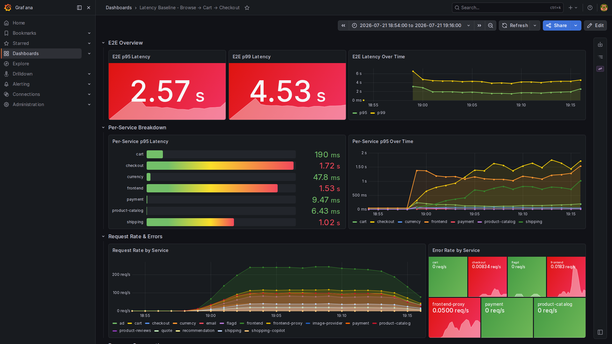
  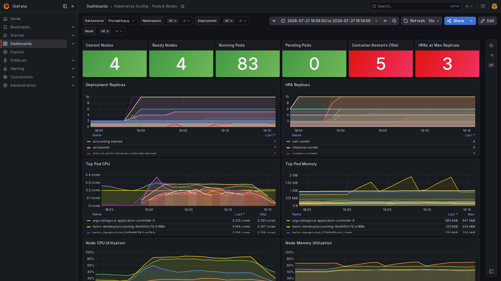 — CSV locust GỐC kèm theo:
  `runs/flashsale-200u-max10/locust_stats.csv` (+percentiles).
- **Phase 4 mixed 60u:** 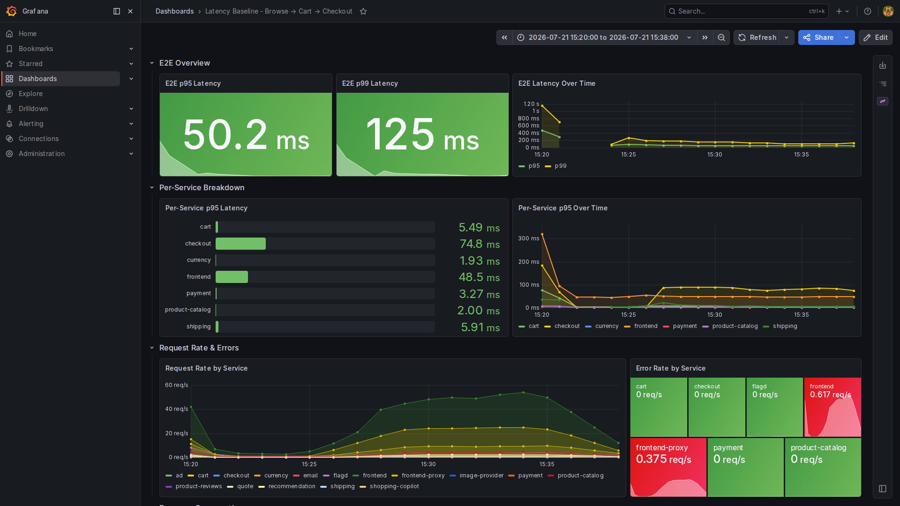 — p95 50.2ms/p99
  125ms, không service nào căng; chỉ frontend scale (5) → khớp kết luận nút thắt.
  (Đốm error frontend 0.617 req/s ở mép trái 15:20 là TRƯỚC khi run bắt đầu 15:24 — không thuộc run.)
- **Trần user-facing qua NLB (EC2 ngoài cụm):** 98 rps @200u giữ SLO — EC2 đã terminate, bằng chứng
  là số liệu README PHASE 6.5.

## ⚠️ Lỗi hạ tầng CÓ SẴN phát hiện khi test (không do tải)

- **product-reviews CrashLoopBackOff** (protobuf gencode 7.35.0 vs runtime 5.29.6) — restart cả khi
  không test (5 lần trong cửa sổ checkout-after). Cần fix build image riêng. Đã loại khỏi số Phase 4.
- jaeger restart ~2 lần dưới tải nặng (all-in-one, không HA) — quan sát, ngoài scope #19.

## E7 — ADR ký tên

`docs/mandate-19/ADR-mandate19-throughput-ceiling.md` — trần cũ/mới, nút thắt, cách nâng, cơ chế
shed, ký `lken1514`. ✅

---

## Phụ lục: cách tái tạo ảnh & số

- Ảnh Grafana: headless Chromium (Playwright) qua `kubectl port-forward svc/grafana 3000:80`,
  URL kèm `from/to` epoch đúng cửa sổ run — ai cũng mở lại được bằng time range trong ảnh.
- Restarts truy vết: `sum by (namespace,pod)(increase(kube_pod_container_status_restarts_total[25m]))`
  tại `time=2026-07-21T10:00:00Z`.
- Job shed demo tái chạy: `locust-shed-demo-job.yaml` (900u FastHttp qua ClusterIP — bơm vượt
  bucket per-pod; lưu ý KHÔNG dùng constant_throughput vì latency request 200 sẽ ghìm offered load
  dưới ngưỡng bucket → không shed, xem lần thử 22/07 10:42Z chỉ đạt 107 rps → 503 thay vì 429).

```bash
export AWS_PROFILE=sso-develop
kubectl get nodes -L eks.amazonaws.com/nodegroup          # node không đổi
kubectl -n techx-develop get hpa                           # frontend 2/10, chain 2/4
kubectl -n techx-develop get deploy frontend -o jsonpath='{.spec.template.spec.containers[0].resources}'
```

---

## Phụ lục: công thức sizing — nguồn kiểm chứng + áp số đo thực của mandate-19

> Công thức lấy từ draft `isolated-flow-load-testing.md`, đã đối chiếu nguồn chính thức và
> **validate bằng chính số đo trong README này**. Chỉ giữ phần áp dụng được cho #19; phần
> N−1/drain rehearsal thuộc bài PDB/drain (INC-2), ngoài scope.

### 1. Replica theo capacity mỗi pod — `Replica_required = ceil(RPS_design / RPS_per_pod_at_SLO)`

Chuẩn capacity planning (Google SRE Book, ch. Handling Overload — size theo mức còn giữ SLO,
KHÔNG theo điểm crash). Áp số Phase 3: `RPS_per_pod_at_SLO ≈ 20 rps/pod` (frontend ghim 1 pod,
120u p95 553ms) →

```
RPS_design 120 rps → Replica_required = ceil(120/20) = 6
```
**Khớp thực đo:** phase 2 catalog @đỉnh, frontend kịch đúng **6 replica** (HPA max 6 thời điểm đó).

### 2. Replica theo HPA CPU — `Replica_CPU = ceil(CPU_required / (CPU_request × HPA_target))`

Đúng theo thuật toán HPA chính thức `desiredReplicas = ceil(current × currentMetric/desiredMetric)`
với utilization tính **trên requests** (kubernetes.io → Horizontal Pod Autoscaling): điểm cân bằng
là CPU/pod = request × target → replica ổn định = tổng CPU / (request × target). Áp số frontend:

```
CPU_cost_per_request = (116m − 10m) / 56.2 rps ≈ 1.9m per rps      (Phase 3, 1 pod)
CPU_required @120rps = 10m + 120 × 1.9m ≈ 238m
Replica_CPU = ceil(238m / (100m × 0.70)) = ceil(3.4) = 4
```

**→ Phát hiện đắt nhất:** `Replica_CPU = 4` **<** `Replica_required = 6`. Công thức chứng minh
bằng số điều đã thấy bằng thực nghiệm: frontend SSR nghẽn **concurrency trước khi nghẽn CPU**,
nên HPA CPU-target một mình sẽ under-scale — phải lấy `max(4, 6) = 6`. Đây chính là lý do
"nút thắt = concurrency Next.js, không phải CPU" ở mục E4.

### 3. Node capacity — `Allocatable = Capacity − kube-reserved − system-reserved − eviction-hard`

Nguồn: kubernetes.io → Reserve Compute Resources; scheduler chỉ nhìn **requests** (Manage
Resources for Containers). Áp số: t3.large (2 vCPU) → allocatable thực đo **1930m**;
`Nodes_base = max(ceil(ΣrequestCPU/1930m), ceil(ΣrequestMem/…), pods-per-node)` — với tổng
requests hiện tại (sau right-size) 3 node app là đủ kèm headroom, khớp thực tế node giữ 4 (3+1 ops)
suốt mọi phép đo.

### 4. Memory — `request ≈ P95(working_set) × SF`, `limit ≈ max_observed × SF`

Cùng nguyên tắc VPA recommender (percentile của working set, KHÔNG tuyến tính theo RPS).
Đã áp đúng kiểu này ở mục "Sizing SAU-SHED" (đo CPU/mem steady-state sau shed rồi đặt request
cho pod chạy ~55–65%).

### 5. Giới hạn của mô hình tuyến tính CPU

`CPU_cost_per_request` chỉ đúng ở vùng tải ổn định — chính data #19 minh họa: gần bão hòa
latency nổ trước khi CPU hết (frontend 83m/500m @bậc gãy cảnh báo), nên mô hình dùng để
**sizing khởi điểm**, còn trần thật phải đo (đúng ghi chú "draft, cần validate" trong tài liệu gốc).

**Safety factor 1.2–1.3:** quy ước headroom phổ biến (SRE workbook khuyến nghị dự phòng
N+1/N+2 theo mức độ quan trọng) — không phải hằng số chuẩn, cần review theo burst pattern
và tốc độ phản ứng HPA, như draft tự ghi chú.
