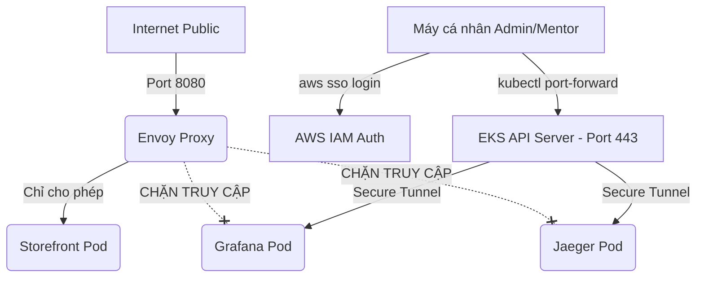

# TÀI LIỆU PHÂN TÍCH GIẢI PHÁP & ĐÁNH GIÁ ĐÁNH ĐỔI (OPTIONS ANALYSIS & TRADE-OFFS REPORT)
**Mã tài liệu**: CDO-SEC-RFC-001  
**Dự án**: TechX Corp Microservices Platform Takeover  
**Yêu cầu áp dụng**: [DIRECTIVE #1] Storefront công khai, mọi cổng vận hành phải riêng tư  
**Đơn vị thực hiện**: Nhóm CDO-05 - Squad A (Security Core)  
**Đơn vị phối hợp & Tư vấn**: Nhóm CDO-09 / Platform Team  
**Trạng thái**: Đề xuất thiết kế (Draft Proposal)  

---

## 1. Tóm tắt dự án & Ràng buộc (Executive Summary & Constraints)

### 1.1. Bối cảnh & Vấn đề
Hiện tại, các cổng quản trị và giám sát vận hành (Observability & Control Plane) bao gồm **Grafana**, **Jaeger**, **Locust (Load Generator)** và **ArgoCD** đang được cấu hình định tuyến công khai thông qua bộ cân bằng tải Ingress/Envoy (`frontend-proxy`) ở cổng `8080`. Bất kỳ ai từ Internet cũng có thể truy cập trực tiếp các trang này mà không qua bất kỳ lớp xác thực nào (lộ thông tin nhạy cảm về log, trace, và cấu hình hệ thống). 

Để thực hiện **Directive #1**, nhóm CDO-05 phối hợp cùng CDO-09 cần đóng hoàn toàn quyền truy cập công khai vào các cổng này, chỉ cho phép truy cập qua kênh nội bộ an toàn (Private Network / Tunnel) trước **Thứ Ba 13/07/2026**.

### 1.2. Ràng buộc thiết kế (Design Constraints)
* **Budget ($0 Extra Cost)**: Không được phát sinh thêm chi phí đáng kể làm vượt trần ngân sách **$300/tuần** của AWS.
* **Reliability (Zero Downtime)**: Không gây gián đoạn hoặc làm sập dịch vụ storefront bán hàng, giữ vững SLO checkout **≥ 99.0%**.
* **Auditability (Khả năng lưu vết)**: Phải ghi nhận lại lịch sử ai truy cập, vào lúc nào để phục vụ công tác kiểm toán bảo mật.
* **Mentor Access**: Phải cung cấp phương thức truy cập rõ ràng và dễ dàng để Mentor tự vào kiểm tra.

---

## 2. Bảng so sánh Đa chiều (Decision Matrix)

| Tiêu chí | Phương án 1A: AWS Client VPN | Phương án 1B: OpenVPN Tự dựng | Phương án 2A: Kubectl Port-Forward | Phương án 2B: AWS SSM Tunnel | Phương án 2C: Cloudflare Tunnel | Phương án 3: Ingress Auth & Filter |
| :--- | :---: | :---: | :---: | :---: | :---: | :---: |
| **Độ phức tạp Setup** | Cao (3/5) | Rất cao (5/5) | **Rất thấp (1/5)** | Trung bình (3/5) | Trung bình (3/5) | Thấp (2/5) |
| **Độ tiện dụng (UX)** | Rất cao | Cao | Trung bình | Trung bình | **Rất cao** | Rất cao |
| **Độ bảo mật** | Rất cao | Rất cao | **Rất cao (IAM/RBAC)** | **Rất cao (IAM)** | Rất cao | Trung bình |
| **Chi phí phát sinh** | ~$75/tháng | ~$15/tháng | **$0** | **$0** | **$0** | **$0** |
| **Độ tin cậy (SLA)** | Rất cao | Trung bình | **Rất cao** | Trung bình | Cao (phụ thuộc 3rd) | Thấp (Dynamic IP) |
| **Tính khả thi (3 tuần)**| Khả thi | Khả thi | **Khả thi ngay** | Khó cố định IP/ID | Khả thi | Kém khả thi |

---

## 3. Chi tiết các Phương án kỹ thuật & Đánh đổi (Detailed Options Analysis)

### 3.1. Nhóm Phương án 1: Mạng riêng ảo (VPN Access)

#### Option 1A: Sử dụng AWS Client VPN (Managed)
* **Cách thực hiện**: Dựng một AWS Client VPN Endpoint liên kết với VPC Private Subnets. Cấu hình Active Directory hoặc xác thực qua Mutual Certificate để cấp file cấu hình OpenVPN cho người dùng.
* **Trade-offs (Đánh đổi)**:
  * *Ưu điểm*: Độ bảo mật cao cấp doanh nghiệp. Trải nghiệm người dùng tuyệt vời (chỉ cần bật client app VPN lên và kết nối là có thể truy cập Grafana/Jaeger qua DNS nội bộ).
  * *Nhược điểm*: Chi phí cực kỳ đắt đỏ. AWS tính phí **$0.15/giờ/endpoint** (~$108/tháng) cộng thêm **$0.05/giờ/kết nối client**. Việc này sẽ ngốn gần 10% tổng ngân sách của cả đội.

#### Option 1B: Tự dựng OpenVPN / WireGuard Server trên EC2
* **Cách thực hiện**: Khởi tạo một EC2 instance nhỏ (t3.micro) chạy OpenVPN/WireGuard trong Public Subnet, cấu hình NAT routing sang Private Subnets chứa EKS.
* **Trade-offs (Đánh đổi)**:
  * *Ưu điểm*: Chi phí rẻ hơn nhiều so với giải pháp managed (chỉ mất khoảng **$15/tháng** tiền thuê EC2).
  * *Nhược điểm*: Độ phức tạp trong vận hành cực kỳ cao. Đội ngũ phải tự quản lý việc cấp phát/thu hồi file cấu hình `.ovpn`, tự vá lỗ hổng bảo mật cho hệ điều hành của VPN Server. Nếu VPN Server bị sập, toàn bộ đội ngũ sẽ mất kết nối.

---

### 3.2. Nhóm Phương án 2: Đường hầm bảo mật (Tunnel Access)

#### Option 2A: Kubernetes API Port-Forwarding (`kubectl port-forward`)
* **Cách thực hiện**: Xóa bỏ các rule định tuyến cho Grafana/Jaeger/Loadgen trong cấu hình Envoy [envoy.tmpl.yaml](file:///c:/Users/THANH%20TRUNG/Desktop/Phase3/capstone-phase-3/techx-corp-platform/src/frontend-proxy/envoy.tmpl.yaml). Khi truy cập, Admin/Mentor sử dụng lệnh `kubectl port-forward` thông qua HTTPS API Server để ánh xạ cổng dịch vụ nội bộ về máy cá nhân.



* **Trade-offs (Đánh đổi)**:
  * *Ưu điểm*: **Chi phí $0**. Bảo mật tuyệt đối vì xác thực trực tiếp qua tài khoản AWS SSO của cá nhân và phân quyền Kubernetes RBAC. Không phụ thuộc vào sự co giãn của Worker Nodes hay IP thay đổi.
  * *Nhược điểm*: Bắt buộc người dùng phải gõ lệnh CLI để thiết lập tunnel trước khi mở trình duyệt web.
  * *Lưu ý quan trọng*: Phương án này yêu cầu EKS API Server Endpoint ở chế độ Public Access (hoặc Public/Private kết hợp). Nếu trong tương lai hệ thống nâng cấp bảo mật và chuyển EKS API sang Private Endpoint hoàn toàn, team sẽ tự động chuyển đổi sang sử dụng **Phương án 2B (AWS SSM Tunnel)** để làm cầu nối đi vào VPC.

#### Option 2B: AWS SSM (Systems Manager) Session Tunnel
* **Cách thực hiện**: Sử dụng tính năng Port Forwarding của AWS SSM Session Manager để kết nối vào EC2 Worker Node, từ đó chuyển tiếp luồng dữ liệu vào Service nội bộ của cụm.
* **Trade-offs (Đánh đổi)**:
  * *Ưu điểm*: **Chi phí $0**. Vô cùng an toàn vì đường truyền đi qua kênh điều khiển mã hóa riêng biệt của AWS Systems Manager, cho phép tắt hoàn toàn EKS Public API Access.
  * *Nhược điểm*: Phức tạp khi vận hành do EKS Autoscaling liên tục tạo và xóa Node, làm **Instance ID thay đổi liên tục**. Người vận hành phải tìm kiếm Instance ID mới để chạy lệnh kết nối, không ổn định bằng `kubectl port-forward` (sử dụng tên Service tĩnh).
  * *Giải pháp khắc phục*: Sự thay đổi liên tục của Instance ID có thể được tự động hóa hoàn toàn bằng cách viết script tự động truy vấn AWS CLI tìm kiếm máy chủ đang chạy thông qua EKS Cluster Tag:
    ```bash
    INSTANCE_ID=$(aws ec2 describe-instances --filters "Name=tag:aws:eks:cluster-name,Values=<cluster-name>" "Name=instance-state-name,Values=running" --query "Reservations[*].Instances[*].InstanceId" --output text | head -n 1)
    ```

#### Option 2C: Cloudflare Tunnel (`cloudflared`)
* **Cách thực hiện**: Triển khai một Pod chạy agent `cloudflared` kết nối tới Cloudflare Network. Thiết lập Cloudflare Access để bắt buộc người dùng đăng nhập bằng Email doanh nghiệp hoặc Google Workspace trước khi vào trang quản trị.
* **Trade-offs (Đánh đổi)**:
  * *Ưu điểm*: **Chi phí $0**. Tiện lợi nhất cho Mentor (chỉ cần click link, nhập email xác thực OTP là vào được ngay, không cần gõ lệnh CLI hay cài VPN).
  * *Nhược điểm*: Phụ thuộc vào hạ tầng mạng của bên thứ ba (Cloudflare). Cần đăng ký tên miền riêng và cấu hình DNS, không phù hợp cho môi trường thi đấu biệt lập.

---

### 3.3. Nhóm Phương án 3: Reverse Proxy Filter (Mở Public kèm chốt chặn)
* **Cách thực hiện**: Giữ các đường dẫn công khai trên Envoy nhưng cấu hình thêm bộ lọc IP nguồn (chỉ cho phép IP tĩnh của Admin) hoặc Basic Authentication (yêu cầu mật khẩu).
* **Trade-offs (Đánh đổi)**:
  * *Ưu điểm*: Chi phí $0. Thiết lập nhanh chóng.
  * *Nhược điểm*: Kém an toàn (sử dụng mật khẩu tĩnh dễ bị rò rỉ). IP mạng cá nhân của mentor và thành viên là IP động, thay đổi liên tục khiến việc duy trì whitelist IP vô cùng bất tiện và dễ làm gián đoạn công việc.

---

## 4. Đề xuất lựa chọn & Kế hoạch hành động (Recommendation & Action Plan)

### 4.1. Đề xuất lựa chọn
Nhóm CDO-05 đề xuất lựa chọn **Phương án 2B: AWS SSM (Systems Manager) Session Tunnel** làm phương án triển khai chính vì nó mang lại độ bảo mật cao nhất (không cần mở cổng mạng, máy chủ có thể nằm hoàn toàn trong subnet riêng tư), có khả năng lưu vết (Auditability) chi tiết và chi phí bằng $0.

### 4.2. Kế hoạch triển khai (Action Plan)
1. **Bước 1 (Cô lập)**: Tiến hành loại bỏ các route `/grafana`, `/jaeger`, `/loadgen` trong file [envoy.tmpl.yaml](file:///c:/Users/THANH%20TRUNG/Desktop/Phase3/capstone-phase-3/techx-corp-platform/src/frontend-proxy/envoy.tmpl.yaml).
2. **Bước 2 (Triển khai)**: Đóng gói lại image `frontend-proxy` mới, deploy lên cụm EKS bằng ArgoCD.
3. **Bước 3 (Xác minh)**: Truy cập thử storefront để đảm bảo mua hàng bình thường, thử truy cập `/grafana` từ bên ngoài để xác nhận đã bị chặn (lỗi 404).
4. **Bước 4 (Bàn giao)**: Cấu hình IAM Policy cho phép SSM Session, viết sẵn script tự động kết nối (`connect-grafana.sh`/`.bat`) tự động lấy EKS Worker Node Instance ID và gửi tài liệu hướng dẫn chạy script qua AWS SSM cho Mentor và nhóm CDO-09.

---

## 5. Ký tên phê duyệt (Sign-off)

*Để biểu quyết thông qua, đại diện các nhóm vui lòng ký tên xác nhận dưới đây:*

| Đại diện | Vai trò | Chữ ký | Trạng thái phê duyệt |
| :--- | :--- | :--- | :--- |
| **SEC-1 (CDO-05)** | Security Core Lead | **Châu Thành Trung** | Phê duyệt (Approved) |
| **PLATFORM-1 (CDO-09)**| Infrastructure Lead | *[Điền tên đại diện]* | Đang xem xét (Pending) |
