# Báo cáo Rà soát Kỹ thuật: Worker Node & Phương án Predictive Pre-scale
**Dự án**: TechX Corp Platform - Capstone Phase 3  
**Tác giả**: CDO-05 (Security + Performance + Auditability)  
**Mục tiêu**: Đánh giá khả năng hỗ trợ và đề xuất phương án Pre-scale hạ tầng phục vụ Flash Sale (Directive #2)  

---

## 1. Hiện trạng Cơ chế Worker Node
Hiện tại, hệ tầng Kubernetes (AWS EKS Cluster) của chúng ta đang quản lý máy chủ theo cấu hình sau:

* **Cơ chế quản lý**: Sử dụng **AWS EKS Managed Node Groups** (được cấu hình bằng Terraform IaC).
* **Cơ chế Autoscaling hiện tại**: Dưới EKS Managed Node Groups là **AWS Auto Scaling Group (ASG)** hoạt động ở chế độ **Reactive Auto Scaling** (co giãn phản ứng theo tải thực tế thông qua chỉ số hoặc khi Pod rơi vào trạng thái *Pending*).
* **Cấu hình Sandbox hiện tại**:
  * **Loại máy chủ (EC2 Instance)**: `t3.large` (2 vCPU, 8 GiB RAM).
  * **Số lượng Node tối thiểu (min_size)**: 2 Nodes.
  * **Số lượng Node mong muốn (desired_size)**: 2 Nodes.
  * **Số lượng Node tối đa (max_size)**: 6 Nodes.

---

## 2. Khả năng hỗ trợ Predictive Pre-scale (Tăng quy mô chủ động)
Cơ chế hiện tại **hoàn toàn hỗ trợ** việc Pre-scale trước sự kiện Flash Sale nhờ vào tính năng **Scheduled Actions** trên AWS Auto Scaling Group hoặc cập nhật thông số IaC thông qua pipeline CI/CD trước giờ G.

### Đo lường thời gian đáp ứng (Provisioning Latency)
Qua kiểm thử thực tế trên AWS, thời gian từ lúc có yêu cầu tạo thêm Node đến lúc sẵn sàng phục vụ là **3 - 5 phút**, bao gồm các bước:
1. **EC2 Provisioning**: AWS khởi tạo máy chủ ảo EC2 mới (~1 phút).
2. **Node Bootstrapping**: Hệ điều hành khởi động, cài đặt Kubelet và kết nối vào EKS cluster (~1 - 1.5 phút).
3. **DaemonSets & Monitoring Initialization**: Khởi chạy các agent hệ thống như kube-proxy, aws-node (CNI), OTel Collector, v.v. (~30 - 45 giây).
4. **Image Pulling & Container Start**: Tải Docker image của microservice và chạy container (~30 giây).
5. **Readiness Probe Pass**: Ứng dụng warm-up và bắt đầu nhận traffic (~15 - 30 giây).

> [!WARNING]
> **Điểm yếu của Reactive Scaling**: Nếu chúng ta để hệ thống tự động scale (chờ traffic tràn vào mới tạo node), độ trễ 3-5 phút này chắc chắn sẽ gây quá tải hệ thống hiện tại, làm rớt kết nối và vi phạm nghiêm trọng cam kết SLO. Do đó, bắt buộc phải thực hiện **Predictive Pre-scale**.

---

## 3. Kịch bản Pre-scale đề xuất (Action Plan)
Để đảm bảo chịu được tải **200 concurrent users** liên tục trong **15 phút** mà không gây downtime, kịch bản phối hợp Pre-scale được đề xuất như sau:

```mermaid
gantt
    title Kịch bản Pre-scale & Scale-down cho Flash Sale
    dateFormat  X
    axisFormat %d
    section Tầng Node (Hạ tầng)
    ASG Scheduled Action (Scale up) : active, 0, 10
    Node Ready & Sẵn sàng chạy Pod : 10, 30
    ASG Scale down về mức thường : 45, 55
    section Tầng Pod (Ứng dụng)
    Pre-scale replicas (Browse/Checkout) : 20, 30
    Thời gian diễn ra Flash Sale (Peak Load) : crit, 30, 45
    Scale down replicas về mặc định : 45, 50
```

### Các bước triển khai cụ thể:
1. **T-20 phút (Chuẩn bị Node)**:
   * Kích hoạt Scheduled Action trên AWS để tăng `desired_size` và `min_size` của ASG lên **6 nodes** (hoặc mức tối đa an toàn).
   * Chờ 5 phút để toàn bộ 6 nodes join cluster thành công và chuyển sang trạng thái `Ready`.
2. **T-10 phút (Chuẩn bị Pod)**:
   * Chạy lệnh scale hoặc cấu hình KEDA Cron Scaler để tăng số bản sao (replicas) của các dịch vụ quan trọng (ví dụ: `browse`, `cart`, `checkout`) từ 1 lên **10-15 replicas**.
   * Các Pod này sẽ được Kubernetes Scheduler xếp vào các Node mới đã chuẩn bị sẵn và hoàn tất quá trình khởi động/warm-up.
3. **T-0 phút (Flash Sale bắt đầu)**:
   * Traffic ồ ạt đổ vào, các Node và Pod đã sẵn sàng chịu tải 100%, không bị trễ provisioning.
4. **T+15 phút (Sau Flash Sale)**:
   * Sự kiện kết thúc, hạ số lượng replicas của Pod về mặc định (`replicas: 1` hoặc theo HPA thông thường).
   * Hạ thông số `min_size` và `desired_size` của ASG về mức bình thường (2 nodes).
   * Kubernetes Cluster Autoscaler sẽ tự động dọn dẹp các Pod trống và thu hồi (terminate) các node EC2 thừa để tối ưu chi phí.

---

## 4. Các giới hạn hệ thống cần lưu ý (Constraints)

> [!IMPORTANT]
> Cần rà soát các chốt chặn vật lý của AWS Account và cấu hình mạng để tránh lỗi scale-up thất bại:
> 1. **VPC Subnet IP Quota**: Mỗi Node và Pod trong EKS sử dụng VPC CNI sẽ lấy trực tiếp 1 IP từ Private Subnet. Với dải `/24` (251 IP khả dụng), cần đảm bảo số lượng IP trống trong subnet phải lớn hơn tổng số Pod + Node dự kiến chạy lúc cao điểm.
> 2. **AWS EC2 Service Quota**: Giới hạn số lượng vCPUs của tài khoản AWS đối với dòng máy chủ `t3` (On-Demand). Cần kiểm tra AWS Service Quotas để đảm bảo tài khoản còn đủ hạn mức chạy 6 nodes `t3.large` cùng lúc.
> 3. **Database Connection Pool**: Số lượng Pod tăng cao sẽ kéo theo số lượng kết nối đồng thời vào PostgreSQL tăng vọt. Cần kiểm tra tham số `max_connections` của DB để tránh bị lỗi từ chối kết nối (Connection Refused).

---

## 5. Thông số Node phục vụ tính toán Capacity

Dưới đây là các thông số chi tiết của Node hiện tại để làm cơ sở tính toán tải mục tiêu:

| Thông số | Giá trị | Giải thích / Ghi chú |
| :--- | :--- | :--- |
| **Loại Instance EC2** | `t3.large` | 2 vCPU, 8 GiB RAM |
| **CPU Allocatable** | **~1.93 vCPU** | CPU thực tế cấp cho ứng dụng (sau khi trừ reserves) |
| **RAM Allocatable** | **~7.07 GiB** | RAM thực tế cấp cho ứng dụng (sau khi trừ reserves) |
| **Số lượng Node hiện tại** | **2 nodes** | Môi trường Sandbox cơ bản |
| **Giới hạn Scale tối đa** | **6 nodes** | Giới hạn `max_size` trong Terraform |
| **Thời gian Node Ready** | **3 - 5 phút** | Thời gian bootstrap và tham gia cluster |
| **Chi phí On-Demand** | **~$0.0832 / giờ / node** | Khoảng ~$60/tháng cho 1 node `t3.large` tại us-east-1 |
| **Chi phí tối đa khi scale** | **~$0.50 / giờ** | Chi phí chạy tối đa 6 nodes trong thời gian Flash Sale |
