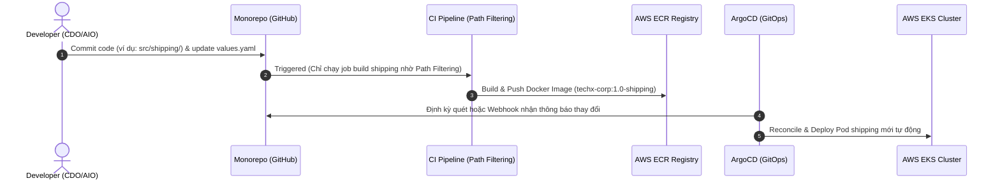
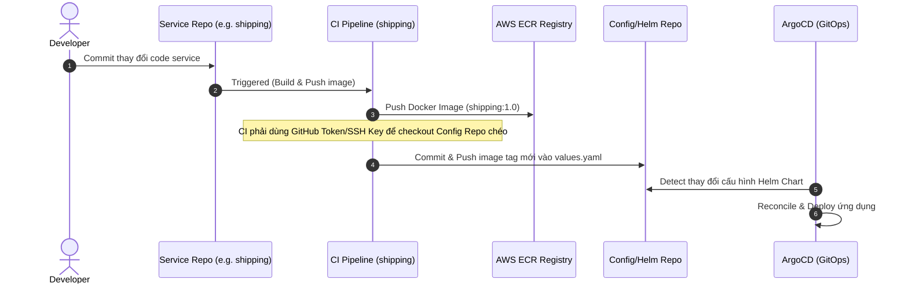

# Báo Cáo Phân Tích Kỹ Thuật: Monorepo vs. Multi-repo
## Dự án: TechX Corp Platform - Capstone Phase 3 (TF1)

Tài liệu này phân tích chi tiết cấu trúc mã nguồn hiện tại của dự án **TechX Corp Platform** và so sánh hai mô hình quản lý repository: **Monorepo** (Cấu trúc hiện tại) và **Multi-repo** (Chia tách thành nhiều repo độc lập) nhằm giúp đội ngũ **TF1 (CDO05, CDO09, AIO03)** đưa ra lựa chọn tối ưu cho giai đoạn vận hành và cải tiến sản phẩm.

---

## 1. Tóm Tắt Quyết Định (Executive Summary)

Sau khi phân tích kỹ lưỡng đặc thù hệ thống với **~18 microservices đa ngôn ngữ (polyglot)**, giao tiếp qua **gRPC (chung một file `pb/demo.proto`)**, hệ thống hạ tầng đồng bộ qua **Terraform** và triển khai **GitOps bằng ArgoCD + Helm Chart**, khuyến nghị kỹ thuật của chúng tôi là:

> [!IMPORTANT]
> **KHUYẾN NGHỊ: Duy trì mô hình MONOREPO hiện tại.**
> Việc chia tách thành Multi-repo trong bối cảnh cuộc thi kéo dài 3 tuần sẽ tạo ra **nợ kỹ thuật (technical debt)** khổng lồ về quản lý phiên bản gRPC, đồng bộ cấu hình Helm Chart, quản lý CI/CD pipeline rời rạc và làm chậm đáng kể tốc độ phối hợp giữa nhóm CDO (Platform) và AIO (AI Features/AIOps).
>
> Để khắc phục điểm yếu lớn nhất của Monorepo (thời gian build CI/CD lâu), team nên áp dụng kỹ thuật **Path Filtering (Lọc đường dẫn)** và **Docker Layer Caching** trong Github Actions để chỉ build và test các service thực sự có thay đổi.

---

## 2. Hiện Trạng Cấu Trúc Mã Nguồn (Current Layout)

Repository `capstone-phase-3` hiện tại đang được tổ chức theo cấu trúc Monorepo:

```
capstone-phase-3/
├── terraform/                      # Hạ tầng AWS IaC (VPC, EKS, ECR)
├── techx-corp-chart/               # Helm Chart duy nhất định nghĩa 24 dịch vụ K8s
├── deploy/                         # Các shell scripts bổ trợ & Manifest GitOps (ArgoCD)
└── techx-corp-platform/            # Mã nguồn các microservices của ứng dụng
    ├── pb/                         # Chứa demo.proto và shopping_copilot.proto (gRPC)
    └── src/                        # 18+ services (Go, Python, C#, Rust, PHP, Java, v.v.)
```

### Đặc trưng hệ thống ảnh hưởng đến quyết định:
1. **Liên kết chặt chẽ qua gRPC:** Hầu hết các service giao tiếp qua gRPC định nghĩa tập trung tại `techx-corp-platform/pb/demo.proto`.
2. **Triển khai GitOps tập trung:** ArgoCD đồng bộ toàn bộ cluster dựa trên một Helm Chart duy nhất là `techx-corp-chart`.
3. **Phối hợp liên chức năng (Cross-functional):** Nhóm CDO tối ưu hạ tầng/Helm Chart, trong khi nhóm AIO cần can thiệp sâu vào các service như `product-reviews` và `llm` để nhét guardrails hoặc build agent, nhưng đồng thời nhóm CDO cần tối ưu Kubernetes manifest (Helm Chart) cho các service đó (thêm liveness probes, chỉnh resource limits).

---

## 3. Bảng So Sánh Chi Tiết (Comparison Matrix)

| Tiêu chí | Monorepo (Khuyên Dùng) | Multi-repo (Không Đề Xuất) |
|---|---|---|
| **Quản lý gRPC Protobuf** | **Dễ dàng:** Thay đổi `demo.proto` và chạy `make generate-protobuf` lập tức cập nhật stubs cho tất cả client/server. | **Cực kỳ phức tạp:** Phải publish stubs thành thư viện riêng hoặc copy file thủ công qua 18+ repos mỗi khi API thay đổi. Dễ lệch phiên bản. |
| **Độ phức tạp CI/CD** | **Tập trung:** Chỉ cần 1-2 workflow Github Actions. Quản lý secret (AWS ECR credentials) ở 1 nơi duy nhất. | **Phân tán:** Phải cấu hình và bảo trì 18+ pipeline khác nhau. Cập nhật secret cấu hình phải thực hiện 18+ lần. |
| **Đồng bộ GitOps (ArgoCD)** | **Mượt mà:** commit cập nhật code ứng dụng và cập nhật tag image trong Helm Chart nằm trên cùng một repository, giúp ArgoCD sync ngay lập tức. | **Rất đau khổ:** CI/CD ở repo service sau khi push image phải checkout và commit ngược lại repo cấu hình (Helm Chart) chéo qua SSH/Personal Access Token. |
| **Trải nghiệm Phát triển (Local Dev)** | **Tiện lợi:** Clone 1 lần duy nhất, gõ `docker compose up` là chạy được toàn bộ môi trường local để debug đầu cuối (E2E). | **Phức tạp:** Lập trình viên phải clone hàng chục repo, thiết lập link thủ công, khó dựng môi trường kiểm thử đầy đủ dưới local. |
| **Tốc độ Build CI/CD** | **Chậm (nếu không tối ưu):** Một thay đổi nhỏ có thể trigger build lại tất cả. *(Có thể tối ưu dễ dàng bằng Path Filtering).* | **Nhanh tự nhiên:** Chỉ build đúng repo chứa code thay đổi. |
| **Tính sở hữu (Ownership)** | **Hỗn hợp:** Tất cả thành viên TF có quyền truy cập toàn bộ code, dễ review chéo nhưng dễ bị ghi đè chéo nếu không kiểm soát. | **Tách biệt:** Từng nhóm sở hữu repo riêng biệt, hạn chế tối qua xung đột git commit. |

---

## 4. Phân Tích Mermaid Flow

### Luồng GitOps & CI/CD khi dùng Monorepo (Mượt mà & Tập trung)


### Luồng GitOps & CI/CD khi dùng Multi-repo (Rườm rà & Rủi ro cao)


---

## 5. Tại sao Multi-repo là "Cạm Bẫy" đối với TF1 trong Phase 3?

1. **Rào cản gRPC:** Hệ thống sử dụng gRPC làm giao thức truyền thông chính giữa các service. Khi cấu trúc API của một service thay đổi (ví dụ: `checkout` gọi thêm trường dữ liệu từ `shipping`), lập trình viên phải sửa đổi file Protobuf chung.
   - Với **Multi-repo**: Lập trình viên phải sửa file `.proto` ở repo protobuf, build, release version mới, sau đó qua repo `shipping` pull code mới về sinh stubs, sửa code server, release. Tiếp tục qua repo `checkout` pull code mới sinh stubs, sửa code client, release. Quy trình này cực kỳ tốn thời gian.
   - Với **Monorepo**: Sửa `.proto` ở folder `pb/`, chạy generator nội bộ, sửa code ở cả hai thư mục `src/shipping/` và `src/checkout/` trong **duy nhất một PR**.
2. **Khó khăn trong phối hợp CDO và AIO:** Nhóm AIO cần can thiệp sâu vào các service như `product-reviews` và `llm` để nhét guardrails hoặc build agent, nhưng đồng thời nhóm CDO cần tối ưu Kubernetes manifest (Helm Chart) cho các service đó (thêm liveness probes, chỉnh resource limits). Việc chia tách repo sẽ làm đứt gãy luồng giao tiếp này, tạo ra tình trạng "code chạy local nhưng deploy lỗi vì lệch cấu hình Helm Chart".
3. **Quản lý Secrets chéo:** Để CI/CD của 18 repo riêng biệt có thể đẩy ảnh lên cùng ECR, team sẽ phải cấu hình AWS credentials hoặc IAM Roles cho 18 repo khác nhau. Việc này làm tăng đáng kể rủi ro bảo mật và tốn thời gian cấu hình vô ích.

---

## 6. Chiến Lược Tối Ưu Hóa Monorepo CI/CD (Path Filtering & Caching)

Để loại bỏ nhược điểm "build chậm" của Monorepo, team TF1 nên thiết lập GitHub Actions sử dụng **Path Filtering**. Dưới đây là mô hình giải pháp cụ thể:

### Giải pháp 1: Sử dụng tính năng `on.push.paths` của GitHub Actions
Mỗi service sẽ có một job hoặc workflow riêng biệt, chỉ chạy khi có thay đổi trong thư mục của service đó.

```yaml
# Ví dụ cấu hình cho service Shipping (.github/workflows/build-shipping.yml)
name: Build and Deploy Shipping Service

on:
  push:
    branches:
      - main
    paths:
      - 'techx-corp-platform/src/shipping/**'
      - 'techx-corp-platform/pb/**'           # Trigger build lại nếu gRPC thay đổi
      - '.github/workflows/build-shipping.yml'

jobs:
  build-and-push:
    runs-on: ubuntu-latest
    steps:
      - name: Checkout Code
        uses: actions/checkout@v4

      # Thực hiện các bước build và push Docker image lên ECR
```

### Giải pháp 2: Tận dụng Docker Layer Caching (GitHub Actions Cache)
Tận dụng cache để tăng tốc độ build Docker. Đối với các service viết bằng Rust (`shipping`), Go (`checkout`), Java (`ad`), C# (`accounting`), việc cache các lớp build dependency (như Cargo target, Go mod cache, NuGet packages) sẽ giúp giảm thời gian build từ 10 phút xuống còn dưới 1 phút.

Sử dụng hành động `docker/build-push-action` cùng với cache backend `gha`:
```yaml
      - name: Build and push
        uses: docker/build-push-action@v5
        with:
          context: ./techx-corp-platform/src/shipping
          push: true
          tags: ${{ steps.login-ecr.outputs.registry }}/techx-corp:1.0-shipping
          cache-from: type=gha
          cache-to: type=gha,mode=max
```

---

## 7. Khuyến Nghị Hành Động Cho Team TF1

1. **Thống nhất giữ nguyên Monorepo:** Chia sẻ báo cáo phân tích này cho cả team và thống nhất không thực hiện việc chia nhỏ repository để tập trung 100% tài nguyên vào việc dựng hệ thống và tối ưu 5 trụ cột.
2. **Setup CI/CD Pipeline Trung Tâm:**
   - Tạo thư mục `.github/workflows/` ở root repo.
   - Viết các pipeline build tự động sử dụng **Path Filtering** cho các service quan trọng nhất (như `frontend`, `product-reviews`, `llm`, `checkout`, `shipping`).
   - Thiết lập tự động cập nhật tag image vào Helm Chart `techx-corp-chart/values.yaml` ngay sau khi build thành công để kích hoạt GitOps tự động qua ArgoCD.
3. **Quy ước nhánh Git (Git Branching Strategy):**
   - Sử dụng nhánh `main` cho code ổn định deploy lên EKS.
   - Mỗi thành viên tạo nhánh feature dạng `feature/<service-name>-<tên-tính-năng>`.
   - Bắt buộc có Pull Request (PR) và code review trước khi merge vào `main`.

---
*Tài liệu được chuẩn bị bởi Antigravity AI Coding Assistant dành riêng cho TF1.*
