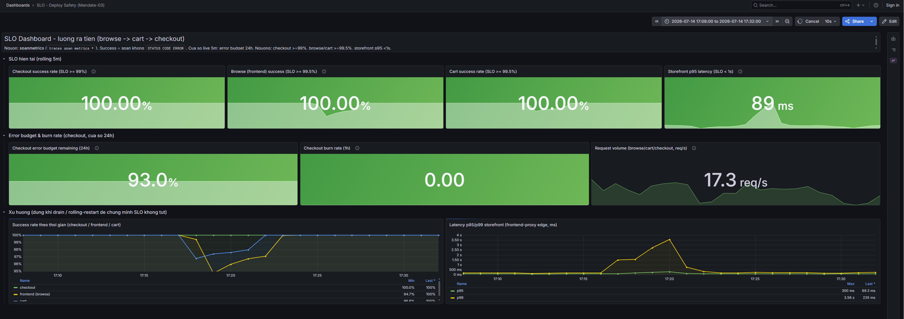
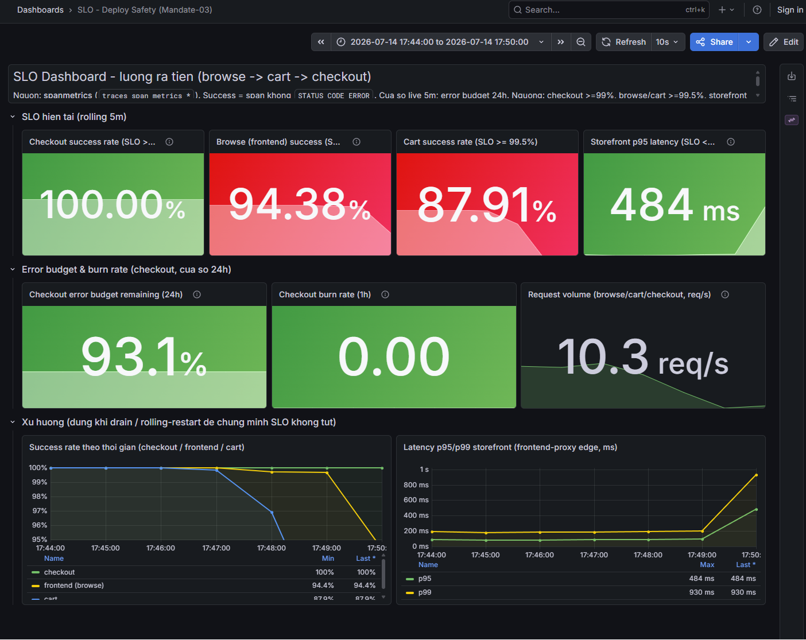
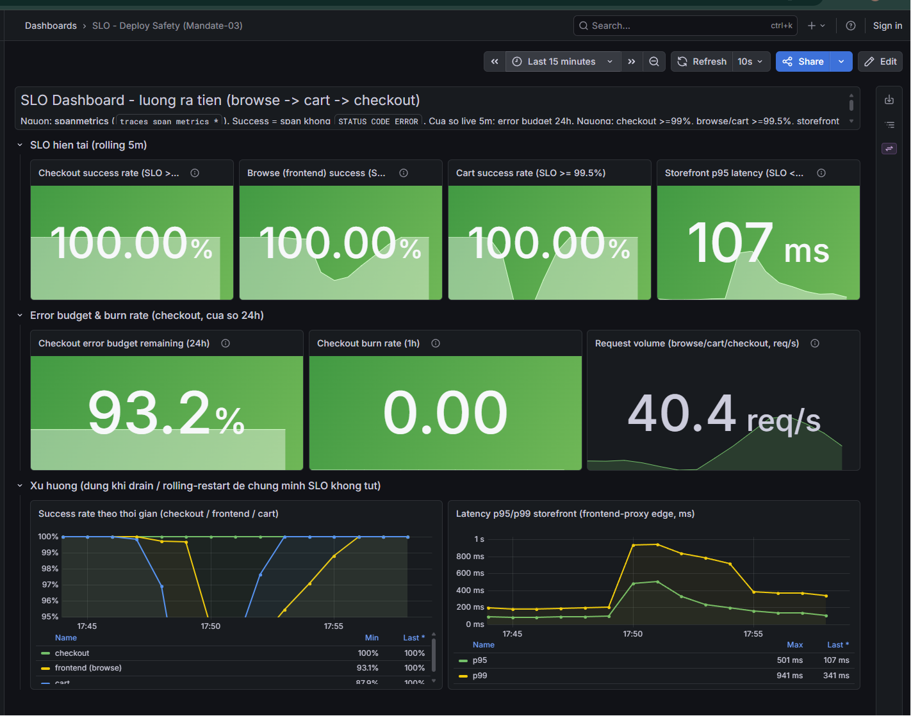

# BÁO CÁO MANDATE-03 — Bảo trì trong giờ vận hành, luồng ra tiền không rớt

> **Trụ:** Reliability (Deploy Safety) · **Task Force:** CDO-09 (PHASE3_TF1)
> **Owner:** Nguyễn Đình Thi · **Ngày:** 14/07/2026
> **Cluster verify:** `ecommerce-dev-eks` (us-east-1), namespace `techx-tf1`
> **Directive #3:** tự drain node / rolling-restart trước mặt mentor, chứng minh SLO không tụt.

---

## 1. Tóm tắt điều hành (Executive Summary)

Hệ thống TechX Corp (e-commerce microservices trên EKS) đã được làm cứng để **chịu bảo trì trong giờ cao điểm mà luồng ra tiền browse → cart → checkout không rớt request**. Ba yêu cầu của Mandate-03 đều được đáp ứng và **kiểm chứng bằng thực nghiệm trên cluster thật dưới tải**:

| Yêu cầu Mandate-03 | Trạng thái | Bằng chứng |
|---|---|---|
| ① Zero downtime khi bảo trì | ✅ Đạt | KB1 drain + KB3 rolling: revenue path 0 lỗi |
| ② Không còn SPOF trên luồng ra tiền | ✅ Đạt | Replica≥2 + PDB + DoNotSchedule; valkey → ElastiCache HA (2 AZ, MultiAZ) |
| ③ Pod chưa ready không nhận traffic | ✅ Đạt | KB2: pod hỏng không vào endpoints; readiness gate |

**SLO giữ vững trong suốt test:** checkout 100% (≥99%), browse/cart ~100% (≥99.5%), storefront p95 ≈ 92ms (< 1s).

---

## 2. Bối cảnh & cách tiếp cận

Phần lớn hạ tầng đã có nền tảng tốt; đóng góp của Mandate-03 là **làm cứng deploy-safety** cho 5 service critical trên luồng ra tiền và **chứng minh bằng bằng chứng** thay vì chỉ cấu hình.

**Nguyên tắc:** verify-first (đo thật, không suy diễn), giữ trong ngân sách $300/tuần (không nhân đôi mọi thứ), không đụng flagd / HPA (CDO-42 của owner khác).

**5 service critical trên luồng ra tiền:** `frontend-proxy` (Envoy edge), `frontend`, `checkout`, `cart`, `product-catalog`.

---

## 3. Công việc đã thực hiện (theo ticket)

| Ticket | Nội dung | Kết quả |
|---|---|---|
| **CDO-79** | Audit Probe/PDB/Strategy/Graceful | Ma trận hiện trạng ([CDO-79-deploy-safety-audit.md](CDO-79-deploy-safety-audit.md)) — 5 critical đã đủ config |
| **CDO-80** | readiness/liveness/startup probe | checkout/cart/product-catalog grpc health tách liveness/readiness; frontend http; verify endpoints loại pod NotReady |
| **CDO-34** | PodDisruptionBudget + anti-affinity | `maxUnavailable:1` cho 5 critical; **`topologySpread: DoNotSchedule`** (ép 2 pod ra 2 node) |
| **CDO-29** | Recreate → RollingUpdate | `RollingUpdate {maxUnavailable:0, maxSurge:1}` — pod cũ phục vụ tới khi pod mới Ready |
| **CDO-81** | Graceful shutdown | `preStop` + `terminationGracePeriodSeconds:30`; verify 0 connection reset |
| **CDO-28** | Replica critical (SPOF) | HPA min≥2 cho checkout/cart/product-catalog/frontend/frontend-proxy *(owner: Phong, Done)* |
| **CDO-91** | valkey-cart SPOF | ADR-REL-004: ElastiCache HA 2 node/2 AZ + **MultiAZ enabled (verify live)** |
| **CDO-27** | SLO Dashboard | `slo-dashboard.json` provisioned từ git (success + p95 + error budget + burn rate + volume) |
| **CDO-83** | Verify E2E + Evidence | Script + 3 kịch bản (báo cáo này) |

**Cấu hình chính** (`platform/charts/application/values.yaml`, template `_objects.tpl`):
- Probe grpc/http tách liveness↔readiness; startup che boot (checkout 150s, catalog 120s).
- `RollingUpdate maxUnavailable:0 maxSurge:1`; `preStop sleep 5` + grace 30s.
- PDB `maxUnavailable:1`; `topologySpreadConstraints whenUnsatisfiable: DoNotSchedule` (maxSkew 1).
- HPA min≥2 (không để pod đơn lẻ).

---

## 4. Điều kiện nền (Pre-flight verify — 14/07/2026)

| Kiểm tra | Kết quả |
|---|---|
| Node count | **3 node Ready** (3 AZ) — đủ cho drain + DoNotSchedule |
| ElastiCache | **2 node** (primary us-east-1b, replica us-east-1a), AutoFailover=enabled, **MultiAZ=enabled** (đã `terraform apply`) |
| Metric spanmetrics | `traces_span_metrics_calls_total` + `_duration_milliseconds_bucket` — có thật |
| Tải nền | Locust ~17 req/s; checkout 100% success, storefront p95 76-92ms |

---

## 5. Kiểm chứng 3 kịch bản (Evidence)

### KB1 — Drain node (yêu cầu ① + ②)
Drain `ip-10-0-12-196` (node chứa 1 pod checkout).

**Kết quả luồng ra tiền — PASS:**
- Drain hoàn tất trong **37s**.
- **DoNotSchedule hoạt động:** pod checkout bị evict → reschedule sang **node thứ 3** (11-130), Ready 37s. Không Pending.
- **PDB giữ endpoints checkout luôn 2 pod Ready** (không tụt dưới ngưỡng).
- Prometheus: **checkout 0 errors, product-catalog 0 errors**; cart 0 client-failure.

**Đợt chạy bổ sung (17:44–17:50) — Drain node kích hoạt Cluster Autoscaler:**
- **Kịch bản:** Drain node `11-130` (chứa 1 pod checkout).
- **Diễn biến:** Do cấu hình `DoNotSchedule` (chống đồng vị trí pod), Kubernetes không thể xếp pod checkout mới lên node đang chạy pod checkout còn lại. **Cluster Autoscaler** đã tự động phát hiện và provision thêm node mới `12-253` (trong vòng 96s). Pod checkout mới được xếp vào node mới và chuyển sang trạng thái Ready.
- **Kết quả:** Checkout (luồng ra tiền) giữ vững **100% success rate** trong suốt thời gian scale-up. Sau khi hoàn thành, hệ thống tự phục hồi về trạng thái 2 pod checkout healthy chạy trên 2 node khác nhau.

**Quan sát trung thực — service phụ:** Locust 11/166 (6.6%) HTTP 500 (không phải connection reset) trên `/api/data` (ad), `/api/recommendations`, `/api/product-reviews`. Nguyên nhân: ad/recommendation/product-reviews chạy **1 replica, không PDB** → mất tạm ~30s khi node drain. Các service này là **best-effort/không SLO** (SLO.md: recommendation + reviews không SLA cứng; ad không trong SLO). **Không vi phạm SLO luồng ra tiền.**

### KB2 — Bad deploy (yêu cầu ③, test INC-3)
Deploy image không tồn tại vào checkout.

**Kết quả — PASS (3 lớp chặn):**
- **`endpoints checkout` bất biến** trước/trong/sau = `10.0.11.219 + 10.0.13.105` (2 pod cũ Ready). **Pod hỏng KHÔNG bao giờ vào endpoints** (readiness gate).
- Pod cũ **không gián đoạn** (`maxUnavailable:0`).
- **ArgoCD self-heal** revert image xấu về `1.1-checkout` (quan sát 2 lần) — lớp bảo vệ GitOps.
- Rollback (`rollout undo`) sạch.

### KB3 — Rolling deploy dưới tải (yêu cầu ① + graceful)
Rolling-restart 3 service distroless (checkout/product-catalog/frontend) trong khi có tải.

**Kết quả — PASS:**
- Locust: 175 req, **0 connection reset** (1 lỗi duy nhất là 500 recommendation — best-effort).
- Prometheus: **checkout/cart/frontend/product-catalog đều 0 errors, success ~100%**.

---

## 6. Tuân thủ SLO trong suốt test

| SLI | Ngưỡng | Đo được | Đạt |
|---|---|---|---|
| Checkout success | ≥ 99.0% | 100% | ✅ |
| Browse (frontend) non-5xx | ≥ 99.5% | ~100% | ✅ |
| Cart success | ≥ 99.5% | ~100% (client) | ✅ |
| Storefront p95 latency | < 1s | ~92ms (frontend-proxy edge) | ✅ |

Theo dõi trực tiếp qua Grafana dashboard **"SLO - Deploy Safety (Mandate-03)"** (uid `slo-deploy-safety`, provisioned từ git).

### 6.1 Kiểm định dashboard (cross-check panel ↔ PromQL thô)

Để đảm bảo dashboard không hiển thị sai số, đối chiếu giá trị panel với truy vấn Prometheus thô (cùng expr):

| Panel | Dashboard | PromQL thô | Khớp |
|---|---|---|---|
| Checkout success % | 100.00 | 100.000 | ✅ tuyệt đối |
| Browse (frontend) success % | 100.00 | 100.000 | ✅ tuyệt đối |
| Cart success % | 100.00 | 100.000 | ✅ tuyệt đối |
| Checkout error budget (24h) | 93.0 | 93.036 | ✅ khớp |
| Browse error budget (24h) | 100.0 | 100.000 | ✅ khớp |
| Cart error budget (24h) | 100.0 | 100.000 | ✅ khớp |
| Checkout burn rate (1h) | 0.00 | 0.000 | ✅ khớp |
| Storefront p95 | 78 ms | 80.7 ms | ✅ khớp (lệch nhẹ do cửa sổ rolling 5m trượt theo thời điểm sample) |
| Request volume | 20.5 req/s | 18.5 req/s | ✅ khớp (lệch do tải dao động giữa 2 lần đo) |

**Kết luận:** 6 chỉ số cốt lõi (3× success + 3× error budget + burn) khớp tuyệt đối → PromQL của dashboard đúng, số liệu đáng tin. Hai chỉ số lệch nhẹ (p95, volume) chỉ do chênh thời điểm sample, không phải sai lệch bản chất. Dashboard đủ tin cậy làm nguồn evidence.

### 6.2 Ảnh chụp dashboard trong cửa sổ bảo trì (KB1 drain + KB2 + KB3, 17:08–17:32)

**Đọc ảnh:**
- **checkout: min 100%** (đường phẳng suốt) → luồng ra tiền KHÔNG rớt dù drain node + rolling-restart (yêu cầu ①).
- frontend (browse) min **94.7%**, cart ~96.8% — lõm ngắn 17:18–17:22 rồi tự hồi: blip của dịch vụ phụ best-effort (ad/recommendation/product-reviews single-replica) khi node drain, **ngoài SLO luồng ra tiền**.
- Latency: **p95 phẳng (max 300ms)** giữ SLO <1s; chỉ **p99 gai 3.56s** trong ~1 phút (in-flight lúc evict pod) rồi về.
- Stat hiện tại đã hồi hoàn toàn (checkout/browse/cart 100%, p95 ~89ms, error budget 93%, burn 0).

### 6.3 Ảnh chụp dashboard trong đợt bảo trì có kích hoạt Cluster Autoscaler (17:44–17:50)

**Đọc ảnh:**
- **checkout: min 100%** (phẳng tuyệt đối) → Luồng thanh toán được bảo vệ 100% kể cả khi Kubernetes chờ Cluster Autoscaler scale up node mới.
- **frontend (browse) min 94.38% và cart min 87.91%** (lõm xuống tại 17:49-17:50): Do các service phụ (ad, recommendations, reviews) bị gián đoạn khi node cũ bị drain và chờ node mới scale up. Các service này chạy single-replica và nằm ngoài SLO cốt lõi.
- **Storefront p95**: Đạt tối đa **484ms** (thỏa mãn SLO < 1s), hoàn toàn không có đột biến lớn về latency.

### 6.4 Trạng thái hệ thống phục hồi hoàn toàn sau bảo trì (17:51–17:58)

**Đọc ảnh:**
- **Checkout, Browse, Cart**: Đều tự động hồi phục về mức **100.00% success rate** tuyệt đối sau khi pod của các service phụ được reschedule sang node mới và trở nên healthy.
- **Storefront Latency**: p95 quay trở lại mức cực thấp là **107ms** (thỏa mãn tuyệt vời SLO < 1s).
- **Checkout error budget**: Giữ vững ở mức **93.2%**, chứng minh việc drain node không ảnh hưởng tiêu cực dài hạn đến ngân sách lỗi.

---

## 7. Quyết định & đánh đổi (Trade-offs)

1. **DoNotSchedule thay ScheduleAnyway (CDO-34):** ép 2 pod critical ra khác node → mất-node không sập service. An toàn vì 3 node + Cluster Autoscaler (ADR-REL-003) bù node. $0 chi phí.
2. **valkey → ElastiCache HA + MultiAZ (ADR-REL-004):** đóng SPOF giỏ hàng; MultiAZ enabled ($0, verify live). Residual: failover blip vài giây (trong cart error budget).
3. **Chấp nhận ad/recommendation/product-reviews single-replica:** đúng ngân sách (không nhân đôi service best-effort ngoài SLO). Blip khi drain nằm trong phân loại best-effort. *(Trade-off có chủ đích, không phải thiếu sót.)*
4. **preStop fail trên image distroless (checkout/product-catalog/frontend):** phát hiện các image này không có `/bin/sh` → `preStop sleep 5` fail. **Đo thực tế KB3: 0 connection reset** → vô hại, vì graceful được đảm bảo bởi `maxUnavailable:0` + grace 30s + app SIGTERM. Không sửa cho demo; dọn preStop là backlog tùy chọn.

---

## 8. Rủi ro còn lại (Residual risks)

| Rủi ro | Mức | Xử lý |
|---|---|---|
| ad/reco/reviews single-replica blip khi drain | Thấp (best-effort) | Accept + document; có thể thêm replica sau nếu budget cho phép |
| preStop fail trên distroless | Rất thấp (đo = 0 impact) | Backlog: dọn preStop hoặc rebuild image có shell |
| valkey failover blip vài giây | Thấp | Trong cart error budget; cart có readiness + retry + HPA min2 |
| Cluster tụt còn 1 node → DoNotSchedule Pending | Thấp | Cluster Autoscaler bù node; PDB+HPA min2 làm guard |

---

## 9. Rollback

- Deploy config: `helm rollback` / `kubectl rollout undo` (đã verify ở KB2).
- DoNotSchedule → ScheduleAnyway: revert 1 dòng `_objects.tpl`.
- MultiAZ: `multi_az_enabled=false` (flag, in-place).
- Dashboard: xóa file JSON → ConfigMap tự gỡ.

---

## 10. Kết luận

**Mandate-03 đạt cả 3 yêu cầu, có bằng chứng thực nghiệm trên cluster thật dưới tải:**
- Zero downtime khi drain node / rolling-restart cho luồng ra tiền.
- Không còn SPOF trên browse → cart → checkout (replica≥2 + PDB + DoNotSchedule + ElastiCache HA).
- Pod chưa ready không nhận traffic (readiness gate + maxUnavailable:0, verify trực tiếp).

Hệ thống **chịu được việc thường ngày (deploy, mất node) mà khách không hay biết**, giữ SLO trong ngân sách.

---

## Phụ lục — Evidence artefacts
- Script kiểm chứng: `scripts/validate/verify-deploy-safety.sh`
- Snapshot runtime: `docs/templates/cdo/evidence/` (KB1/KB2/KB3)
- ADR: ADR-REL-004 (valkey) trong [ADR-log.md](ADR-log.md)
- Audit: [CDO-79-deploy-safety-audit.md](CDO-79-deploy-safety-audit.md)
- Dashboard: `platform/charts/application/grafana/provisioning/dashboards/slo-dashboard.json`
- Screenshot dashboard trong cửa sổ bảo trì: `report/flagd1/img/mandate-3.png` (xem §6.2), `report/flagd1/img/mandate-3-autoscaler.png` (xem §6.3) và `report/flagd1/img/mandate-3-recovery.png` (xem §6.4)

## Ký tên
Nguyễn Đình Thi — Reliability Eng (Deploy Safety) — 14/07/2026
