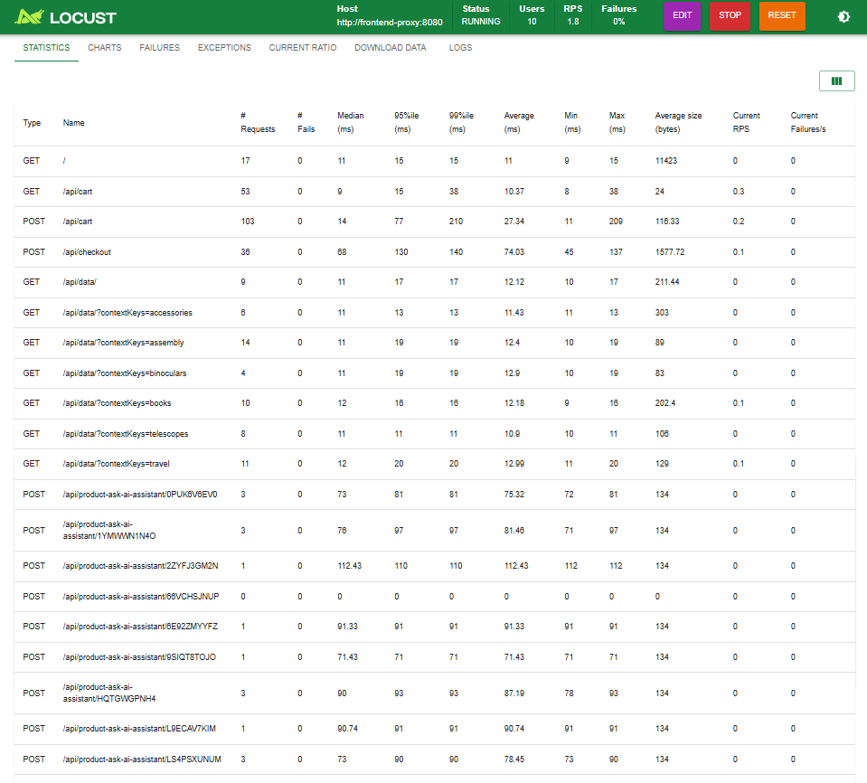
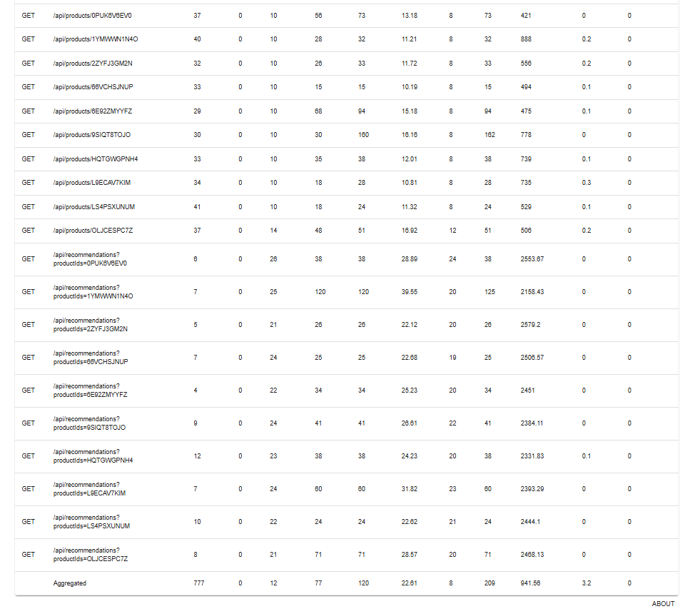
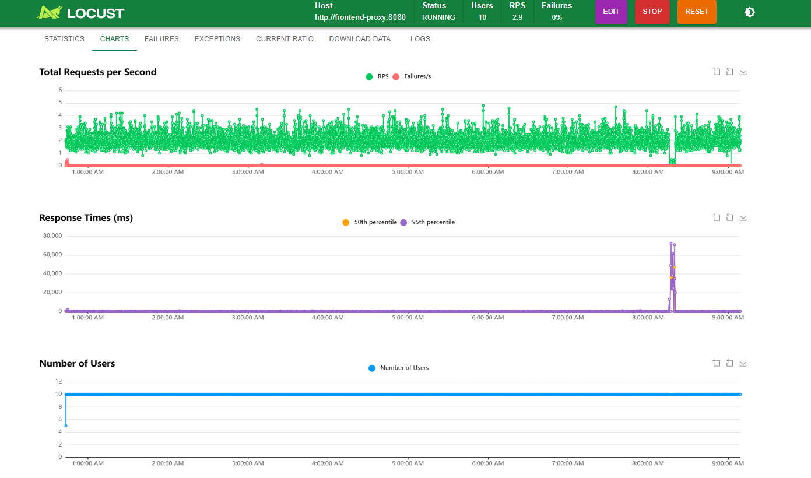
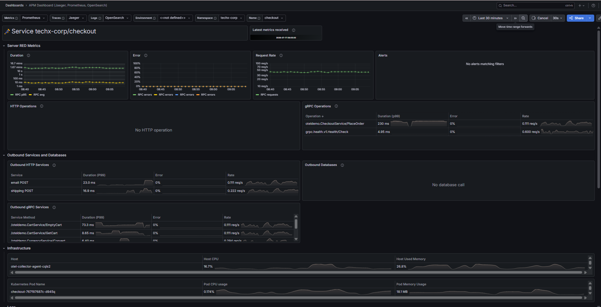

# Báo Cáo Minh Chứng M9 Baseline & Load Window

Tài liệu này ghi nhận chi tiết kịch bản tải, kế hoạch cửa sổ chạy tải, cấu hình giám sát dashboard và số liệu đo lường baseline trước khi thực hiện các thay đổi Mandate 9.

---

## 1. Kịch Bản Tải & Thiết Lập (Load Scenario & Setup)

* **Luồng chính (Scope)**: Mô phỏng hành trình người dùng mua sắm thực tế bao gồm duyệt sản phẩm (browse), thêm/xem giỏ hàng (cart), và thanh toán đơn hàng (checkout).
* **Cấu hình tải**:
  * **Số Users (Users)**: `10`
  * **Tốc độ khởi tạo (Spawn Rate)**: `1 user/sec`
  * **Mức tải ổn định (Steady RPS)**: `~1.8 - 2.5 RPS`
  * **Host chạy tải**: `http://frontend-proxy:8080`
  * **Owner vận hành**: **Mai Phước Khoa**

---

## 2. Kế Hoạch Cửa Sổ Chạy Tải (Load Window Plan)

* **Thời gian bắt đầu (Start)**: `2026-07-17T09:00:00+07:00`
* **Thời gian kết thúc (End)**: `2026-07-17T09:05:00+07:00`
* **Thời lượng (Duration)**: `5 phút` (cho giai đoạn đo lường Baseline trước thay đổi)
* **Kế hoạch cửa sổ thay đổi**: Giữ nguyên mức tải 10 Users chạy liên tục xuyên suốt quá trình thực hiện các thay đổi lớn tiếp theo.

---

## 3. Cấu Hình Dashboard & Truy Vấn Đo Lường (Metrics Dashboard)

Sử dụng **Grafana APM Dashboard** (cổng `3000`) và báo cáo thống kê client-side từ **Locust Web UI** (cổng `8089`) để đo lường các chỉ số với PromQL tương ứng:

1. **Tổng lượng Request (Throughput/RPS)**:
   ```promql
   sum(rate(http_server_request_duration_seconds_count{deployment_environment_name="production"}[1m]))
   ```
2. **Tổng số lỗi HTTP 5xx (Failures - MUST BE 0)**:
   ```promql
   sum(increase(http_server_request_duration_seconds_count{deployment_environment_name="production", http_response_status_code=~"5.."}[1m]))
   ```
3. **Độ trễ P95 (P95 Latency)**:
   ```promql
   histogram_quantile(0.95, sum by (le) (rate(http_server_request_duration_seconds_bucket{deployment_environment_name="production"}[1m])))
   ```
4. **Tỷ lệ lỗi (Error Rate %)**:
   ```promql
   (sum(rate(http_server_request_duration_seconds_count{deployment_environment_name="production", http_response_status_code=~"5.."}[1m])) * 100) 
   / 
   sum(rate(http_server_request_duration_seconds_count{deployment_environment_name="production"}[1m]))
   ```

---

## 4. Kết Quả Đo Lường Baseline Trước Khi Thay Đổi (Pre-change Baseline)

Ghi nhận từ đợt chạy baseline sạch lỗi trong 5 phút đầu tiên:

* **Tổng số Request (Total Requests)**: `777`
* **RPS Trung bình (Average RPS)**: `1.8`
* **P95 Latency**: `77 ms`
* **Tổng số lỗi (Error Count / Failures)**: **`0`** (Đạt tiêu chuẩn zero-error)

### Hình ảnh minh chứng (Baseline Screenshots)

#### **Hình 1: Thống kê Locust Baseline**


*Giải thích hình ảnh: Bảng thống kê Locust ghi nhận sau khi reset dữ liệu lỗi. Tổng số request đạt 777, RPS trung bình đạt 1.8 và P95 Latency ở mức 77ms trên các API chính. Cột `# Fails` của toàn bộ các API endpoint đều bằng 0 tuyệt đối.*

#### **Hình 2: Biểu đồ tải Locust Baseline**

*Giải thích hình ảnh: Biểu đồ đường thẳng RPS và Failures ổn định thể hiện lưu lượng tải chạy sạch lỗi.*

#### **Hình 3: Grafana APM Dashboard Baseline**

*Giải thích hình ảnh: Biểu đồ APM Dashboard trên Grafana hiển thị Error Rate phẳng ở mức 0% và Throughput ổn định tương ứng với lưu lượng tải sinh ra.*
