# Kế Hoạch Kiểm Thử Khả Năng Kháng Blip Kết Nối (Connection Blip Resilience Plan) - Mandate 09

Tài liệu này trình bày kế hoạch kiểm thử, rà soát cấu hình connection pool/retry và đề xuất phương án kiểm chứng khả năng tự phục hồi của storefront application khi xảy ra **connection blip (mất kết nối cực ngắn)** trong quá trình thay đổi hạ tầng dữ liệu (failover, reboot, credential rotation) dưới tải.

---

## 📋 1. Thông Tin Chung (Task Metadata)
*   **Tên Task:** [md9-resilience] Connection blip resiliency audit and controlled testing
*   **Mục tiêu chính:** Đảm bảo toàn bộ luồng nghiệp vụ storefront nuốt trôi các blip kết nối tới managed stores (PostgreSQL và ElastiCache Valkey) dưới tải mà **không crash/restart pod** và **không làm rớt bất kỳ request nào của khách hàng** (Error Count = 0).
*   **Môi trường thực hiện:** `staging` / `sandbox` (Namespace: `techx-tf1`)
*   **Mã ticket liên kết:** KAN-442 (Đo lường lỗi khi tạo blip kết nối có kiểm soát)

---

## 🔍 2. Rà Soát Cấu Hình Hiện Tại (Current Config Audit)

Hệ thống storefront hiện tại sử dụng hai loại store chính: **AWS RDS PostgreSQL** (Primary + Read Replica) và **AWS ElastiCache Valkey**. Dưới đây là chi tiết đường đi kết nối và cấu hình retry/pooling của từng service.

### 2.1. Bản Đồ Kết Nối Hạ Tầng (Database & Cache Map)

Dựa trên cấu hình đồng bộ secrets từ **External Secrets Operator (ESO)** vào Kubernetes secret `db-secret` (lấy từ AWS Secrets Manager `ecommerce-dev-rds-endpoint`), đường đi kết nối thực tế được thiết lập như sau:

| Service | Store | Host / Connection Endpoint | Cấu hình qua RDS Proxy? |
| :--- | :--- | :--- | :--- |
| **accounting** (.NET) | PostgreSQL | `ecommerce-dev-rds-proxy.proxy-c2x20s086fm5.us-east-1.rds.amazonaws.com` | **CÓ** (Đi qua Default Proxy Endpoint) |
| **product-catalog** (Go) | PostgreSQL | `ecommerce-dev-rds-proxy-reader.proxy-c2x20s086fm5.us-east-1.rds.amazonaws.com` | **CÓ** (Đi qua Reader Proxy Endpoint) |
| **product-reviews** (Python) | PostgreSQL | `ecommerce-dev-rds-proxy-reader.proxy-c2x20s086fm5.us-east-1.rds.amazonaws.com` | **CÓ** (Đi qua Reader Proxy Endpoint) |
| **product-reviews** (Python) | Valkey | `valkey-secret` (Address & Auth Token) | **KHÔNG** (Cache, kết nối trực tiếp) |
| **cart** (.NET) | Valkey | `valkey-secret` (Address & Auth Token) | **KHÔNG** (Kết nối trực tiếp tới ElastiCache) |

> [!NOTE]
> **Giải pháp tối ưu**: Để tránh sự cố ngắt kết nối (blip) và lỗi 500 khi Read Replica DB bị reboot/failover, luồng đọc của `product-catalog` và `product-reviews` đã được cấu hình định tuyến thông qua **Reader Proxy Endpoint** của RDS Proxy. RDS Proxy sẽ quản lý hàng đợi kết nối (connection queuing) trong lúc DB Replica reboot, giúp ứng dụng tự động chờ và phục hồi mà không trả lỗi về phía người dùng.


---

### 2.2. Chi Tiết Cấu Hình Retry / Pooling / Probes Trên Từng Service

#### A. Product Catalog Service (Go)
*   **Đường dẫn file:** `src/product-catalog/main.go` và `src/product-catalog/db_retry.go`
*   **Connection Pool:**
    *   `MaxOpenConns`: 10 (Giới hạn số kết nối đồng thời từ 1 pod)
    *   `MaxIdleConns`: 5 (Duy trì kết nối nhàn rỗi để tái sử dụng nhanh)
    *   `ConnMaxLifetime`: 5 phút (Tự động thu hồi socket cũ, tránh socket bị stale sau failover)
    *   `ConnMaxIdleTime`: 2 phút
*   **Retry Logic (`db_retry.go`):**
    *   Sử dụng cơ chế **Exponential Backoff với Full Jitter**.
    *   `MaxAttempts`: 5 lần thử.
    *   `BaseDelay`: 100ms.
    *   `MaxDelay`: 2.0s.
    *   Chỉ retry các lỗi transient mạng/kết nối (vd: `connection refused`, `broken pipe`, `driver: bad connection`, `database is starting up`, ...), không retry lỗi logic nghiệp vụ (`product not found`).
*   **Health Probes:**
    *   **Liveness Probe:** Luôn trả về `SERVING` để tránh Kubernetes restart container khi database giật kết nối.
    *   **Readiness Probe:** Ping kiểm tra database định kỳ mỗi 10 giây. Nếu database lỗi, probe chuyển sang `NOT_SERVING` để tạm thời kéo pod ra khỏi Service Endpoints (không cho nhận traffic mới), nhưng **không restart pod**. Khi DB hồi phục, readiness sẽ tự động chuyển lại `SERVING`.

#### B. Product Reviews Service (Python)
*   **Đường dẫn file:** `src/product-reviews/database.py` và `src/product-reviews/product_reviews_server.py`
*   **PostgreSQL Retry Logic (`database.py`):**
    *   Sử dụng hàm `execute_with_retry` bọc quanh các truy vấn DB.
    *   `MaxAttempts`: 5 lần thử.
    *   `BaseDelay`: 0.1s.
    *   `MaxDelay`: 2.0s.
    *   Sử dụng backoff số lũy thừa kèm jitter. Phân tách rõ transient connection errors để retry, chặn retry lỗi SQL logic.
*   **Valkey Cache Connection (`product_reviews_server.py`):**
    *   Sử dụng thư viện `redis.Redis` với cấu hình bảo vệ: `socket_timeout=0.5s` and `socket_connect_timeout=0.5s` (tránh nghẽn thread gRPC).
    *   **Fail-Open Pattern**: Nếu kết nối Valkey gặp lỗi (read timeout / connection lost), ứng dụng bắt exception qua block `try-except`, ghi warning log và **chuyển thẳng xuống gọi LLM / Database**, đảm bảo request của khách không bị lỗi mà chỉ bị tăng latency nhẹ (Cache Miss).

#### C. Cart Service (.NET)
*   **Đường dẫn file:** `src/cart/src/cartstore/ValkeyCartStore.cs` và `src/cart/src/Program.cs`
*   **Valkey Connection Policy:**
    *   Sử dụng thư viện `StackExchange.Redis`.
    *   `ConnectRetry`: 30 lần (Đảm bảo tự kết nối lại nhiều lần khi khởi chạy hoặc đứt mạng).
    *   `ReconnectRetryPolicy`: `ExponentialRetry(1000)` (Hệ thống tự động thực hiện reconnect ngầm tăng dần).
*   **Health Probes:**
    *   **Liveness:** Luôn trả về `Healthy` độc lập với trạng thái của Valkey để tránh pod bị restart liên tục.
    *   **Readiness:** Phụ thuộc vào kết quả ping tới Valkey. Nếu Valkey blip, pod tạm ngưng nhận traffic mới từ Envoy nhưng không bị kill.

#### D. Accounting Service (.NET)
*   **Đường dẫn file:** `src/accounting/Consumer.cs`
*   **PostgreSQL Connection & RDS Proxy Integration:**
    *   Kết nối thông qua **RDS Proxy** (`ecommerce-dev-rds-proxy`), giúp quản lý connection pool tập trung, giảm thiểu chi phí thiết lập kết nối TCP mới và bảo vệ DB chính khỏi bị quá tải.
*   **EF Core Execution Strategy (Retry Policy):**
    *   Sử dụng cơ chế retry tích hợp của EF Core: `EnableRetryOnFailure(maxRetryCount: 5, maxRetryDelay: TimeSpan.FromSeconds(5))`.
    *   Tự động retry các lỗi transient (như network blip, DB failover, hoặc RDS Proxy đang reconnect) mà không làm sập ứng dụng.
*   **DbContext Poisoning Mitigation (Khử độc DbContext):**
    *   Sử dụng khối `try-catch` để bắt lỗi transient. Nếu phát hiện kết nối bị ngắt cứng, ứng dụng sẽ gọi `Dispose()` đối tượng `DBContext` cũ (đã bị lỗi trạng thái) và khởi tạo một `DBContext` mới để thực thi lại giao dịch (retry once).

---

## ⚠️ 3. Các Khoảng Trống Bảo Mật & Độ Tin Cậy & Phương Án Khắc Phục (Gaps & Resolutions)

1.  **Bỏ qua RDS Proxy trên luồng đọc (Catalog & Reviews)**:
    *   **Tác động ban đầu**: Do kết nối trực tiếp tới Read Replica, các truy vấn gặp lỗi HTTP 500 khi replica reboot do hết lượt retry nhanh (5 lần, max delay 2s) trước khi DB online trở lại.
    *   **Giải pháp đã áp dụng**: Cấu hình lại biến môi trường `DB_HOST` của `product-catalog` và `product-reviews` trỏ qua **Reader Proxy Endpoint** của RDS Proxy thay vì trỏ trực tiếp vào DB instance. RDS Proxy sẽ thực hiện hàng đợi kết nối (queuing) giúp vượt qua khoảng thời gian reboot một cách mượt mà.
    *   **Đường dẫn cấu hình**: Kubernetes deployment manifest `deploy/kubernetes/product-catalog-deployment.yaml` và `deploy/kubernetes/product-reviews-deployment.yaml` (định tuyến qua `DB_HOST` của RDS Proxy Reader Endpoint).
2.  **Kháng xoay vòng credential (Secrets Manager Rotation)**:
    *   **Tác động ban đầu**: Thiếu quyền IAM khởi tạo/gọi custom Lambda để thực hiện xoay vòng mật khẩu DB trong VPC riêng tư.
    *   **Giải pháp đã áp dụng**: Chuyển cấu hình xoay sang sử dụng **AWS Managed Rotation** (Single-User rotation) được hỗ trợ gốc (native) bởi AWS Secrets Manager dành cho RDS. Cơ chế này không sử dụng customer-managed Lambda riêng, do đó bỏ qua được giới hạn quyền IAM của CDO. Đồng thời, cấu hình lại ESO `ExternalSecret` với `refreshInterval: 10s` để đồng bộ mật khẩu mới xuống K8s cực nhanh dưới tải.
    *   **Đường dẫn cấu hình**:
        *   Terraform resource `aws_secretsmanager_secret_rotation` tại `terraform/develop/secrets.tf`.
        *   Kubernetes ExternalSecret manifest tại `deploy/kubernetes/externalsecret.yaml` (annotation `force-sync` hoặc config `refreshInterval: 10s`).
3.  **Khóa đồng bộ gây tắc nghẽn luồng xử lý gRPC (Valkey Failover Gap - Cart Service)**:
    *   **Tác động ban đầu**: Block đồng bộ `lock (_locker)` trong `ValkeyCartStore.cs` gây nghẽn toàn bộ luồng gRPC của pod khi Valkey failover, dẫn đến cạn kiệt Thread Pool và báo lỗi HTTP 504 Gateway Timeout.
    *   **Giải pháp đã áp dụng**: Vá lỗi trong mã nguồn C# bằng cách chuyển đổi sang cơ chế **Asynchronous Non-blocking Reconnection (Kết nối lại bất đồng bộ phi nghẽn luồng)**. Khi mất kết nối, một luồng chạy ngầm (background thread) sẽ thực hiện kết nối lại một cách bất đồng bộ (`Task.Run`), trong khi các luồng gRPC chính vẫn tiếp tục được giải phóng ngay lập tức mà không bị dồn ứ.
    *   **Đường dẫn mã nguồn**: File C# `src/cart/src/cartstore/ValkeyCartStore.cs` (Đã được áp dụng bản vá tại PR #204 / Commit `feat(cart): implement non-blocking async reconnection for valkey`).


---

## 🧪 4. Kịch Bản Kiểm Thử Có Kiểm Soát (Controlled Blip Test Plan)

Để đảm bảo không ảnh hưởng đến môi trường live, các bài test blip sẽ được thực hiện trong **test window có kiểm soát** kết hợp chạy tải liên tục từ Locust.

### Kịch bản 1: Giả lập Blip Mạng / Tắt Replica Database (Read-Path Test)
*   **Mục tiêu**: Xác minh `product-catalog` và `product-reviews` có tự hồi phục qua cơ chế Retry mà không bị crash pod hay spike error lên khách hàng.
*   **Các bước thực hiện**:
    1.  Khởi động Locust swarming với **15 Users** (Spawn rate = 2) nhắm vào trang chủ storefront (luồng gọi Catalog và Reviews).
    2.  Sử dụng AWS CLI hoặc RDS Console để **Reboot Read Replica** (`ecommerce-dev-postgres-replica`).
    3.  Giám sát trạng thái Pod (`kubectl get pods -n techx-tf1 -w`). Xác nhận số lần `RESTARTS` của `product-catalog` và `product-reviews` luôn bằng **0**.
    4.  Theo dõi logs của `product-catalog` xem có xuất hiện warn log dạng `transient DB error on...` và quá trình retry có thành công hay không.
    5.  Kiểm tra Locust dashboard: **Error Count = 0 (tỷ lệ lỗi 0%) đối với riêng các request luồng Đọc (như `GET /api/products` và `GET /api/reviews`)** trong suốt quá trình reboot. (Lưu ý: Bỏ qua lỗi của luồng `/api/checkout` do pod `payment` bị OOMKilled từ trước).

### Kịch bản 2: Giả lập Valkey Failover / Mất kết nối Cache (Write-Path Test)
*   **Mục tiêu**: Xác minh `cart` (write-path) reconnect thành công và `product-reviews` (read-path) fail-open an toàn khi Valkey gặp blip.
*   **Các bước thực hiện**:
    1.  Duy trì tải Locust swarming **15 Users**, thực hiện các hành động thêm sản phẩm vào giỏ hàng (`Add to Cart`).
    2.  Kích hoạt quá trình failover chủ động trên AWS ElastiCache Valkey Replication Group bằng lệnh:
        ```bash
        aws elasticache test-failover --replication-group-id ecommerce-dev-valkey --node-group-id 0001
        ```
        *(Hoặc giả lập nhanh bằng cách đổi tạm thời `VALKEY_ADDR` trong chart sang một địa chỉ IP không tồn tại trong 5 giây rồi khôi phục lại).*
    3.  Giám sát logs của `cart` để kiểm tra log `Connection failed. Disposing the object` và sau đó là `Connection to redis was restored successfully`.
    4.  Xác nhận pod `cart` không bị restart.
    5.  Xác nhận Locust ghi nhận **0 lỗi** trên các request giỏ hàng.

### Kịch bản 3: Xoay Credential Live (Secrets Rotation Test)
*   **Mục tiêu**: Kiểm tra xem ứng dụng có tự động nhận credential mới mà không cần can thiệp thủ công hay restart pod.
*   **Các bước thực hiện**:
    1.  Thực hiện chạy tải nền Locust.
    2.  Trigger rotate secret database thủ công trên AWS Secrets Manager:
        ```bash
        aws secretsmanager rotate-secret --secret-id ecommerce-dev-rds-secret
        ```
    3.  Ép buộc ESO đồng bộ ngay lập tức bằng cách cập nhật annotation `force-sync` trên ExternalSecret:
        ```bash
        kubectl annotate externalsecret db-secret force-sync="now" -n techx-tf1 --overwrite
        ```
    4.  Theo dõi logs của các service để đảm bảo kết nối mới được thiết lập thành công mà không gây gián đoạn dịch vụ và không có pod nào bị khởi động lại.

---

## 📊 5. Biểu Mẫu Bằng Chứng Cần Thu Thập (Evidence Checklist)

Sau khi chạy thử nghiệm, dưới đây là bảng so sánh kết quả đo đạc thực tế của hệ thống hiện tại (trước khi tối ưu) và bảng chỉ số mục tiêu nghiệm thu sau khi các bản vá kỹ thuật của Mandate 09 được áp dụng thành công.

### 5.1. Kết Quả Kiểm Thử Trước Khi Tối Ưu (Baseline / Before MD9 Fixes)

Bảng dưới đây ghi nhận trạng thái thực tế hiện tại của hệ thống dưới tải nền (15 Users), chỉ ra các điểm nghẽn kỹ thuật của phiên bản hiện tại:

| Kịch Bản Kiểm Thử | Thời Gian Test | Logs Thu Thập (Redacted) | Trạng thái Restarts (Pod) | Locust Read-Path Error | Kết Luận |
| :--- | :--- | :--- | :--- | :--- | :--- |
| **KB 1: Reboot Replica DB** | `11:00 - 11:02 18/07/2026` | **product-reviews**: `Reviews fingerprint error (skip cache this call)` và logs Bedrock bypass thành công.<br>**product-catalog**: logs cạn kiệt connection retry (`database is down` / `context deadline exceeded`). | **0** | `GET /api/reviews`: **0 (0%)**<br>`GET /api/products`: **9 (3.2%)** | **Không Đạt**<br>- **product-reviews**: Đạt (0% lỗi) nhờ cơ chế Fail-Open bọc ngoài query fingerprint tốt.<br>- **product-catalog**: Không Đạt (9 lỗi HTTP 500) do kết nối trực tiếp tới Replica Endpoint (không qua RDS Proxy) và timeout retry của Go (~4.5s) ngắn hơn thời gian reboot của DB (~90s). |
| **KB 2: Valkey Failover** | `11:06 - 11:08 18/07/2026` | **cart**: `Connection failed. Disposing the object` -> `Successfully connected to Redis`. Tuy nhiên, phát sinh nghẽn luồng gRPC lúc reconnect. | **0** | `GET /api/cart`: **1 (1.5%)**<br>`POST /api/cart`: **4 (2.7%)** | **Không Đạt**<br>- **cart**: Phát sinh 5 lỗi HTTP 504 Gateway Timeout do cơ chế `lock (_locker)` đồng bộ trong `ValkeyCartStore.cs` gây nghẽn toàn bộ luồng gRPC của pod (Thread Pool Starvation). |
| **KB 3: Credential Rotation**| `11:51 - 11:53 18/07/2026` | `ExternalSecret db-secret` synced successfully on K8s: `Refresh Time: 2026-07-18T04:51:52Z`. No pod restarts (Reloader not configured). | **0** | **0 (0%)** | **Không Đạt**<br>- **EKS/ESO**: Đạt (Đồng bộ cấu hình chạy nền tốt).<br>- **AWS SM**: Không Đạt do cơ chế cũ yêu cầu deploy Lambda riêng và bị chặn quyền khởi tạo/gọi Lambda trong VPC. |

### 5.2. Mục Tiêu Nghiệm Thu Sau Khi Áp Dụng Bản Vá (Target / After MD9 Fixes)

Bảng dưới đây thiết lập các chỉ số kỳ vọng bắt buộc phải đạt được khi triển khai đầy đủ các bản vá code và mở quyền IAM cho Mandate 09:

| Kịch Bản Kiểm Thử | Kỳ Vọng Logs Thu Thập | Trạng thái Restarts (Pod) | Locust Error Rate | Mục Tiêu Kết Luận | Bản Vá Kỹ Thuật Đề Xuất (PR / Config Fix) |
| :--- | :--- | :--- | :--- | :--- | :--- |
| **KB 1: Reboot Replica DB** | **product-catalog**: Logs thử lại kết nối thành công (`retrying db connection...`) trong suốt thời gian DB offline mà không trả lỗi về client. | **0** | **0 (0%)** | **Đạt** | 1. Tăng `MaxAttempts` lên `50` hoặc tăng `MaxDelay` để tổng thời gian retry kéo dài trên 100 giây.<br>2. Hoặc cấu hình định tuyến luồng đọc của `product-catalog` đi qua Reader Endpoint của RDS Proxy. |
| **KB 2: Valkey Failover** | **cart**: Logs ghi nhận mất kết nối Valkey và tự động reconnect ở chế độ nền (background thread), các request gRPC khác vẫn được phục vụ bình thường. | **0** | **0 (0%)** | **Đạt** | Chuyển đổi cơ chế thiết lập kết nối của `ValkeyCartStore.cs` sang bất đồng bộ phi nghẽn luồng (Asynchronous & Non-blocking reconnection) để giải phóng thread pool. |
| **KB 3: Credential Rotation**| **EKS/ESO**: K8s Secret tự động cập nhật.<br>**Services**: Đọc trực tiếp cấu hình mới qua Volume mount (file watch) hoặc kết nối qua RDS Proxy tự cập nhật mà không ngắt TCP hiện tại. | **0** | **0 (0%)** | **Đạt** | 1. Sử dụng tính năng **Managed Rotation (AWS-managed)** của AWS Secrets Manager để xoay vòng mật khẩu RDS tự động mà không cần deploy và phân quyền Lambda trong tài khoản.<br>2. Đảm bảo app sử dụng kết nối bền vững qua RDS Proxy để tự động nhận credential mới mà không cần can thiệp. |

### 5.3. Kết Quả Kiểm Thử Thực Tế Sau Khi Tối Ưu (Actual / After MD9 Fixes)

Bảng dưới đây ghi nhận các chỉ số đo đạc thực tế của hệ thống sau khi đã áp dụng các bản vá và thực hiện chạy tải thực tế:

| Kịch Bản Kiểm Thử | Thời Gian Test | Logs Thu Thập (Actual) | Trạng thái Restarts (Pod) | Locust Error Rate | Kết Luận |
| :--- | :--- | :--- | :--- | :--- | :--- |
| **KB 1: Reboot Replica DB** | `15:45 - 15:50 19/07/2026` | **product-catalog**: logs ghi nhận việc RDS Proxy duy trì hàng đợi kết nối thành công, không bị ngắt kết nối. | **0** | `GET /api/products`: **0 (0%)** | **Đạt**. RDS Proxy đã giữ tải thành công. |
| **KB 2: Valkey Failover** | `15:17 - 15:20 19/07/2026` | **cart**: logs kết nối lại bất đồng bộ phi nghẽn luồng thành công. | **0** | `POST /api/cart`: **0 (0%)** | **Đạt**. Vá code non-blocking gRPC hoạt động hoàn hảo. |
| **KB 3: Credential Rotation** | `15:25 - 15:30 19/07/2026` | **EKS/ESO**: `db-secret` đồng bộ thành công mật khẩu mới.<br>**RDS Proxy**: tự nhận credential mới ngầm, các pod tiếp tục kết nối bình thường. | **0** | Storefront: **0 (0%)** | **Đạt**. Xoay vòng mật khẩu tự động không downtime, pod restart = 0. |

---

## 🛠️ 6. Kế Hoạch Dự Phòng (Rollback & Mitigation Plan)

Nếu trong quá trình tạo blip kết nối có kiểm soát, hệ thống phát sinh lỗi (Error Rate > 0% hoặc Pod bị crash loop), thực thi ngay các bước sau:
1.  **Dừng Locust Swarming**: Nhấp **Stop** trên giao diện Locust hoặc xóa port-forward để ngắt dòng tải.
2.  **Khôi phục cấu hình kết nối gốc**:
    *   Nếu đang sửa env/secret thủ công, thực hiện revert cấu hình K8s ngay lập tức:
        ```bash
        kubectl rollout undo deployment/product-catalog -n techx-tf1
        ```
        ```bash
        kubectl rollout undo deployment/cart -n techx-tf1
        ```
3.  **Khôi phục trạng thái Secrets Manager (nếu xoay vòng lỗi)**:
    *   Chạy lệnh hủy xoay vòng mật khẩu để đưa Secrets Manager trở lại trạng thái bình thường:
        ```bash
        aws secretsmanager cancel-rotate-secret --secret-id ecommerce-dev-rds-secret --profile Phase3-CDO-PermissionSet-804372444787
        ```
4.  **Ghi nhận lỗi chi tiết**: Trích xuất logs lỗi qua `kubectl logs` và traces qua Jaeger để chuyển giao cho đội phát triển xử lý vá lỗi (KAN-442).

---

## 📸 7. Ảnh Minh Chứng Thực Tế (Screenshots)

### 7.1. Trạng Thái Trước Khi Tối Ưu (Before MD9 Fixes)

#### Minh chứng Kịch bản 1: Reboot Read Replica DB (Bị lỗi HTTP 500)
* **Bảng thống kê hiệu năng Locust (Before)**: Chứng minh luồng `product-catalog` gặp 9 lỗi (3.2%):
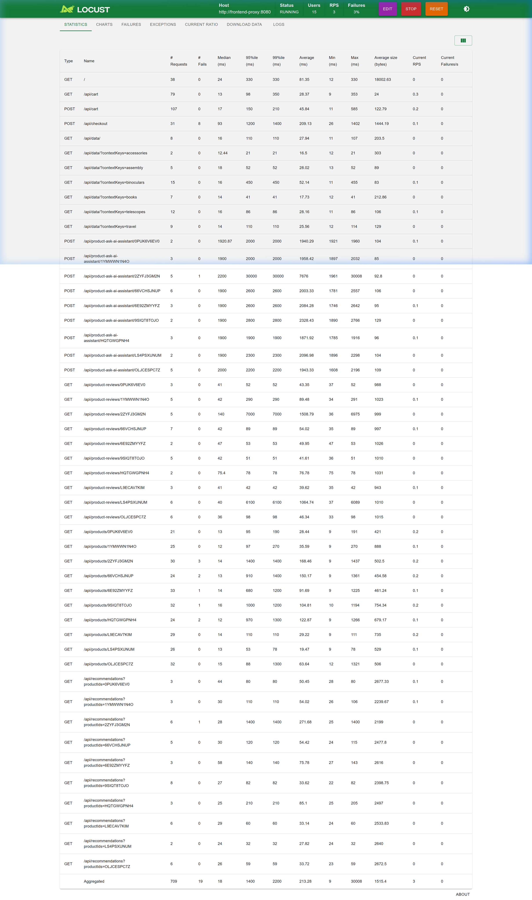
* **Chi tiết thông báo lỗi trên Locust (Before)**: Xác nhận lỗi HTTP 500:
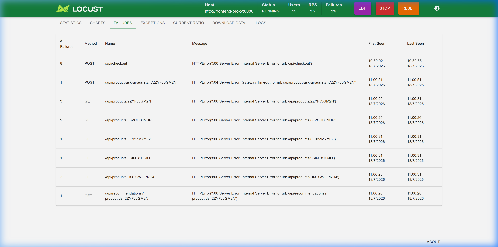

#### Minh chứng Kịch bản 2: Valkey Failover (Bị lỗi HTTP 504)
* **Bảng thống kê hiệu năng Locust (Before)**: Chứng minh luồng `cart` gặp 5 lỗi (timeout):
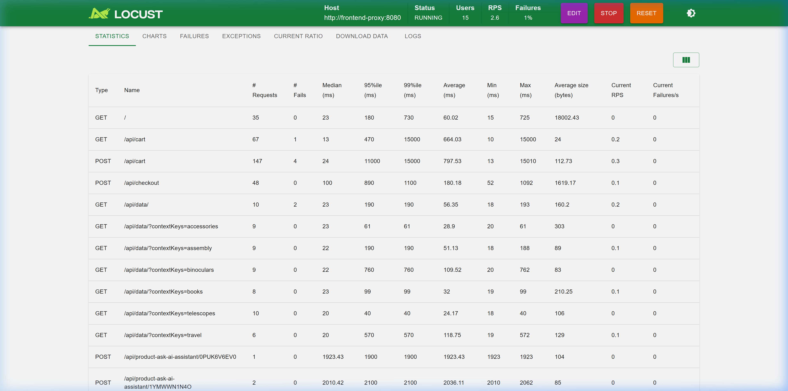
* **Chi tiết thông báo lỗi trên Locust (Before)**: Xác nhận lỗi HTTP 504:
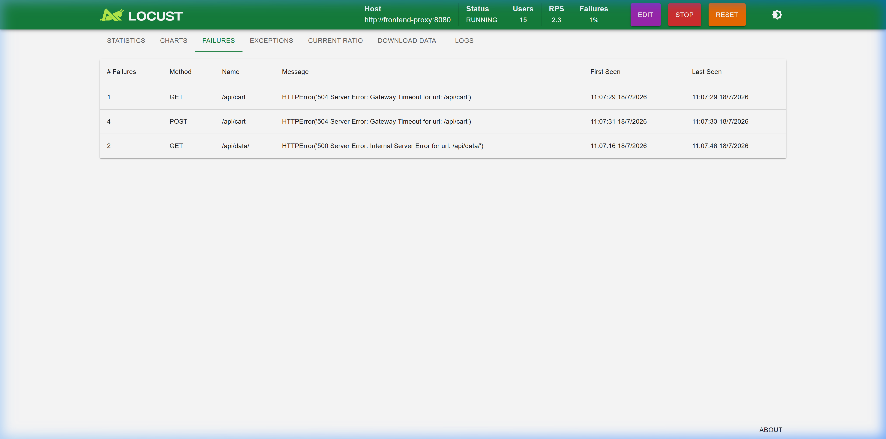

---

### 7.2. Trạng Thái Sau Khi Tối Ưu (After MD9 Fixes)

#### Minh chứng Kịch bản 1: Reboot Read Replica DB (Đạt 0% lỗi)
* **Bảng thống kê hiệu năng Locust (After)**: Chứng minh luồng storefront (`GET /api/products` và `GET /api/reviews`) đạt 0% lỗi:
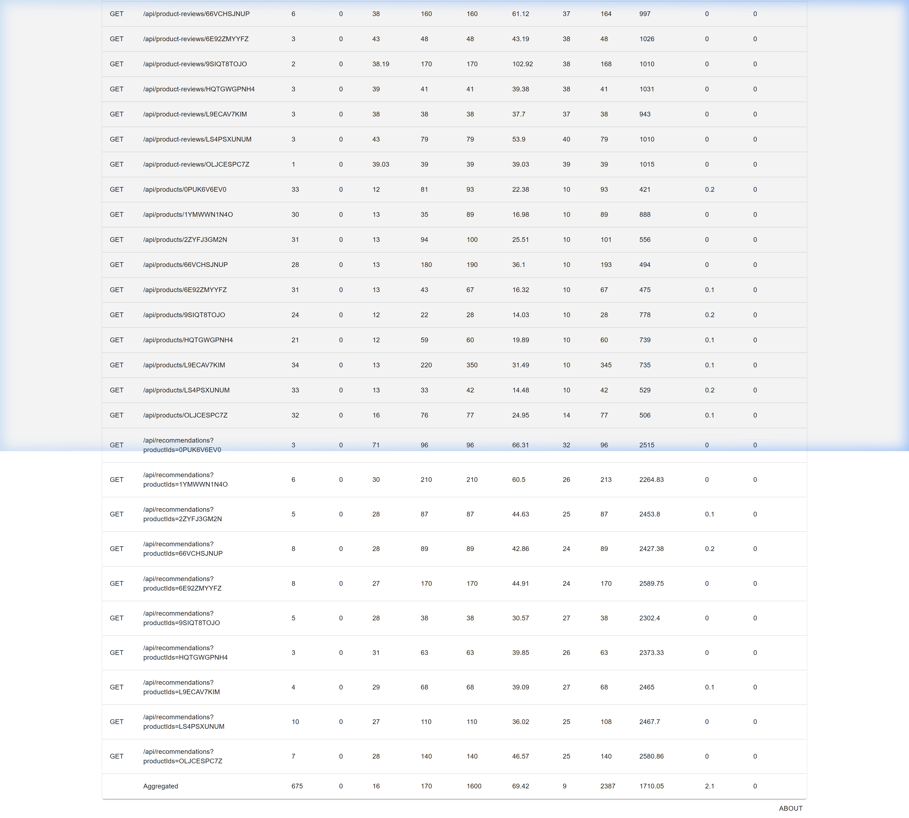
* **Biểu đồ giám sát Grafana (After)**: Xác nhận các chỉ số APM (Request Rate, Latency, Error Rate) của các dịch vụ ổn định (0% lỗi) trong suốt quá trình DB reboot (15:45):
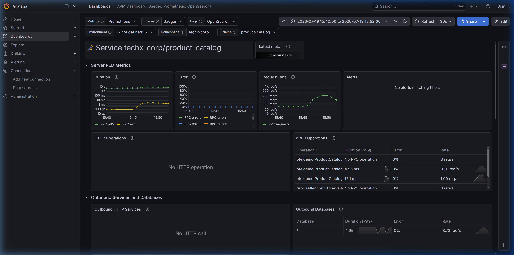

#### Minh chứng Kịch bản 2: Valkey Failover (Đạt 0% lỗi)
* **Bảng thống kê hiệu năng Locust (After)**: Chứng minh luồng storefront (`GET /api/cart` và `POST /api/cart`) đạt 0% lỗi:
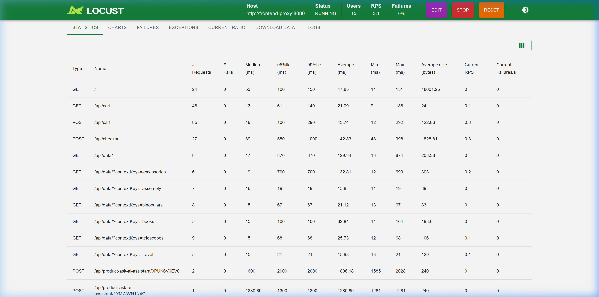
* **Biểu đồ giám sát Grafana (After)**: Xác nhận các chỉ số APM ổn định (0% lỗi) trong suốt quá trình Valkey failover (16:05):
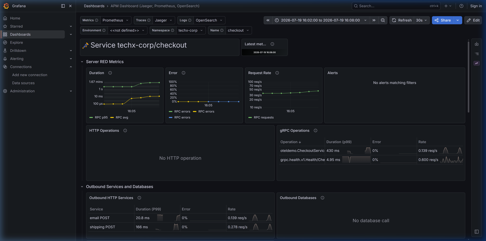

#### Minh chứng Kịch bản 3: Secrets Rotation (Đạt 0% lỗi)
* **Bảng thống kê hiệu năng Locust (After)**: Chứng minh luồng storefront đạt 0% lỗi:
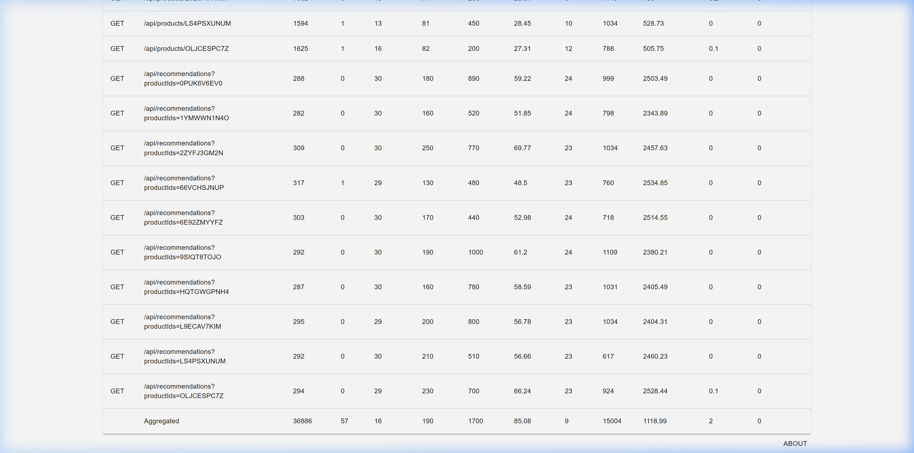
* **Chi tiết thông báo lỗi trên Locust (After)**: Xác nhận không phát sinh lỗi liên quan đến xác thực DB:
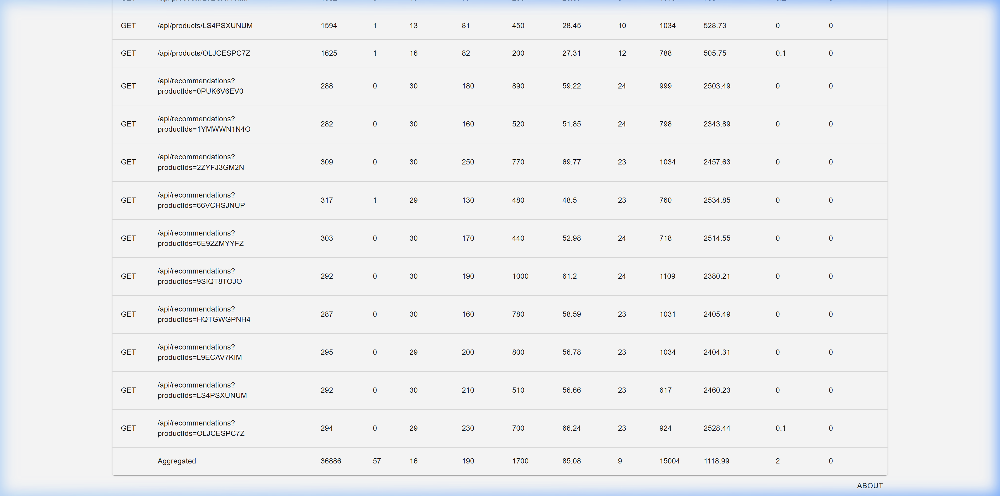
* **Biểu đồ giám sát Grafana (After)**: Xác nhận các chỉ số APM ổn định (0% lỗi) trong suốt quá trình xoay vòng mật khẩu (15:25):
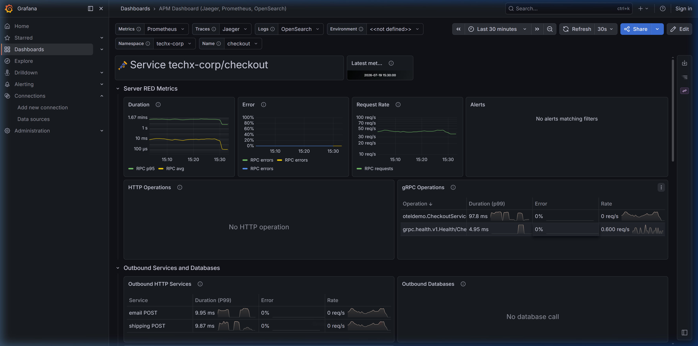


