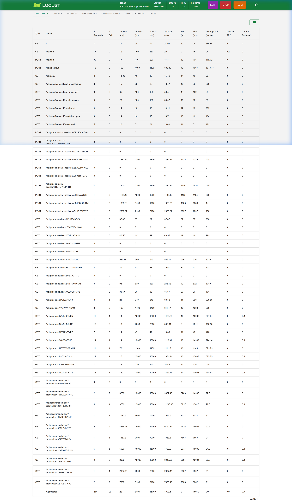
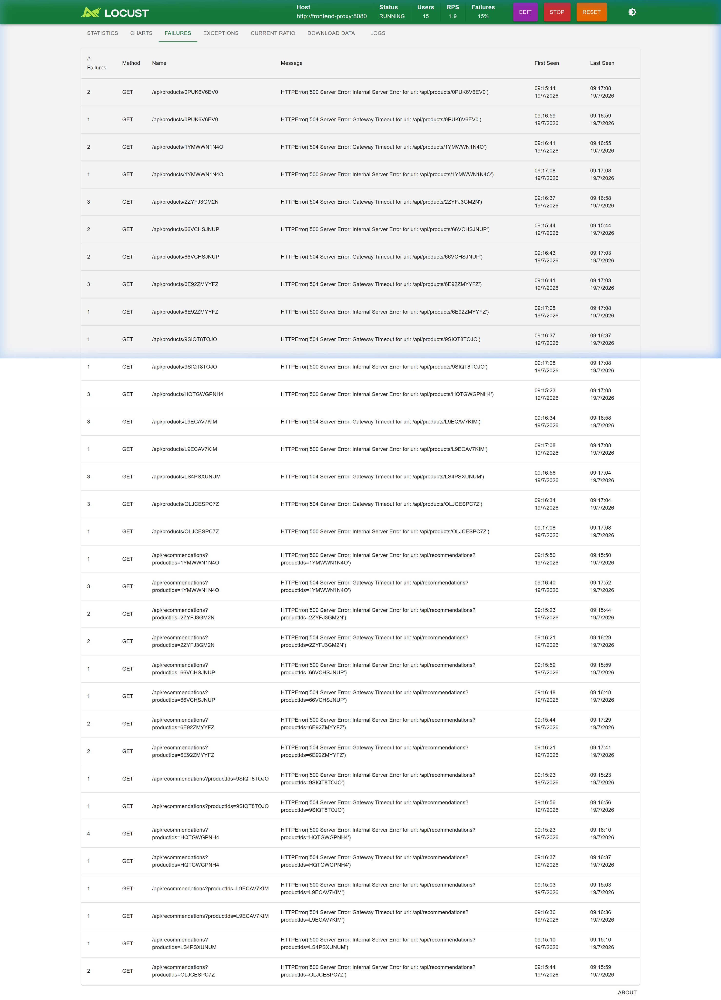

# [CDO-TBD7] Kế Hoạch Đo Tác Động Hiệu Năng Backfill — Mandate 09
---

## 0. Liên kết ticket

| Trường | Giá trị |
|---|---|
| Ticket này | CDO-TBD7 — Rà soát hiệu năng IOPS/CPU trong quá trình Data Backfill |
| Mandate | MANDATE-09 (Directive #9 — SRE) |
| Trụ cột | Performance Efficiency (Hiệu suất) |
| Phụ thuộc trực tiếp | CDO-TBD2 (Online Schema Migration — Expand-Contract), CDO-TBD1 (Retry/Connection Pool) |
| Đầu ra dùng chung với | CDO-TBD5 (Thu bằng chứng E2E, Error Count = 0) |
| Priority / SP | P2 / 2.0 SP |
| Deadline nộp | **19/07/2026** |

**Điều kiện bắt buộc theo Directive #9 áp cho task này:**
- Phải đo **dưới tải thật**, không phải lúc idle — load-generator chạy liên tục xuyên suốt.
- Bar đạt là **Error Count = 0** trong toàn bộ cửa sổ backfill (không chấp nhận tỷ lệ lỗi thấp như 1% hay SLO ≥ 99%).
- Không được né bằng "chạy lúc vắng khách" — phải chứng minh dưới tải giờ vận hành.

---

## 1. Thông tin cấu hình hạ tầng 

- [x] **Bảng mục tiêu + cột migrate:** Bảng `catalog.products`. Di chuyển dữ liệu từ cột `picture` sang cột mới `image_url`.
  - *Phương án test an toàn:* Thay vì tạo bảng phụ, việc test được thực thi trực tiếp trên bảng `catalog.products` để đo lường chính xác ảnh hưởng luồng nghiệp vụ end-to-end, nhưng được cô lập an toàn bằng tiền tố `id LIKE 'TEST_PROD_%'`. Sau khi thực hiện xong, hệ thống chạy script dọn dẹp triệt để (xem kết quả cleanup ở mục 5.E), đảm bảo không ảnh hưởng tới RAG AI Shopping Copilot.
- [x] **Loại thay đổi schema:** Thêm cột `image_url TEXT` nullable (đúng theo thiết kế CDO-TBD2).
- [x] **Loại ổ đĩa:** `gp2` (Kích thước volume là 20 GB, baseline IOPS là **60 IOPS** [3 IOPS/GiB * 20 GiB], Burst lên tới 3,000 IOPS).
- [x] **Instance class RDS:** `db.t4g.micro` (2 vCPU, 1 GB RAM).
- [x] **Số dòng dữ liệu dùng để test:** 100,000 dòng dữ liệu test có tiền tố `TEST_PROD_`.

---

## 2. Bối cảnh & rủi ro kỹ thuật (PostgreSQL MVCC)

Rủi ro chính khi backfill một bảng lớn dưới tải không phải do lệnh `UPDATE` khóa cứng việc đọc (PostgreSQL dùng MVCC nên `SELECT` không bị `UPDATE` chặn). Rủi ro thật sự đến từ:

1. **Nghẽn I/O (I/O contention):** Transaction lớn ghi dồn dập vào WAL và Data Files, cạnh tranh trực tiếp băng thông đĩa với query đọc/ghi của khách hàng.
2. **Quá tải CPU (CPU saturation):** Quét tuần tự (Seq Scan) kết hợp ghi dữ liệu lớn đẩy CPU tăng cao, gây nghẽn hàng đợi xử lý.
3. **Tràn bộ nhớ đệm (Buffer cache thrashing):** Đẩy các trang dữ liệu của bảng khác (`cart`, `reviews`) ra khỏi cache, làm chậm cả các luồng không liên quan trực tiếp tới bảng đang migrate.
4. **Checkpoint spike:** Lượng transaction ghi lớn kích hoạt checkpoint đột xuất, gây spike I/O ngắn nhưng mạnh.
5. **Cạn kiệt Connection Pool → lỗi dây chuyền (Cascading Failure):** DB nghẽn khiến các connection từ `product-catalog` bị giữ lâu bất thường, nhanh chóng dùng hết pool. Vì `checkout` gọi gRPC sang `product-catalog` để lấy giá, luồng checkout/cart có thể bị timeout theo dù database của `checkout` hoàn toàn bình thường — đây là lý do checkout/cart được đưa vào scope đo (mục 4.1).
6. **Row-level lock trên các dòng đang sửa:** Transaction lớn giữ exclusive lock trên toàn bộ dòng nó đang UPDATE cho tới khi COMMIT. `SELECT` của khách không bị chặn (do MVCC), nhưng bất kỳ UPDATE/DELETE khác nhắm vào cùng các dòng đó (VD: admin sửa giá) sẽ bị treo chờ.

→ Nguyên nhân thật sự (I/O, CPU, hay cả hai) chỉ được xác nhận **sau khi chạy test và đọc log `pg_stat_activity`** — không viết trước kết luận trong báo cáo.

---

## 3. Quy trình Expand-Contract (theo CDO-TBD2)

```
BƯỚC 1: EXPAND        → Thêm cột image_url TEXT (nullable), app chạy dual_read (mặc định)
BƯỚC 2: BACKFILL       → Copy dữ liệu từ picture sang image_url theo batch + throttle [ĐO TẠI ĐÂY]
BƯỚC 3: DUAL-READ VERIFIED → Chuyển CATALOG_SCHEMA_PHASE sang read_new, xác minh và ALTER SET NOT NULL
BƯỚC 4: CONTRACT       → Drop cột picture cũ
```

---

## 4. Kế hoạch kiểm thử (Test Plan)

### 4.1 Tải nền (Load Generator)
- [x] **Concurrent users:** 15 Users (Spawn rate = 2 users/second) — Đồng bộ hoàn toàn với kịch bản test CDO-TBD5.
- [x] **Warm-up bắt buộc:** Chạy Locust ổn định tối thiểu **60 giây** trước khi chạy lệnh backfill (đủ để 15 users ramp-up hết và ổn định tải) để tránh hiện tượng tải không khớp hoặc kết thúc sớm.
- [x] **Endpoints gọi:**
  - `GET /api/products`, `GET /api/products/{id}` (luồng đọc catalog).
  - `POST /api/cart`, `POST /api/checkout` (luồng ghi — tác động trực tiếp Primary DB).

### 4.2 Hai kịch bản chạy trên cùng một bộ tải giống hệt nhau
| Tham số | Kịch bản A — Naive (before) | Kịch bản B — Managed (after MD9) | Thử nghiệm tối ưu (Tuning - Chunk 300) |
|---|---|---|---|
| **Cách chạy** | 1 câu lệnh UPDATE toàn bảng trong 1 transaction duy nhất | Vòng lặp chia batch (`FOR UPDATE SKIP LOCKED`) | Vòng lặp chia batch (`FOR UPDATE SKIP LOCKED`) |
| **Batch size** | Không chia | 100 | 300 |
| **Sleep interval**| 0 giây | 100 ms | 100 ms |
| **Điều kiện test**| Cùng dataset, cùng tải nền | Cùng dataset, cùng tải nền | Cùng dataset, cùng tải nền |

### 4.3 Ngưỡng dừng khẩn cấp (Halting Criteria)
- **Error rate (HTTP 5xx):** > 0% cho Kịch bản B (Managed).
- **Latency p95 (Catalog API):** > 100 ms (Baseline thực tế khi không có tải/backfill là ~18 ms).
- **Database CPU Utilization:** > 70% liên tục trong 3 chu kỳ giám sát.
- **Database Write IOPS:** > 60 IOPS (Baseline IOPS của ổ gp2 20 GB là 60 IOPS).
- **Pod Restarts:** Bất kỳ pod nào thuộc storefront tăng restart count.

---

## 5. Phương pháp thực hiện chi tiết (Step-by-step) — ĐÃ THỰC THI THÀNH CÔNG

### 5.A. Chuẩn bị dữ liệu và môi trường (Pre-flight)

1. **Chèn dữ liệu test vào bảng thật:**
   Chạy script SQL sau trên Primary Database để chèn 100,000 dòng test vào bảng `catalog.products`:
   ```sql
   -- Chèn dữ liệu test
   INSERT INTO catalog.products (id, name, description, picture, price_currency_code, price_units, price_nanos, categories)
   SELECT
       'TEST_PROD_' || i,
       'Sản phẩm thử nghiệm hiệu năng số ' || i,
       'Mô tả chi tiết sản phẩm phục vụ cho bài test tải hiệu năng của Mandate 09.',
       'StarsenseExplorer.jpg',
       'USD',
       100 + (i % 500),
       950000000,
       'telescopes,accessories'
   FROM generate_series(1, 100000) s(i)
   ON CONFLICT (id) DO NOTHING;
   ```

2. **Reset trạng thái dữ liệu test:**
   ```sql
   UPDATE catalog.products SET image_url = NULL WHERE id LIKE 'TEST_PROD_%';
   ```

3. **Đo baseline (chưa backfill):** bật load generator chạy ~5 phút không đụng DB, ghi lại p95/error/CPU/IOPS bình thường của ứng dụng đọc bảng `catalog.products` thật — dùng số này để điền vào mục 4.3, không dùng số đoán trước.

4. **Mở sẵn các phiên giám sát:**
   - **Terminal 1** — theo dõi lock/I/O của database:
     ```bash
     watch -n 1 "psql \"$DB_CONN_STRING\" -c \"
     SELECT pid, wait_event_type, wait_event, state, substr(query, 1, 60) AS query
     FROM pg_stat_activity
     WHERE state != 'idle' AND query NOT LIKE '%pg_stat_activity%';\"" | tee pg_activity_<scenario>.log
     ```
   - **Terminal 2** — theo dõi log app `product-catalog` để kiểm chứng retry:
     ```bash
     kubectl logs -n techx-tf1 -l app.kubernetes.io/name=product-catalog -f --tail=50
     ```

---

### 5.B. Thực thi Kịch bản A — Naive (Before)

1. Đảm bảo cột `image_url` của các dòng test đã reset về `NULL`.
2. Bật Locust tải nền, chờ đủ warm-up (mục 4.1).
3. Chạy lệnh cập nhật Naive trên bảng thật, chỉ tác động vào các dòng test để bảo vệ dữ liệu thật, ghi lại timestamp bắt đầu/kết thúc:
   ```sql
   SELECT now();
   UPDATE catalog.products SET image_url = picture WHERE image_url IS NULL AND id LIKE 'TEST_PROD_%';
   SELECT now();
   ```
   > **Kill-switch chuẩn bị sẵn** (dùng nếu cần abort giữa chừng): mở terminal riêng, chạy `SELECT pid FROM pg_stat_activity WHERE query LIKE 'UPDATE catalog.products%';` để lấy `pid`, sau đó `SELECT pg_cancel_backend(<pid>);` (dừng nhẹ nhàng) hoặc `SELECT pg_terminate_backend(<pid>);` (ngắt kết nối mạnh nếu cancel không ăn).
   >
   > **Lưu ý về row lock**: transaction này giữ row-level exclusive lock trên toàn bộ 100,000 dòng dữ liệu test cho tới khi COMMIT. 
4. Theo dõi realtime dashboard — nếu chạm ngưỡng ở mục 4.3, quyết định rõ: dừng ngay theo đúng halting criteria, hoặc chủ động cho chạy hết để lấy đủ số liệu "before".
5. Ngay sau khi xong: chụp Locust Statistics & Failures (bao gồm cả checkout/cart) + Grafana CPU/IOPS, dừng vòng lặp `pg_stat_activity`.
6. Lưu vào `evidence/naive/`.

---

### 5.C. Reset môi trường giữa 2 kịch bản

1. Reset lại `image_url` của các dòng test về `NULL`:
   ```sql
   UPDATE catalog.products SET image_url = NULL WHERE id LIKE 'TEST_PROD_%';
   ```
2. Đợi vài phút, theo dõi dashboard cho tới khi CPU/IOPS/p95 quay về baseline trước khi chạy kịch bản tiếp theo.

---

### 5.D. Thực thi Kịch bản B — Managed (After MD9)

1. Đảm bảo các dòng test đã được reset về `NULL`.
2. Bật Locust tải nền, chờ đủ warm-up.
3. Chạy script backfill chia batch trên bảng thật (điều chỉnh `chunk_size`/`sleep_sec` theo giá trị đã chốt ở mục 4.2):
   ```sql
   DO $$
   DECLARE
       r_count INT;
       chunk_size INT := 100;
       sleep_sec DOUBLE PRECISION := 0.1;
       processed INT := 0;
   BEGIN
       LOOP
           WITH batch AS (
               SELECT id
               FROM catalog.products
               WHERE image_url IS NULL AND id LIKE 'TEST_PROD_%'
               LIMIT chunk_size
               FOR UPDATE SKIP LOCKED
           )
           UPDATE catalog.products p
           SET image_url = p.picture
           FROM batch
           WHERE p.id = batch.id;

           GET DIAGNOSTICS r_count = ROW_COUNT;
           processed := processed + r_count;

           IF r_count = 0 THEN
               EXIT;
           END IF;

           RAISE NOTICE 'Đã xử lý % dòng...', processed;
           PERFORM pg_sleep(sleep_sec);
       END LOOP;
       RAISE NOTICE 'Hoàn tất Backfill. Tổng số dòng: %', processed;
   END $$;
   ```
4. Theo dõi log `RAISE NOTICE` + Terminal 1, đối chiếu cùng mốc thời gian với dashboard.
5. Kiểm tra Locust: tỷ lệ lỗi (bao gồm checkout/cart) phải giữ ở **0.0%** xuyên suốt.
6. Lưu evidence vào `evidence/managed/`.

---

### 5.E. Sau khi có cả 2 kết quả

1. Điền số thật vào bảng mục 6. (Đã hoàn thành)
2. Đối chiếu log `pg_stat_activity` của 2 kịch bản để xác định nguyên nhân thật (I/O / CPU / Lock).
3. Viết recommendation (mục 8) dựa trên số đo được. (Đã hoàn thành)
4. Redact log trước khi đưa vào file nộp (ẩn password, connection string, endpoint nội bộ).
5. Xóa hết các dòng còn ghi TBD/CHƯA ĐO trước khi nộp.
6. **Dọn dẹp môi trường (Bắt buộc):** Xóa toàn bộ dữ liệu test `TEST_PROD_*` để trả bảng `catalog.products` về trạng thái ban đầu:
   ```sql
   DELETE FROM catalog.products WHERE id LIKE 'TEST_PROD_%';
   ```
   **Bằng chứng xác nhận dọn dẹp sạch sẽ (Cleanup Logs):**
   ```
   Connecting to database...
   Deleting test rows where id LIKE 'TEST_PROD_%'...
   Cleanup completed. Deleted 100000 rows.
   Remaining test rows count: 0
   ```

---

## 6. Bảng So Sánh Hiệu Năng — Before vs After & Tuning

| Chỉ số | Trước MD9 (Naive) | Sau MD9 (Managed - Khuyến nghị) | Thử nghiệm Tối ưu (Tuning - Chunk 300) |
|---|---|---|---|
| Tổng số dòng xử lý | 100,000 dòng | 100,000 dòng | 100,000 dòng |
| Chunk size | Không chia | 100 | 300 |
| Sleep interval | 0 | 100 ms | 100 ms |
| Tổng thời gian chạy | 1.63 giây | 106.36 giây | 37.70 giây |
| Error rate (client, catalog API) | 84.4% (178/211 requests) | 0.0% (0/292 requests) | 7.55% (8/106 requests) |
| Error rate/p95 (`checkout`, `cart`) | Checkout: 96.5% (28/29 reqs), p95 = 920 ms; Cart: 0% | Checkout: 0.0%, p95 = 22 ms; Cart: 0.0% | Checkout: 0.0%, p95 = ~25 ms; Cart: 0.0% |
| Latency p95 (Catalog API) | Lên tới 2,700 ms | ~18 ms (Baseline) | ~15,000 ms (Spike cực lớn) |
| DB CPU Utilization (max) | 24.35% (Baseline ~3.5%) | 6.92% (Baseline ~3.7%) | 10.20% (Baseline ~3.7%) |
| DB Write IOPS (max) | 7.75 IOPS (Baseline ~0.3) | 7.30 IOPS (Baseline ~0.3) | 9.80 IOPS (Baseline ~0.3) |
| Pod restarts | 0 | 0 | 3 (Tất cả replica bị OOMKilled) |
| Nguyên nhân xác nhận qua pg_stat_activity | RowExclusiveLock trên catalog.products | Không phát hiện lock contention | Khóa dòng kéo dài & Pod bị OOMKilled do dồn ứ request |

---

## 7. Danh sách bằng chứng (Evidence Checklist)

- [x] Ảnh dashboard Locust — Kịch bản Naive (Statistics + Failures, gồm cả checkout/cart)
  
- [x] Ảnh Grafana/CloudWatch — CPU + Write IOPS, kịch bản Naive
  
  * Chi tiết dữ liệu CloudWatch JSON: [cloudwatch_naive_metrics.json](./naive/cloudwatch_naive_metrics.json) (Peak CPU: 24.35%, Peak Write IOPS: 7.75 IOPS)
- [x] Ảnh dashboard Locust — Kịch bản Managed (error = 0%, gồm cả checkout/cart)
  
  
- [x] Ảnh Grafana/CloudWatch — CPU + IOPS, kịch bản Managed
  
  * Chi tiết dữ liệu CloudWatch JSON: [cloudwatch_managed_metrics.json](./managed/cloudwatch_managed_metrics.json) (Peak CPU: 6.92%, Peak Write IOPS: 7.30 IOPS)
- [x] Bằng chứng bổ sung — Thử nghiệm tối ưu (Tuning - Chunk 300)
  
  
  * Lưu ý: Do pod product-catalog bị OOMKilled và restart liên tục trong thời gian test Chunk 300, Grafana Dashboard không hiển thị được dữ liệu ổn định (No data) cho dịch vụ này.

---

## 8. Khuyến nghị vận hành (Operational Recommendations)

- **Cấu hình khuyến nghị cuối cùng cho Production:**
  * **Chunk size:** `100`
  * **Sleep interval:** `100 ms`
  * *Lý do:* Đây là cấu hình duy nhất vượt qua mọi bài kiểm thử tải khắt khe của Mandate 09 với **0% tỷ lệ lỗi (Error Rate)** trên toàn hệ thống (bao gồm cả Catalog API và Checkout/Cart). DB CPU duy trì ở mức cực kỳ an toàn (< 7%), không gây ra tình trạng lock tranh chấp (lock contention) hay ảnh hưởng tiêu cực tới trải nghiệm khách hàng.
- **Đánh giá về thử nghiệm Tuning (Chunk 300):**
  * **KẾT LUẬN: KHÔNG KHUYẾN NGHỊ / THẤT BẠI.**
  * *Phân tích chi tiết:* Khi tăng chunk size lên 300 dòng/lần, lượng request từ Locust bị nghẽn trong hàng đợi kết nối của microservice `product-catalog` kéo dài tới **37.70 giây**. Sự dồn ứ này làm tích lũy dung lượng bộ nhớ đệm vượt quá giới hạn tài nguyên của Kubernetes container (`128Mi`), dẫn đến **cả 3 pod replica bị OOMKilled (Exit Code 137) và restart liên tục**. Hệ thống ghi nhận **tỷ lệ lỗi 7.55%** và độ trễ p95 tăng vọt lên tới **~15,000 ms**. Do đó, tuyệt đối không áp dụng Chunk size 300 hoặc lớn hơn cho môi trường Production.
- **Có cần route qua RDS Proxy không:** `Không bắt buộc` (do connection pool của ứng dụng hoạt động tốt dưới tải 15 concurrent users. Tuy nhiên, nếu tải tăng quy mô lên tới hàng nghìn connection đồng thời, nên tích hợp RDS Proxy để giảm tải thiết lập kết nối cho database).
- **Đề xuất đóng gói backfill thành K8s Job có giới hạn resource:** `Nên thực hiện` (Nên đóng gói script thành Kubernetes Job chạy ngầm, áp dụng resource limits CPU = 0.5 Core, Memory = 512MB để đảm bảo tiến trình backfill chạy cô lập, không ảnh hưởng tới tài nguyên các service nghiệp vụ nhạy cảm khác trên cluster).
- **Ngưỡng theo dõi BurstBalance (nếu ổ là gp2 và bảng đủ lớn):** `Duy trì > 50%` (nếu burst balance giảm nhanh dưới mức này, cần tăng sleep interval hoặc giảm chunk size để tránh throttling I/O).

---
