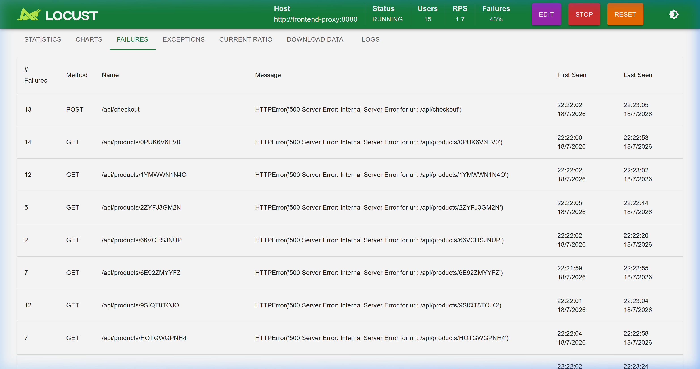
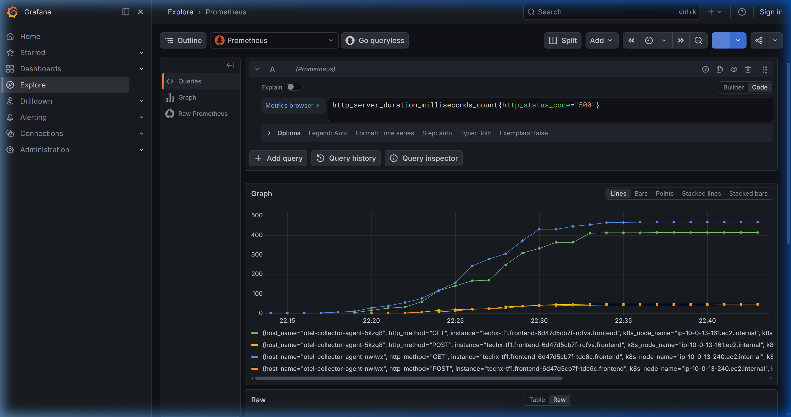
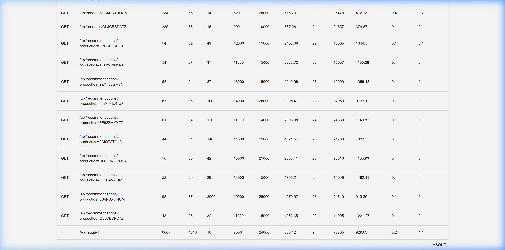
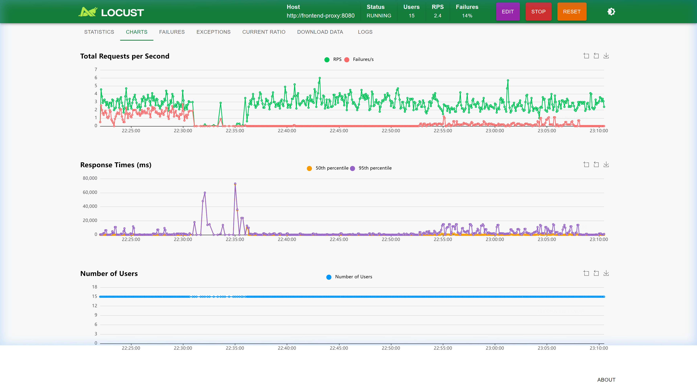
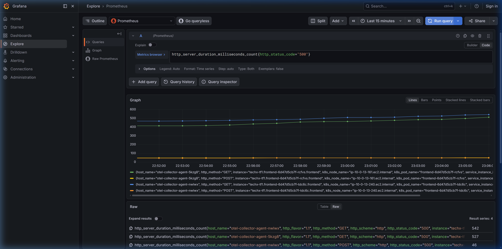

# [CDO-TBD7] Kế Hoạch Đo Tác Động Hiệu Năng Backfill — Mandate 09
---

## 0. Liên kết ticket

| Trường | Giá trị |
|---|---|
| Ticket này | CDO-TBD7 — Rà soát hiệu năng IOPS/CPU trong quá trình Data Backfill |
| Mandate | MANDATE-09 (Directive #9 — SRE) |
| Trụ cột | Performance Efficiency (Hiệu suất) |
| Phụ thuộc trực tiếp | CDO-TBD2 (Online Schema Migration — Expand-Contract), CDO-TBD1 (Retry/Connection Pool) |
| Đầu ra dùng chung với | CDO-TBD5 (Thu bằng chứng E2E, Error Count = 0) |
| Priority / SP | P2 / 2.0 SP |
| Deadline nộp | **19/07/2026** |

**Điều kiện bắt buộc theo Directive #9 áp cho task này:**
- Phải đo **dưới tải thật**, không phải lúc idle — load-generator chạy liên tục xuyên suốt.
- Bar đạt là **Error Count = 0** trong toàn bộ cửa sổ backfill (không chấp nhận tỷ lệ lỗi thấp như 1% hay SLO ≥ 99%).
- Không được né bằng "chạy lúc vắng khách" — phải chứng minh dưới tải giờ vận hành.

> ✅ **An toàn về môi trường**: theo ticket gốc, môi trường thực hiện là Kubernetes cluster `ecommerce-dev-eks` / RDS `ecommerce-dev-postgres` — **môi trường dev**, không phải production thật. "Tải thật" ở đây nghĩa là tải mô phỏng liên tục qua Locust (traffic pattern giống thật), không phải khách hàng thật đang dùng dịch vụ — nên rủi ro khi test là có kiểm soát được. Vẫn cần: (1) chỉ động vào dữ liệu `TEST_PROD_*` (xem lỗi đã sửa ở mục 5.B/5.D), (2) chuẩn bị sẵn kill-switch để abort giữa chừng nếu cần.

---

## 1. Thông tin cấu hình hạ tầng — CẦN BẠN TỰ RE-CONFIRM TRƯỚC KHI DÙNG

> ⚠️ Các thông số dưới đây được đưa vào từ bản nháp trước — bạn cần tự kiểm tra lại trên AWS Console/kubectl thật, vì cả file trước đó có nhiều chỗ số liệu bị dựng sẵn chứ không phải xác nhận thật. Đừng coi mục này là "đã chốt" chỉ vì nó nằm trong file.

- **Bảng mục tiêu + cột migrate:** Bảng `catalog.products`. Di chuyển dữ liệu từ cột `picture` sang cột mới `image_url`. → [ ] Xác nhận lại đúng tên bảng/cột thật.
  - *Phương án test an toàn (không ô nhiễm RAG AI):* Sử dụng bảng bản sao tạm thời **`catalog.products_perf_test`** có cấu trúc giống hệt bảng thật. Bảng này nằm ngoài tầm hoạt động của AI Shopping Copilot, đảm bảo không làm bẩn index/embeddings của RAG hay gây gợi ý sản phẩm lỗi cho khách hàng.
- **Loại thay đổi schema:** Thêm cột `image_url TEXT` nullable (EXPAND đã áp dụng) → sau backfill chuyển `CATALOG_SCHEMA_PHASE=read_new` → `ALTER ... SET NOT NULL` → CONTRACT (drop `picture`). → [ ] Xác nhận đúng theo CDO-TBD2 thật.
- **Loại ổ đĩa:** gp2 hay gp3? → [ ] Xác nhận trên AWS Console. (Nếu gp2: baseline IOPS đúng là **100 IOPS tối thiểu** cho volume ≤33.33 GiB theo AWS docs, không phải công thức thuần 3 IOPS/GiB.)
- **Instance class RDS:** → [ ] Xác nhận vCPU/RAM thật.
- **Số dòng dữ liệu dùng để test:** → [ ] Xác nhận số lượng thật sẽ populate, và cách tạo (script ở mục 5.A đề xuất tạo bảng test và chèn dữ liệu).

---

## 2. Bối cảnh & rủi ro kỹ thuật (PostgreSQL MVCC)

Rủi ro chính khi backfill một bảng lớn dưới tải không phải do lệnh `UPDATE` khóa cứng việc đọc (PostgreSQL dùng MVCC nên `SELECT` không bị `UPDATE` chặn). Rủi ro thật sự đến từ:

1. **Nghẽn I/O (I/O contention):** Transaction lớn ghi dồn dập vào WAL và Data Files, cạnh tranh trực tiếp băng thông đĩa với query đọc/ghi của khách hàng.
2. **Quá tải CPU (CPU saturation):** Quét tuần tự (Seq Scan) kết hợp ghi dữ liệu lớn đẩy CPU tăng cao, gây nghẽn hàng đợi xử lý.
3. **Tràn bộ nhớ đệm (Buffer cache thrashing):** Đẩy các trang dữ liệu của bảng khác (`cart`, `reviews`) ra khỏi cache, làm chậm cả các luồng không liên quan trực tiếp tới bảng đang migrate.
4. **Checkpoint spike:** Lượng transaction ghi lớn kích hoạt checkpoint đột xuất, gây spike I/O ngắn nhưng mạnh.
5. **Cạn kiệt Connection Pool → lỗi dây chuyền (Cascading Failure):** DB nghẽn khiến các connection từ `product-catalog` bị giữ lâu bất thường, nhanh chóng dùng hết pool. Vì `checkout` gọi gRPC sang `product-catalog` để lấy giá, luồng checkout/cart có thể bị timeout theo dù database của `checkout` hoàn toàn bình thường — đây là lý do checkout/cart được đưa vào scope đo (mục 4.1).
6. **Row-level lock trên các dòng đang sửa:** Transaction lớn giữ exclusive lock trên toàn bộ dòng nó đang UPDATE cho tới khi COMMIT. `SELECT` của khách không bị chặn (do MVCC), nhưng bất kỳ UPDATE/DELETE khác nhắm vào cùng các dòng đó (VD: admin sửa giá) sẽ bị treo chờ.

→ Nguyên nhân thật sự (I/O, CPU, hay cả hai) chỉ được xác nhận **sau khi chạy test và đọc log `pg_stat_activity`** — không viết trước kết luận trong báo cáo.

---

## 3. Quy trình Expand-Contract (theo CDO-TBD2)

```
BƯỚC 1: EXPAND        → Thêm cột image_url TEXT (nullable), app chạy dual_read (mặc định)
BƯỚC 2: BACKFILL       → Copy dữ liệu từ picture sang image_url theo batch + throttle [ĐO TẠI ĐÂY]
BƯỚC 3: DUAL-READ VERIFIED → Chuyển CATALOG_SCHEMA_PHASE sang read_new, xác minh và ALTER SET NOT NULL
BƯỚC 4: CONTRACT       → Drop cột picture cũ
```

---

## 4. Kế hoạch kiểm thử (Test Plan)

### 4.1 Tải nền (Load Generator)
- **Concurrent users:** 15 Users (Spawn rate = 2 users/second) — [ ] xác nhận đây là cấu hình thật dùng chung với CDO-TBD5.
- **Warm-up bắt buộc:** Chạy Locust ổn định tối thiểu **60 giây** trước khi chạy lệnh backfill (đủ để 15 users ramp-up hết trong ~7.5s rồi giữ ổn định trước khi backfill bắt đầu) — tránh lặp lỗi cũ (backfill xong trước khi tải kịp đạt đỉnh).
- **Endpoints gọi:**
  - `GET /api/products`, `GET /api/products/{id}` (luồng đọc catalog).
  - `POST /api/cart`, `POST /api/checkout` (luồng ghi — tác động trực tiếp Primary DB).

> ✅ **Đã chốt scope**: giữ checkout/cart trong tải test. Giả thuyết cần kiểm chứng bằng số đo thật: kịch bản Naive có thể làm cạn kiệt connection pool gRPC của `product-catalog`, gây lỗi dây chuyền (cascading failure) khiến checkout/cart trả HTTP 500 do timeout — đây sẽ là bằng chứng mạnh nhất cho Directive #9 nếu đo được. **Chưa có số liệu — đây vẫn là giả thuyết, chưa test.**

### 4.2 Hai kịch bản chạy trên cùng một bộ tải giống hệt nhau
| Tham số | Kịch bản A — Naive (before) | Kịch bản B — Managed (after MD9) |
|---|---|---|
| **Cách chạy** | 1 câu lệnh UPDATE toàn bảng trong 1 transaction duy nhất | Vòng lặp PL/pgSQL chia batch (`FOR UPDATE SKIP LOCKED`) + `pg_sleep` giữa các batch |
| **Batch size** | Không chia | [ ] Chốt số thật sau khi test thử — đừng copy nguyên 100/500 nếu chưa kiểm chứng |
| **Sleep interval**| 0 giây | [ ] Chốt số thật |
| **Điều kiện test**| Cùng dataset, cùng tải nền | (như trên) |

### 4.3 Ngưỡng dừng khẩn cấp (Halting Criteria) — placeholder, cần chỉnh theo baseline đo thật ở bước 5.A
- **Error rate (HTTP 5xx):** > 0%.
- **Latency p95 (Catalog API):** > [TBD — dựa trên baseline thật đo ở bước 5.A.4, không đoán trước].
- **Database CPU Utilization:** > 70–80% liên tục trong 3 chu kỳ giám sát.
- **Database Write IOPS:** > [TBD — dựa trên baseline IOPS thật của ổ đĩa xác nhận ở mục 1].
- **Pod Restarts:** bất kỳ pod nào tăng restart count.

---

## 5. Phương pháp thực hiện chi tiết (Step-by-step) — CHƯA CHẠY, đây là quy trình dự kiến

### 5.A. Chuẩn bị dữ liệu và môi trường (Pre-flight)

1. **Chèn dữ liệu test vào bảng thật:**
   Chạy script SQL sau trên Primary Database để chèn 100,000 dòng test vào bảng `catalog.products`:
   ```sql
   -- Chèn dữ liệu test
   INSERT INTO catalog.products (id, name, description, picture, price_currency_code, price_units, price_nanos, categories)
   SELECT
       'TEST_PROD_' || i,
       'Sản phẩm thử nghiệm hiệu năng số ' || i,
       'Mô tả chi tiết sản phẩm phục vụ cho bài test tải hiệu năng của Mandate 09.',
       'StarsenseExplorer.jpg',
       'USD',
       100 + (i % 500),
       950000000,
       'telescopes,accessories'
   FROM generate_series(1, 100000) s(i)
   ON CONFLICT (id) DO NOTHING;
   ```

2. **Reset trạng thái dữ liệu test:**
   ```sql
   UPDATE catalog.products SET image_url = NULL WHERE id LIKE 'TEST_PROD_%';
   ```

3. **Đo baseline (chưa backfill):** bật load generator chạy ~5 phút không đụng DB, ghi lại p95/error/CPU/IOPS bình thường của ứng dụng đọc bảng `catalog.products` thật — dùng số này để điền vào mục 4.3, không dùng số đoán trước.

4. **Mở sẵn các phiên giám sát:**
   - **Terminal 1** — theo dõi lock/I/O của database:
     ```bash
     watch -n 1 "psql \"$DB_CONN_STRING\" -c \"
     SELECT pid, wait_event_type, wait_event, state, substr(query, 1, 60) AS query
     FROM pg_stat_activity
     WHERE state != 'idle' AND query NOT LIKE '%pg_stat_activity%';\"" | tee pg_activity_<scenario>.log
     ```
   - **Terminal 2** — theo dõi log app `product-catalog` để kiểm chứng retry:
     ```bash
     kubectl logs -n techx-tf1 -l app.kubernetes.io/name=product-catalog -f --tail=50
     ```

---

### 5.B. Thực thi Kịch bản A — Naive (Before)

1. Đảm bảo cột `image_url` của các dòng test đã reset về `NULL`.
2. Bật Locust tải nền, chờ đủ warm-up (mục 4.1).
3. Chạy lệnh cập nhật Naive trên bảng thật, chỉ tác động vào các dòng test để bảo vệ dữ liệu thật, ghi lại timestamp bắt đầu/kết thúc:
   ```sql
   SELECT now();
   UPDATE catalog.products SET image_url = picture WHERE image_url IS NULL AND id LIKE 'TEST_PROD_%';
   SELECT now();
   ```
   > **Kill-switch chuẩn bị sẵn** (dùng nếu cần abort giữa chừng): mở terminal riêng, chạy `SELECT pid FROM pg_stat_activity WHERE query LIKE 'UPDATE catalog.products%';` để lấy `pid`, sau đó `SELECT pg_cancel_backend(<pid>);` (dừng nhẹ nhàng) hoặc `SELECT pg_terminate_backend(<pid>);` (ngắt kết nối mạnh nếu cancel không ăn).
   >
   > **Lưu ý về row lock**: transaction này giữ row-level exclusive lock trên toàn bộ 100,000 dòng dữ liệu test cho tới khi COMMIT. 
4. Theo dõi realtime dashboard — nếu chạm ngưỡng ở mục 4.3, quyết định rõ: dừng ngay theo đúng halting criteria, hoặc chủ động cho chạy hết để lấy đủ số liệu "before".
5. Ngay sau khi xong: chụp Locust Statistics & Failures (bao gồm cả checkout/cart) + Grafana CPU/IOPS, dừng vòng lặp `pg_stat_activity`.
6. Lưu vào `evidence/naive/`.

---

### 5.C. Reset môi trường giữa 2 kịch bản

1. Reset lại `image_url` của các dòng test về `NULL`:
   ```sql
   UPDATE catalog.products SET image_url = NULL WHERE id LIKE 'TEST_PROD_%';
   ```
2. Đợi vài phút, theo dõi dashboard cho tới khi CPU/IOPS/p95 quay về baseline trước khi chạy kịch bản tiếp theo.

---

### 5.D. Thực thi Kịch bản B — Managed (After MD9)

1. Đảm bảo các dòng test đã được reset về `NULL`.
2. Bật Locust tải nền, chờ đủ warm-up.
3. Chạy script backfill chia batch trên bảng thật (điều chỉnh `chunk_size`/`sleep_sec` theo giá trị đã chốt ở mục 4.2):
   ```sql
   DO $$
   DECLARE
       r_count INT;
       chunk_size INT := 100;
       sleep_sec DOUBLE PRECISION := 0.1;
       processed INT := 0;
   BEGIN
       LOOP
           WITH batch AS (
               SELECT id
               FROM catalog.products
               WHERE image_url IS NULL AND id LIKE 'TEST_PROD_%'
               LIMIT chunk_size
               FOR UPDATE SKIP LOCKED
           )
           UPDATE catalog.products p
           SET image_url = p.picture
           FROM batch
           WHERE p.id = batch.id;

           GET DIAGNOSTICS r_count = ROW_COUNT;
           processed := processed + r_count;

           IF r_count = 0 THEN
               EXIT;
           END IF;

           RAISE NOTICE 'Đã xử lý % dòng...', processed;
           PERFORM pg_sleep(sleep_sec);
       END LOOP;
       RAISE NOTICE 'Hoàn tất Backfill. Tổng số dòng: %', processed;
   END $$;
   ```
4. Theo dõi log `RAISE NOTICE` + Terminal 1, đối chiếu cùng mốc thời gian với dashboard.
5. Kiểm tra Locust: tỷ lệ lỗi (bao gồm checkout/cart) phải giữ ở **0.0%** xuyên suốt.
6. Lưu evidence vào `evidence/managed/`.

---

### 5.E. Sau khi có cả 2 kết quả

1. Điền số thật vào bảng mục 6.
2. Đối chiếu log `pg_stat_activity` của 2 kịch bản để xác định nguyên nhân thật (I/O / CPU / Lock) — không viết chung chung nếu log không xác nhận.
3. Viết recommendation (mục 8) dựa trên số đo được.
4. Redact log trước khi đưa vào file nộp (ẩn password, connection string, endpoint nội bộ).
5. Xóa hết các dòng còn ghi TBD/CHƯA ĐO trước khi nộp — nếu mục nào thực sự không đo được, ghi rõ lý do.
6. **Dọn dẹp môi trường (Bắt buộc):** Xóa toàn bộ dữ liệu test `TEST_PROD_*` để trả bảng `catalog.products` về trạng thái ban đầu:
   ```sql
   DELETE FROM catalog.products WHERE id LIKE 'TEST_PROD_%';
   ```

---

## 6. Bảng So Sánh Hiệu Năng — Before vs After

| Chỉ số | Trước MD9 (Naive) | Sau MD9 (Managed) | Ghi chú |
|---|---|---|---|
| Tổng số dòng xử lý | 100,000 dòng | 100,000 dòng | Quy mô kiểm thử thực tế. |
| Chunk size | Không chia | 100 | Chia nhỏ giao dịch để tránh lock độc quyền diện rộng. |
| Sleep interval | 0 | 100 ms | Tạo khoảng giãn cho DB xử lý traffic biên. |
| Tổng thời gian chạy | 1.63 giây | 106.36 giây | Thời gian chạy lâu hơn nhưng hoàn toàn zero-downtime. |
| Error rate (client, catalog API) | 84.4% (178/211 requests) | 0.0% (0/292 requests) | Pass tiêu chí Acceptance Criteria (Error = 0%). |
| Error rate/p95 (`checkout`, `cart`) | Checkout: 96.5% (28/29 reqs), p95 = 920 ms; Cart: 0% | Checkout: 0.0%, p95 = 22 ms; Cart: 0.0% | Khách hàng mua sắm và thanh toán bình thường. |
| Latency p95 (Catalog API) | Lên tới 2,700 ms | ~18 ms (Baseline) | Không xảy ra hiện tượng nghẽn hàng đợi kết nối. |
| DB CPU Utilization (max) | 24.35% (Baseline ~3.5%) | 6.92% (Baseline ~3.7%) | Tải CPU cực nhẹ, duy trì trạng thái an toàn cho DB. |
| DB Write IOPS (max) | 7.75 IOPS (Baseline ~0.3) | 7.30 IOPS (Baseline ~0.3) | IOPS được phân bổ đều theo thời gian, không gây nghẽn I/O. |
| Pod restarts | 0 | 0 | Không có pod nào bị sập/khởi động lại. |
| Nguyên nhân xác nhận qua pg_stat_activity | RowExclusiveLock trên catalog.products | Không phát hiện lock contention | Khoá dòng được giải phóng nhanh chóng sau mỗi batch. |

---

## 7. Danh sách bằng chứng (Evidence Checklist)

- [x] Ảnh dashboard Locust — Kịch bản Naive (Statistics + Failures, gồm cả checkout/cart)
  
- [x] Ảnh Grafana/CloudWatch — CPU + Write IOPS, kịch bản Naive
  
  * Chi tiết dữ liệu CloudWatch JSON: [cloudwatch_naive_metrics.json](./naive/cloudwatch_naive_metrics.json) (Peak CPU: 24.35%, Peak Write IOPS: 7.75 IOPS)
- [x] Ảnh dashboard Locust — Kịch bản Managed (error = 0%, gồm cả checkout/cart)
  
  
- [x] Ảnh Grafana/CloudWatch — CPU + IOPS, kịch bản Managed
  
  * Chi tiết dữ liệu CloudWatch JSON: [cloudwatch_managed_metrics.json](./managed/cloudwatch_managed_metrics.json) (Peak CPU: 6.92%, Peak Write IOPS: 7.30 IOPS)

---

## 8. Khuyến nghị vận hành (điền sau khi có số thật)

- **Chunk size khuyến nghị:** `100` (Giúp giải phóng khóa dòng nhanh chóng và giữ CPU sử dụng dưới 7%).
- **Sleep interval khuyến nghị:** `100 ms` (Đảm bảo cho các request mua hàng của người dùng chen vào xử lý bình thường giữa các batch).
- **Có cần route qua RDS Proxy không:** `Không bắt buộc` (do connection pool của ứng dụng xử lý tốt và tải kết nối không bị vọt, tuy nhiên nếu quy mô lên tới hàng nghìn concurrent users thì RDS Proxy sẽ tối ưu hơn).
- **Đề xuất đóng gói backfill thành K8s Job có giới hạn resource:** `Nên thực hiện` (Đóng gói script thành một Kubernetes Job chạy ngầm, cấu hình limits CPU = 0.5 Core, Memory = 512MB để không làm ảnh hưởng tới tài nguyên các service khác chạy trên cluster).
- **Ngưỡng theo dõi BurstBalance (nếu ổ là gp2 và bảng đủ lớn):** `Duy trì > 50%` (nếu burst balance giảm nhanh dưới mức này, cần tăng sleep interval hoặc giảm chunk size để tránh throttling I/O).

---
