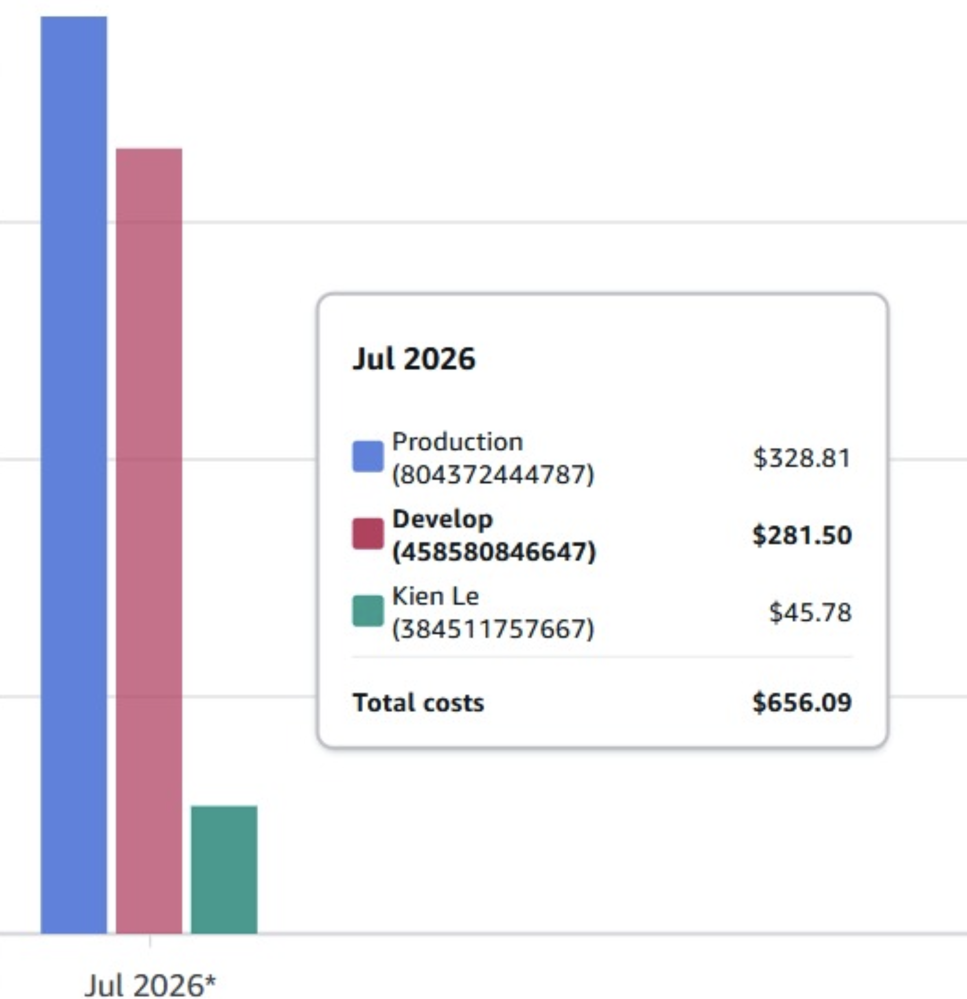
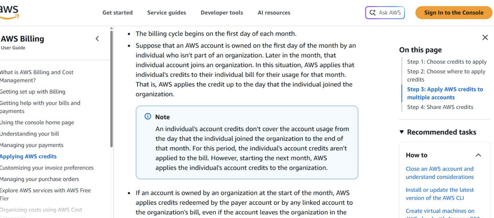

# Incident Report

**Title:** AWS Organizations & Credit Allocation Issue During Environment Separation

**Date:** 2026-07-28

**Status:** Resolved

## 1. Background

Để tách biệt môi trường triển khai và quản lý tài nguyên, nhóm thiết lập một AWS Organization với cấu trúc như sau:

- **Management Account:** KIEN LE
- **Member Accounts:**
  - Production
  - Development

Toàn bộ AWS Credits được quản lý trên Management Account (KIEN LE). Các workload của dự án được triển khai trên hai member accounts (Production và Development).

## 2. Incident Summary

Trong quá trình triển khai hạ tầng trên hai môi trường Production và Development, nhóm phát hiện hai member accounts không được áp dụng AWS Credits theo chính sách của chương trình credit đang sử dụng, trong khi credits được quản lý trên Management Account (KIEN LE).

Do chưa thể xác nhận rằng chi phí phát sinh trên các member accounts sẽ được bù trừ bằng AWS Credits, nhóm xác định có nguy cơ phát sinh chi phí ngoài ý muốn nếu tiếp tục triển khai.

Sau khi họp và trao đổi với các mentor, nhóm thống nhất thực hiện phương án tạm dừng toàn bộ hoạt động triển khai, destroy tất cả các resources trên Production và Development, đồng thời kiểm tra lại Billing của từng account và xác minh cơ chế áp dụng AWS Credits trước khi tiếp tục triển khai hệ thống.

## 3. Impact

- Hoạt động triển khai trên môi trường Production và Development bị tạm dừng.
- Một số tài nguyên đã được xóa (destroy) để tránh phát sinh chi phí.
- Tiến độ triển khai bị gián đoạn trong thời gian xác minh cơ chế billing và credit.

## 4. Root Cause

Nguyên nhân trực tiếp là nhóm phát hiện cơ chế áp dụng AWS Credits không hoạt động như kỳ vọng đối với hai member accounts trong AWS Organization.

Trước khi triển khai workload, nhóm chưa xác minh đầy đủ cách chương trình AWS Credits được áp dụng trong mô hình sử dụng AWS Organizations, dẫn đến việc chưa thể đảm bảo rằng chi phí của các member accounts sẽ được bù trừ bằng credits.

## 5. Resolution

Nhóm thực hiện các bước xử lý sau:

- Tạm dừng toàn bộ hoạt động triển khai.
- Destroy toàn bộ tài nguyên trên Production và Development.
- Kiểm tra Billing của từng account..
- Chuẩn bị phương án triển khai lại sau khi xác nhận cách phân bổ credits phù hợp.

## 6. Lessons Learned

- Xác minh chính sách áp dụng AWS Credits trước khi thiết kế mô hình AWS Organizations.
- Kiểm tra Billing và Credits ngay sau khi tạo Organization hoặc thay đổi kiến trúc tài khoản.
- Thực hiện thử nghiệm với workload nhỏ trước khi triển khai toàn bộ hệ thống.
- Thiết lập checklist xác nhận Billing/Credits trước mỗi lần triển khai hạ tầng.

## Evidence

