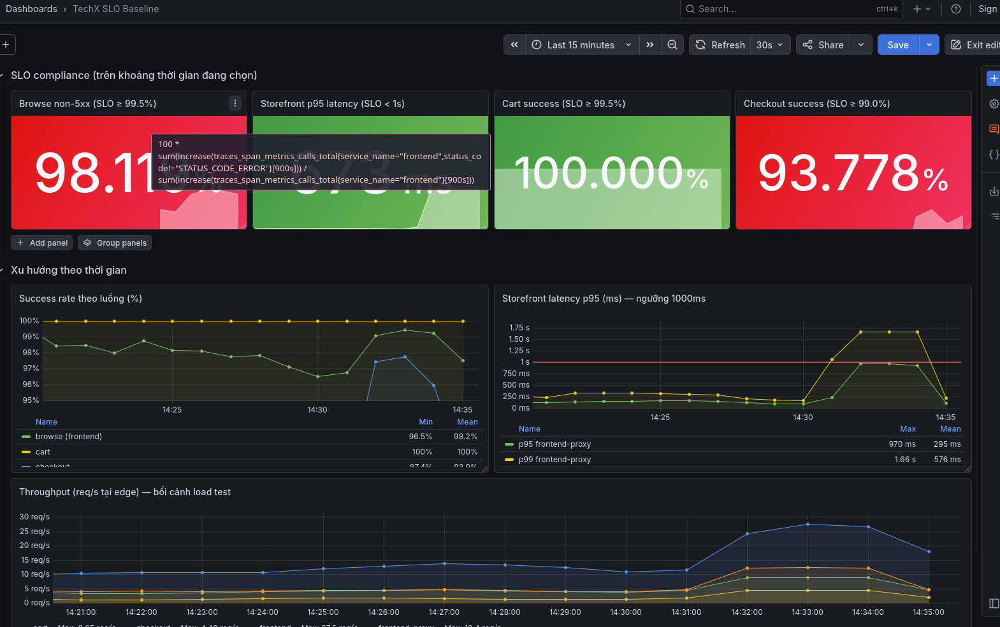
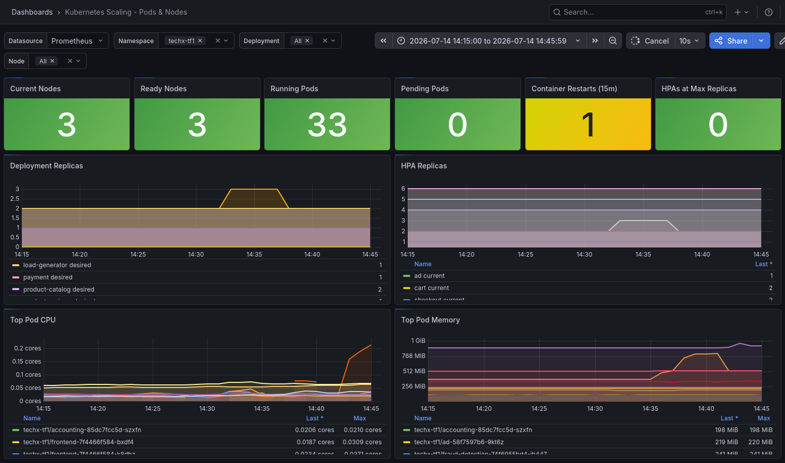
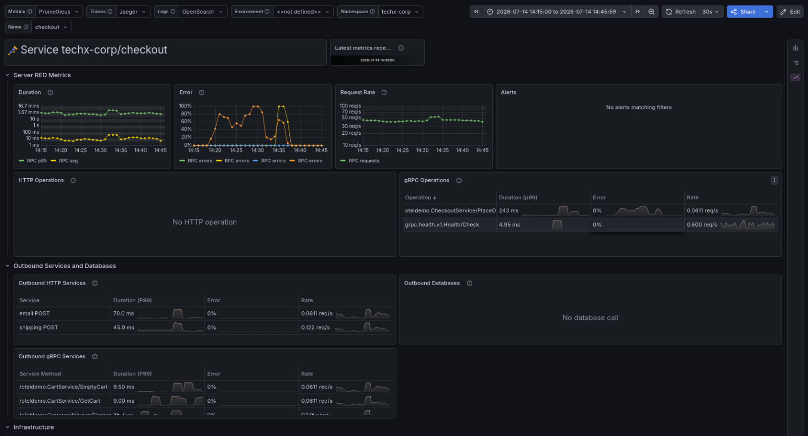
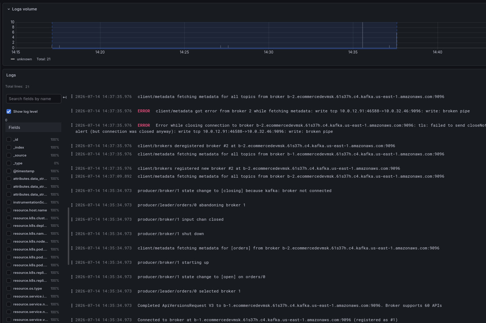
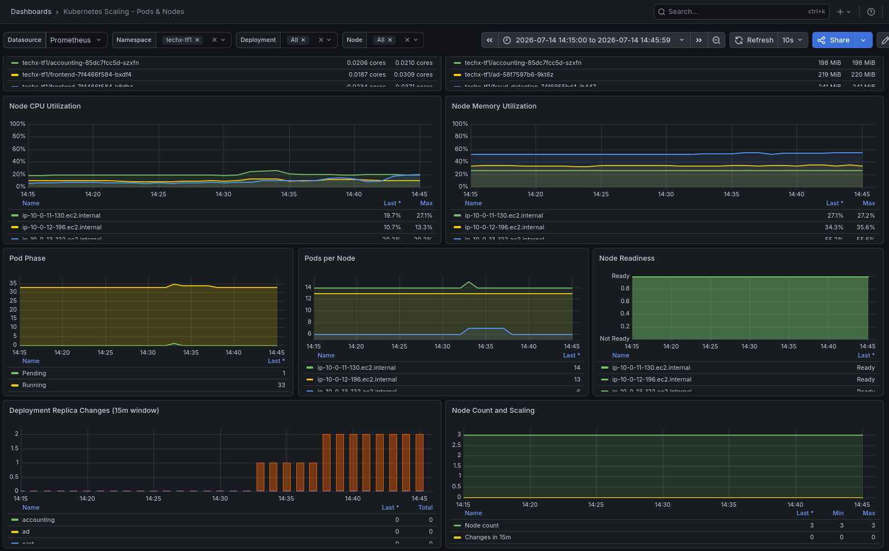

# Postmortem / COE - INC-20260714-FLAGD - TF1

## Tóm tắt

Hệ thống bị thử nghiệm sự cố (tấn công giả lập) thông qua việc thay đổi cấu hình flagd trung tâm từ BTC, đi kèm việc khởi chạy các pod curl độc lập để kích hoạt lỗi. Sự cố gây lỗi diện rộng tại luồng Checkout/Payment do lỗi thanh toán và nghẽn hàng đợi Kafka đồng bộ, quá tải CPU khiến frontend scale-up, và dịch vụ giám sát Grafana bị sập (OOMKilled) liên tục 20 lần do lượng dữ liệu giám sát tăng đột biến vượt quá giới hạn tài nguyên.

## Mức độ & ảnh hưởng khách

- **Severity**: Major (Ảnh hưởng trực tiếp đến tính sẵn sàng của luồng thanh toán và hệ thống giám sát).
- **Luồng bị ảnh hưởng**: Checkout / Payment / Kafka Queue / Observability (Grafana).
- **SLO bị ảnh hưởng**:
  - Tỷ lệ thanh toán thành công giảm mạnh trong thời gian tải (không đạt SLO checkout ≥ 99%).
  - Độ trễ phản hồi (storefront p95) tăng cao do luồng Checkout bị nghẽn đồng bộ tại bước ghi tin nhắn sang Kafka.
- **Thời gian kéo dài**: ~12 phút (từ 14:30 đến 14:42 ngày 14/07/2026).
- **Phạm vi ảnh hưởng**: Toàn bộ khách hàng thực hiện checkout và hệ thống giám sát của đội vận hành trong thời gian diễn ra sự cố.

## Timeline

| Thời điểm | Sự kiện (phát hiện / chẩn đoán / hành động / phục hồi)                                                                                                                                                                                                      |
| --------- | ----------------------------------------------------------------------------------------------------------------------------------------------------------------------------------------------------------------------------------------------------------- |
| **14:30** | BTC kích hoạt các flag sự cố trên server flagd trung tâm (`paymentFailure`, `kafkaQueueProblems`, `loadGeneratorFloodHomepage`, `emailMemoryLeak`...). Pod test `pf-19276` khởi chạy để giả lập lỗi thanh toán. Đồng thời hàng đợi Kafka bị spam gây nghẽn. |
| **14:31** | Pod test `mx-6980` chạy test rò rỉ bộ nhớ email. Pod `rt-15604` chạy test probe/rate limit. Phát hiện lỗi giao dịch hàng loạt từ log frontend.                                                                                                              |
| **14:32** | Pod test `rt1-17507` và `rt2-17507` chạy test. Horizontal Pod Autoscaler (HPA) tự động scale frontend từ 2 lên 3 replicas do CPU vượt ngưỡng chịu tải.                                                                                                      |
| **14:33** | Pod test `fr-22647` chạy giả lập flood homepage.                                                                                                                                                                                                            |
| **14:36** | Lượng log/metric sinh ra quá lớn từ đợt flood khiến Grafana vượt quá giới hạn tài nguyên bộ nhớ (`limits.memory: 300Mi`), bị **OOMKilled** liên tục (tổng cộng 20 lần restart).                                                                             |
| **14:37** | Lượng tải từ load-generator giảm xuống, HPA tự động scale down frontend từ 3 về lại 2 replicas.                                                                                                                                                             |
| **14:42** | BTC đưa cấu hình flagd trung tâm về mặc định (`off`). Các pod test tự giải phóng. Hệ thống tự phục hồi hoàn toàn.                                                                                                                                           |

## Nguyên nhân gốc

1. **Lỗi Checkout/Payment**: Flag `paymentFailure` được kích hoạt làm dịch vụ Payment trả về lỗi logic (`Payment request failed. Invalid token. app.loyalty.level=gold`).

   

2. **Nghẽn Hàng Đợi Kafka**: Flag `kafkaQueueProblems` làm chậm việc xử lý tin nhắn của consumer (lag spike) và spam tin nhắn gây nghẽn hàng đợi. Vì Checkout gọi `sendToPostProcessor` đồng bộ (blocking), luồng xử lý đơn hàng của Checkout bị treo khi đẩy tin nhắn vào `cs.KafkaProducerClient.Input()` và chờ phản hồi ở kênh `Successes()`, kéo sập SLO về độ trễ.

   

3. **Sập Grafana (OOMKilled)**: Giới hạn bộ nhớ của Grafana quá thấp (`300Mi`), không đủ tài nguyên để Bleve-search index và xử lý dữ liệu OpenSearch/Prometheus đổ về dồn dập trong lúc hệ thống bị flood homepage, dẫn đến bị OOMKilled 20 lần (thực tế đo trên EKS).
4. **Cảnh báo `FailedPreStopHook`**: preStop hook của các service distroless (`checkout`, `product-catalog`, `frontend`) bị lỗi khi pod terminate vì image distroless không chứa shell (`/bin/sh` hoặc lệnh `sleep`).
5. **Cảnh báo `startupProbe`**: Một số pod frontend mới khởi chạy dưới tải nặng gặp lỗi `context deadline exceeded` do default timeout của probe chỉ là `1s`, không kịp phản hồi khi CPU đang bận khởi động container Next.js. Tuy nhiên, `failureThreshold: 24` đã hấp thụ hết lỗi và giúp pod cuối cùng đạt trạng thái Ready an toàn với 0 lần restart thực tế.

## Thực nghiệm & Kiểm chứng thực tế (KB3)

Trong quá trình phân tích cảnh báo `FailedPreStopHook` trên 3 dịch vụ sử dụng ảnh distroless, đội ngũ đã thực hiện load-test bằng Locust và tiến hành rolling-restart cả 3 dịch vụ này dưới tải để đo lường tác động thực tế:

* **Kết quả đo từ Locust (Client-side)**: Thực hiện tổng cộng 175 requests, ghi nhận duy nhất 1 lỗi HTTP 500 từ dịch vụ `recommendation` (thuộc luồng phụ, best-effort), hoàn toàn **0 lỗi connection reset / connection refused** trên luồng mua hàng chính (browse -> cart -> checkout).
* **Kết quả đo từ Prometheus**:
  * `checkout`: 0 errors (Success Rate 100%)
  * `cart`: 0 errors (Success Rate ~100%)
  * `frontend`: 0 errors (Success Rate 100%)
  * `product-catalog`: 0 errors (Success Rate 100%)
* **Cơ chế đảm bảo**: Lỗi `preStop` là vô hại vì graceful shutdown được bảo vệ tốt bởi 3 lớp:
  1. `maxUnavailable: 0` đảm bảo pod cũ chỉ tắt sau khi pod mới đã `Ready`.
  2. `terminationGracePeriodSeconds: 30` cho phép pod cũ có 30 giây để xử lý kết nối còn tồn đọng sau tín hiệu SIGTERM.
  3. Bản thân ứng dụng (Go gRPC GracefulStop, Next.js drain) tự bắt tín hiệu `SIGTERM` và giải phóng kết nối một cách an toàn.

**Kết luận**: Lỗi `FailedPreStopHook` và cảnh báo `startupProbe` hiện tại là **vô hại** dưới tải, không cần sửa đổi hay rebuild image cho bản demo nhằm giảm thiểu độ phức tạp và rủi ro.

## Loại sự cố

- **flagd BTC bơm vào** (sự cố giả lập để kiểm tra độ tin cậy của hệ thống).
- *Hướng xử lý*: Cải tiến hệ thống chịu được lỗi (resilience) qua fallback, retry, async processing và tối ưu hóa tài nguyên (Resource limits).

## Xử lý

- BTC tắt cấu hình sự cố về mặc định. Hệ thống tự phục hồi.
- **MTTD** (Thời gian phát hiện): ~2 phút (từ lúc bắt đầu lỗi đến lúc phát hiện lỗi trong log/metric).
- **MTTR** (Thời gian phục hồi): ~12 phút.

## Việc theo sau

| Việc | Chủ | Hạn | Trạng thái | ADR liên quan |
| --- | --- | --- | --- | --- |
| Chuyển lời gọi `sendToPostProcessor` (ghi sang Kafka) trong Checkout thành bất đồng bộ (Goroutine) để cô lập lỗi hàng đợi | CDO team | 15/07/2026 | **Cần thực hiện** | ADR-PERF-005 |
| Tăng memory limit của Grafana lên `512Mi`/`1Gi` để tránh OOMKilled | CDO team | 15/07/2026 | **Cần thực hiện** | ADR-REL-004 |
| Bổ sung cơ chế Fallback lưu trạng thái đơn hàng PENDING khi cổng thanh toán chính gặp sự cố kết nối | CDO team | 16/07/2026 | **Cần thực hiện** | ADR-REL-005 |
| Cấu hình Rate Limiting tại `frontend-proxy` để chặn bớt lưu lượng spam từ load-generator | CDO team | 16/07/2026 | **Cần thực hiện** | ADR-SEC-003 |

## Ký tên

- On-call team: TF1 Operations Team (CDO09).
- Ngày lập: 14/07/2026.
