# MANDATE-05 — Runtime Hardening Report

**Team:** TF1 (CDO05) · **Ngày:** 2026-07-17 · **Cluster:** `ecommerce-dev-eks` / us-east-1

---

## 1. Kết quả tổng hợp

| Yêu cầu | Giải pháp | Trạng thái |
|---|---|---|
| Không container chạy root | `run-as-non-root` — MustRunAsNonRoot | ✅ deny |
| Không image tag di động | `deny-floating-image-tag` — cấm `latest/dev/master/main/stable/edge` | ✅ deny |
| Workload phải khai báo resource | `require-cpu-memory-limits-requests` | ✅ deny |
| Cấm privilege escalation | `deny-privilege-escalation` | ✅ deny |
| Capabilities tối thiểu | `psp-capabilities` — drop ALL, chỉ add `NET_BIND_SERVICE` | ✅ deny |

```
kubectl get constraint -A
NAME                                 ENFORCEMENT-ACTION   TOTAL-VIOLATIONS
deny-floating-image-tag              deny                 0
run-as-non-root                      deny                 0
deny-privilege-escalation            deny                 0
psp-capabilities                     deny                 0
require-cpu-memory-limits-requests   deny                 0
```

**→ 5/5 constraint `deny` · TOTAL-VIOLATIONS = 0**

---

## 2. Evidence — Test bị chặn (Negative)

| Test | Vi phạm | Kết quả |
|---|---|---|
| `neg-01-root.yaml` | Thiếu `runAsNonRoot` / `runAsUser` | ✅ REJECT |
| `neg-02-image-latest.yaml` | Tag `:latest` | ✅ REJECT |
| `neg-08-no-image-tag.yaml` | Không có image tag | ✅ REJECT |
| `neg-03-missing-resources.yaml` | Thiếu toàn bộ requests + limits | ✅ REJECT |
| `neg-10-missing-limits-only.yaml` | Có requests, thiếu limits | ✅ REJECT |
| `neg-04-priv-esc-true.yaml` | `allowPrivilegeEscalation: true` | ✅ REJECT |
| `neg-05-priv-esc-missing.yaml` | Thiếu field `allowPrivilegeEscalation` | ✅ REJECT |
| `neg-06-no-drop-all.yaml` | Không drop ALL capabilities | ✅ REJECT |
| `neg-07-add-dangerous-cap.yaml` | Add `SYS_ADMIN` | ✅ REJECT |

### N-01 · run-as-non-root
```bash
# Lệnh thực thi:
$ kubectl apply -f gatekeeper/tests/neg-01-root.yaml

# Phản hồi từ server:
Error from server (Forbidden): [run-as-non-root] Container neg-root is attempting to run
without a required securityContext/runAsNonRoot or securityContext/runAsUser != 0
```
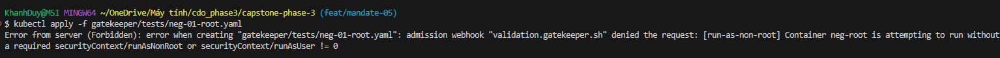

### N-02 · deny-floating-image-tag (latest)
```bash
# Lệnh thực thi:
$ kubectl apply -f gatekeeper/tests/neg-02-image-latest.yaml

# Phản hồi từ server:
Error from server (Forbidden): [deny-floating-image-tag] container <neg-image-latest>
has a disallowed tag
```
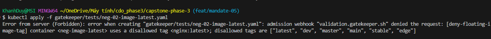

### N-03 · deny-floating-image-tag (no tag)
```bash
# Lệnh thực thi:
$ kubectl apply -f gatekeeper/tests/neg-08-no-image-tag.yaml

# Phản hồi từ server:
Error from server (Forbidden): [deny-floating-image-tag] container <neg-no-image-tag>
didn't specify an image tag <public.ecr.aws/docker/library/nginx>
```
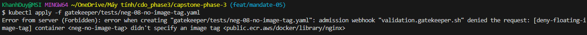

### N-04 · require-resources (thiếu cả requests + limits)
```bash
# Lệnh thực thi:
$ kubectl apply -f gatekeeper/tests/neg-03-missing-resources.yaml

# Phản hồi từ server:
Error from server (Forbidden): [require-cpu-memory-limits-requests]
  container <neg-missing-resources> does not have <{"cpu", "memory"}> limits defined
  container <neg-missing-resources> does not have <{"cpu", "memory"}> requests defined
```
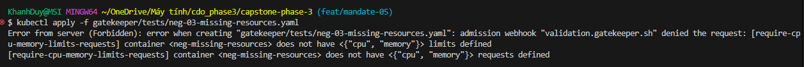

### N-05 · require-resources (thiếu limits)
```bash
# Lệnh thực thi:
$ kubectl apply -f gatekeeper/tests/neg-10-missing-limits-only.yaml

# Phản hồi từ server:
Error from server (Forbidden): [require-cpu-memory-limits-requests]
  container <neg-missing-limits-only> does not have <{"cpu", "memory"}> limits defined
```
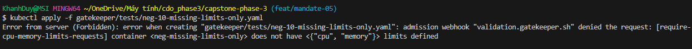

### N-06 · deny-privilege-escalation (true)
```bash
# Lệnh thực thi:
$ kubectl apply -f gatekeeper/tests/neg-04-priv-esc-true.yaml

# Phản hồi từ server:
ValidatingAdmissionPolicy 'gatekeeper-k8spspallowprivilegeescalationcontainer'
denied request: Privilege escalation container is not allowed: nginx:1.27
```
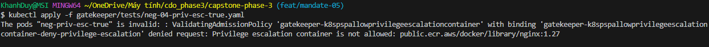

### N-07 · deny-privilege-escalation (missing)
```bash
# Lệnh thực thi:
$ kubectl apply -f gatekeeper/tests/neg-05-priv-esc-missing.yaml

# Phản hồi từ server:
ValidatingAdmissionPolicy 'gatekeeper-k8spspallowprivilegeescalationcontainer'
denied request: Privilege escalation container is not allowed: nginx:1.27
```
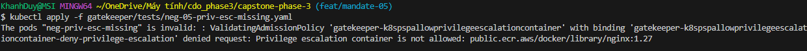

### N-08 · psp-capabilities (no drop ALL)
```bash
# Lệnh thực thi:
$ kubectl apply -f gatekeeper/tests/neg-06-no-drop-all.yaml

# Phản hồi từ server:
ValidatingAdmissionPolicy 'gatekeeper-k8spspcapabilities'
denied request: containers are not dropping all required capabilities:
{container: neg-no-drop-all, capabilities: [ALL]}
```
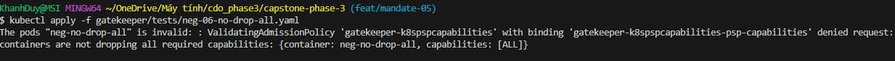

### N-09 · psp-capabilities (SYS_ADMIN)
```bash
# Lệnh thực thi:
$ kubectl apply -f gatekeeper/tests/neg-07-add-dangerous-cap.yaml

# Phản hồi từ server:
ValidatingAdmissionPolicy 'gatekeeper-k8spspcapabilities'
denied request: containers have disallowed capabilities:
{container: neg-add-dangerous-cap, capabilities: [SYS_ADMIN]}
```
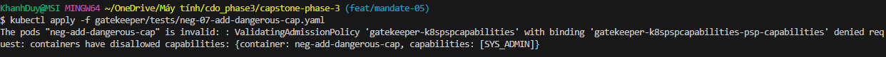

---

## 3. Evidence — Pod hợp lệ không bị chặn (Positive)

| Test | Điểm hợp lệ | Kết quả |
|---|---|---|
| `pos-01-valid.yaml` | Full compliant tất cả luật | ✅ PASS |
| `pos-02-run-as-nonroot-only.yaml` | `runAsNonRoot: true` (không cần `runAsUser`) | ✅ PASS |
| `pos-03-allowed-cap.yaml` | Add `NET_BIND_SERVICE` (whitelist) | ✅ PASS |
| `pos-04-exempt-image.yaml` | Image `pause*` trong exemptImages | ✅ PASS |

```
# Lệnh thực thi:
$ kubectl apply --dry-run=server -f pos-01-valid.yaml

# Phản hồi từ server:
pod/pos-valid created (server dry run)

# Lệnh thực thi:
$ kubectl apply --dry-run=server -f pos-02-run-as-nonroot-only.yaml

# Phản hồi từ server:
pod/pos-run-as-nonroot-only created (server dry run)

# Lệnh thực thi:
$ kubectl apply --dry-run=server -f pos-03-allowed-cap.yaml

# Phản hồi từ server:
pod/pos-allowed-cap created (server dry run)

# Lệnh thực thi:
$ kubectl apply --dry-run=server -f pos-04-exempt-image.yaml

# Phản hồi từ server:
pod/pos-exempt-image created (server dry run)
```

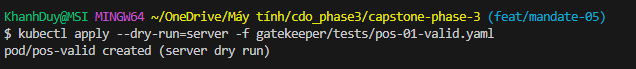
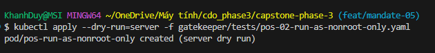
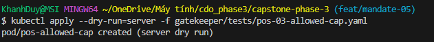
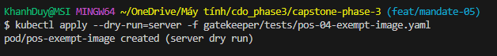

---

## 4. Ngoại lệ (Observability Stack)

Ghi trong constraint files + ADR-003 §4 · **hết hạn 2026-12-31**:

| Image | Lý do |
|---|---|
| `otel/opentelemetry-collector-contrib*` | DaemonSet cần đọc host metrics |
| `quay.io/prometheus/prometheus*` | Node scraping |
| `jaegertracing/jaeger*` | Trace collector |
| `opensearchproject/opensearch*` | Log storage (priv-esc only) |

---

## 5. Cách chuyển audit → enforce an toàn

1. Chạy `dryrun` → ghi nhận violations.
2. Dọn sạch vi phạm trước (violations = 0).
3. Flip từng constraint: `deny-floating-image-tag` → `require-resources` → `run-as-non-root` → `deny-privilege-escalation` → `psp-capabilities`.
4. Sau mỗi flip: test negative (phải REJECT) + kiểm pods không rớt.
5. Rollback tức thì nếu cần: `kubectl patch <kind> <name> --type=merge -p '{"spec":{"enforcementAction":"dryrun"}}'`

---

**Mandate-05 DONE ✅** — 9/9 REJECT · 4/4 PASS · VIOLATIONS = 0

*CDO05 TF1 · 2026-07-17*
