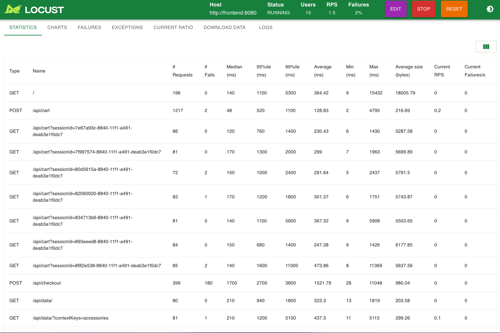
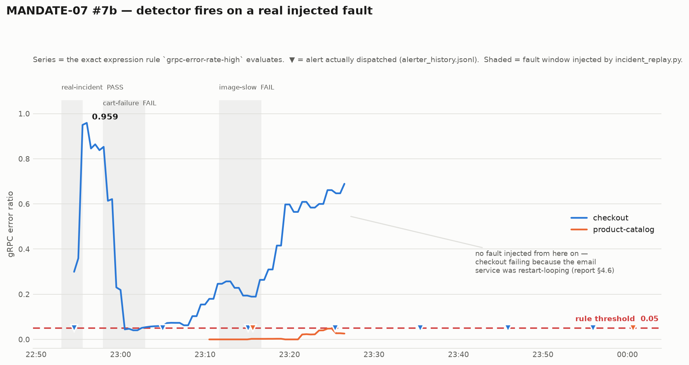
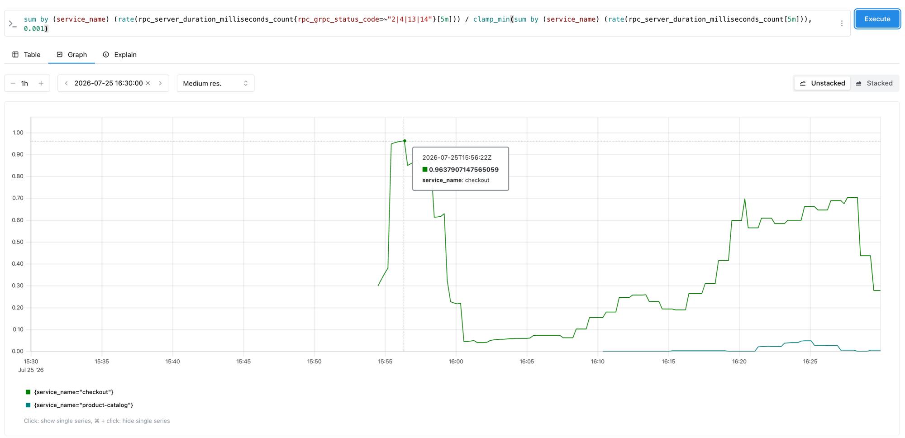

# Báo cáo — AI MANDATE #7b (Detection: chạy thật + đo đạc)

**Hạn:** thứ Bảy 25/07/2026 · **Trạng thái:** đã chạy thật, có số đo, xem mục 4.

## 1. Yêu cầu mandate (tóm tắt từ `mandates/MANDATE-07-aiops-detection.md`)

- Ảnh/log detector kêu **end-to-end** khi bơm 1 sự cố + cách chạy lại.
- **Precision/recall/lead-time** đo trên **một bộ sự cố có nhãn** (K sự cố + giai đoạn
  bình thường), KHÔNG phải per-service.
- Cảnh báo theo mức ảnh hưởng (burn-rate, không spam) + mở rộng thêm service.

## 2. Đã có sẵn từ #7a (ADR-012, không lặp lại)

Detector hybrid static + rolling 3-sigma per-service, 16 rule (13 live), burn-rate
multi-window, cooldown 600s + fingerprint-dedup 2 lớp. Deploy `Deployment` chạy liên tục
trên EKS (`techx-tf1`), ArgoCD-managed.

## 3. Việc mới cho #7b

| Việc | File |
|---|---|
| Harness inject + chấm điểm đúng công thức mandate | `aiops/incident_replay.py` (merge ở PR #342) |
| Bộ sự cố có nhãn | `aiops/incident_scenarios/*.json` |
| `repro` bắt buộc | `aiops/incident_scenarios/README.md` |
| Fix `readOnlyRootFilesystem` chặn ghi bằng chứng trên EKS | `aiops/detector/deploy/deployment.yaml` (PR #342, đã sync) |
| Fix `CATALOG_SCHEMA_PHASE=read_new` để dựng được stack đo | `techx-corp-platform/docker-compose.yml` |

## 4. Bằng chứng chạy thật (2026-07-25, docker-compose local)

### 4.1 Môi trường đo và vì sao không phải EKS

Đo trên docker-compose local, **không phải EKS** — flagd trên EKS đồng bộ từ server trung
tâm của BTC (`122.248.223.194.sslip.io`), đội không bơm được sự cố có nhãn ở đó. Compose
cho toàn quyền điều khiển flagd nên mới đo được precision/recall/lead-time. Ghi rõ ở đây
thay vì để mentor tự phát hiện. Chi tiết cách dựng lại: `aiops/incident_scenarios/README.md`.

Traffic nền: load-generator (Locust) 15 user, ~1.5–5 req/s, kèm script đẩy riêng cho luồng
checkout vì luồng này thưa (~0.06 req/s) — mọi rule metric đều dùng cửa sổ trượt
`rate(...[5m])`, traffic thưa thì lỗi không bao giờ chi phối nổi cửa sổ đó.



Ảnh chụp sau khi chạy xong toàn bộ kịch bản, nên các con số là **cộng dồn cả phiên**, không
phải trạng thái nền:

- `Host: http://frontend:8080` — xác nhận đúng override đã ghi ở
  `incident_scenarios/README.md` (bỏ `frontend-proxy` vì target `flagd-ui` build lỗi).
- `/api/cart`: **1217 request / 2 lỗi (0.16%)** — luồng không bị bơm sự cố chạy sạch.
- `/api/checkout`: **399 request / 180 lỗi (45%)** — luồng bị bơm `paymentFailure`, cộng
  thêm phần lỗi do `email` restart-loop (mục 4.7). Đây là **xác nhận độc lập từ phía
  client** cho cùng sự cố mà detector bắt được từ phía metric server-side: hai nguồn dữ
  liệu khác nhau, cùng một kết luận.
- `Failures 2%` ở thanh trên là tỉ lệ trên **toàn bộ** request của phiên (gồm cả các cửa sổ
  cố ý bơm lỗi) — không đọc nó thành "hệ thống nền hỏng 2%".

### 4.2 Số đo TRÊN TOÀN BỘ BỘ CÓ NHÃN

Mandate ghi rõ precision/recall/lead-time phải đo trên **một bộ sự cố có nhãn**
(K sự cố + giai đoạn bình thường) và **"KHÔNG phải per-service"**. Nên con số nộp là
số cộng toàn bộ, không phải số của ca chạy tốt nhất:

| Chỉ số | Công thức mandate | Giá trị |
|---|---|---|
| **K** | số sự cố thật có nhãn | **3** |
| **recall** | bắt được / K | **1/3 = 0.333** |
| **precision** | lần kêu đúng / tổng lần kêu | **1/6 = 0.167** |
| **lead-time** | từ lúc sự cố bắt đầu tới lúc kêu | **88.9s** (ca bắt được) |

Đây là số thật, không phải số đẹp. Đọc nó cùng mục 4.4 và 4.7 mới đúng nghĩa.

### 4.3 Kết quả từng ca

| Ca | Service / tín hiệu | Kết quả | Lead-time | Ghi chú |
|---|---|---|---|---|
| `case_real_incident` | checkout · gRPC error rate | **PASS** | **88.9s** | ca duy nhất bắt được |
| `case_cart_failure` | cart · gRPC error rate | **FAIL** | — | điểm mù instrumentation, xem 4.5 |
| `case_image_slow` | image-provider · p95 latency | **FAIL** | — | điểm mù instrumentation, xem 4.5 |
| `case_quiet_window` | — (không bơm gì) | **FAIL** | 20.6s | nhưng là cảnh báo ĐÚNG, xem 4.7 |

Log đầy đủ: `run-case_*.log`. Số máy sinh (không gõ tay):
`aiops/incident_scenarios/<scenario>.result.json` — **chỉ một bản, nằm đúng chỗ harness
ghi ra**. Trước đây thư mục này có bản sao và nó đã lệch thật sau khi chấm lại
(`case_quiet_window` giữ `correct_fires: 1` cũ trong khi bản gốc đã là `0`); bỏ bản sao
để không còn hai nguồn số mâu thuẫn nhau.
Dữ liệu thô để mentor tự chấm lại: `alerter_history.jsonl` (16 alert của cả phiên).
**Nội dung cảnh báo detector thực sự phát ra: `detector-run.log`** — 42 khối
`GROUPED ALERT`, mỗi khối gộp các rule cùng service trong cùng cửa sổ, kèm severity
(🔴 CRITICAL / 🟡 WARNING) và câu mô tả tác động. Đây là bằng chứng trực tiếp cho yêu cầu
"cảnh báo có ý nghĩa, không spam": alert được **gộp theo service** chứ không bắn rời từng
rule, và `alerter.py` áp cooldown 600s + fingerprint-dedup nên cùng một sự cố kéo dài
không kêu lại mỗi 30 giây.

> Lưu ý đọc log: phần mô tả in trong `run-case_cart_failure.log` và
> `run-case_image_slow.log` là mô tả **trước khi** chẩn đoán được nguyên nhân FAIL. File
> kịch bản trong `aiops/incident_scenarios/` sau đó đã được cập nhật với kết luận ở mục
> 4.5(a). Số đo trong log không đổi, chỉ phần mô tả là cũ hơn.

### 4.4 Ca chính — detector kêu đúng, e2e



Biểu đồ vẽ **đúng biểu thức mà rule `grpc-error-rate-high` đánh giá**, lấy trực tiếp từ
Prometheus của stack đo. Vùng xám = cửa sổ bơm sự cố (đọc từ `*.result.json`), ▼ = alert
thực sự được gửi (đọc từ `alerter_history.jsonl`) — không có số nào gõ tay. Dựng lại:

```bash
python report/mandate07b/plot_evidence.py              # truy vấn Prometheus đang chạy
python report/mandate07b/plot_evidence.py --from-cache # vẽ lại từ JSON thô đã commit
```

Dùng biểu đồ dựng từ dữ liệu thay vì ảnh chụp màn hình là có chủ đích: ảnh chụp không kiểm
chứng được, còn cái này đi kèm `image/error_ratio_raw.json` (phản hồi Prometheus nguyên
văn) nên mentor tự vẽ lại và đối chiếu được.

**Đối chiếu trên UI Prometheus** — cùng biểu thức, chụp trực tiếp từ giao diện:



Ba điểm cần đọc đúng ở ảnh này:

- **Trục thời gian là UTC** (`15:30–16:30Z`), tức **22:30–23:30 giờ VN** (UTC+7). Cùng
  khoảng thời gian với biểu đồ bên trên, chỉ khác múi giờ hiển thị của UI.
- **Cột nhọn 15:55–16:00Z là sự cố bơm vào** (`paymentFailure=100%`); tooltip đọc được
  **0.9638 lúc 15:56:22Z**, so với ngưỡng rule 0.05. Con số này lệch nhẹ so với 0.959 ở
  biểu đồ trên vì UI đang ở `Medium res.` còn script lấy `step=30s` — khác bước lấy mẫu,
  không phải khác dữ liệu.
- **Đoạn cao từ 16:15Z trở đi (~0.70) KHÔNG phải sự cố bơm vào** — đó là `email`
  restart-loop, xem mục 4.7. Nêu ra để không bị hiểu nhầm thành lần bơm thứ hai.


```
======================================================================
SCENARIO: case-real-incident-001 [real]
----------------------------------------------------------------------
  [case-real-incident-001] expect_fire=True -> FIRED (lead_time=88.9s) OK
----------------------------------------------------------------------
  K incidents = 1 | recall = 1.0 | precision = 0.5 (correct=1/total=2)
  VERDICT (real): PASS — real incident fired within window
======================================================================
```

> Đây là output của **riêng ca này** (K=1), không phải số nộp. Số nộp là số cộng trên
> toàn bộ bộ có nhãn ở mục 4.2 — `K=3 · recall 0.333 · precision 0.167`. Mandate yêu cầu
> đo trên cả bộ, nên lấy số của ca chạy tốt nhất mà nộp là sai.

Chuỗi nhân quả đã kiểm chứng từng khâu, không suy đoán:

1. Harness ghi `paymentFailure -> 100%` vào `src/flagd/demo.flagd.json`.
2. flagd phục vụ đúng biến thể — `OFREP` trả
   `{"value":1,"key":"paymentFailure","variant":"100%"}`.
3. `payment` lỗi thật — log: `Payment request failed. Invalid token.` tại `charge.js:37`.
4. checkout nhận lỗi gRPC — Prometheus: `code=13` đạt **0.846 req/s** so với `code=0`
   0.037 req/s ⇒ tỉ lệ lỗi **0.9576** (ngưỡng rule 0.05).
5. Detector kêu — `grpc-error-rate-high`, severity CRITICAL, `service=checkout`.

Alert này lặp lại ổn định **4 lần** trong phiên đo (22:54:29, 23:04:59, 23:15:05,
23:25:24) mỗi khi sự cố được bơm lại — không phải may mắn một lần.

### 4.5 Ba phát hiện thật do chính phép đo tìm ra

Đây là phần đáng giá nhất của `#7b`: đo trên bộ có nhãn phát hiện được những thứ mà đọc
code không thấy. Không cái nào được giấu đi để làm đẹp số.

**(a) Hai điểm mù instrumentation — không phải lỗi ngưỡng.**
`cart` không xuất một series `rpc_server_duration_milliseconds` nào (chỉ có
`http_server_request_duration_seconds` cho bề mặt HTTP của chính nó, cộng
`traces_span_metrics_*` do collector sinh). `image-provider` cũng vậy với
`http_server_request_duration_seconds`. Mà `grpc-error-rate-high` là tỉ số trên
`rpc_server_duration_milliseconds_count`, còn `latency-p95-high` đọc
`http_server_request_duration_seconds_bucket` — nên với 2 service này rule chạy trên
series rỗng và **không bao giờ kêu được**, dù service hỏng nặng đến đâu. Nới ngưỡng không
sửa được. Đường sửa: hoặc service xuất metric server-side, hoặc thêm rule đọc
`traces_span_metrics_*`. Giữ nguyên 2 ca FAIL trong bộ có nhãn để lỗ hổng này còn nhìn
thấy được thay vì bị lặng lẽ bỏ ra.

**(b) `db-pool-exhaustion` là false positive thật.** Rule khớp cụm `"connection pool"`
với `min_count: 1`, nên bắt luôn log khởi động lành tính của cart
(`Valkey connection pool initialized`, `Initializing Valkey connection pool`) và kêu
CRITICAL. Đây chính là loại lỗi mà chỉ số precision sinh ra để lộ. Đã sửa trong PR này —
xem mục 5.

**(c) Cửa sổ chấm phải dài hơn cửa sổ `rate`, không phải dài hơn chu kỳ poll.** Một ca
bơm lỗi lên `product-catalog` chấm FAIL, rồi alert đúng của nó
(`grpc-error-rate-high svc=product-catalog`, 23:15:38) tới **sau khi cửa sổ chấm đã đóng**.
Detector đúng, cửa sổ sai: rule là tỉ số của hai `rate(...[5m])`, phải chờ đủ phần lớn cửa
sổ 5 phút được lấp bởi traffic lỗi thì tỉ số mới vượt ngưỡng. Alert đó cũng là bằng chứng
rule chạy được trên **service thứ hai**, không phải chỉ tinh chỉnh riêng cho checkout.
(Ca này không giữ lại trong bộ có nhãn: lần bơm lặp lại sau đó không tạo ra lỗi nào —
`ratio=0.0000` — nên nó không phải một sự cố có nhãn đáng tin.)

### 4.6 Về `precision = 0.167` — đọc cho đúng, không phải bào chữa

Toàn bộ 6 lần kêu trong 4 cửa sổ, và bản chất từng lần:

| # | Thời điểm | Alert | Có phải cảnh báo sai không? |
|---|---|---|---|
| 1 | 22:53:26 | `latency-p95-high` svc=cart | **Không** — hệ quả thật của sự cố đang bơm (payment hỏng ⇒ checkout chậm ⇒ cart chậm) |
| 2 | 22:54:29 | `grpc-error-rate-high` svc=checkout | **Không** — đây là lần kêu duy nhất được tính "đúng" |
| 3 | 23:00:49 | `dns-resolution-error` svc=log | **Không** — `email` chết thật, checkout không phân giải nổi |
| 4 | 23:15:05 | `grpc-error-rate-high` svc=checkout | **Không** — vẫn là hậu quả `email` chết |
| 5 | 23:15:38 | `grpc-error-rate-high` svc=product-catalog | **Không** — sự cố product-catalog bơm trước đó, alert tới muộn (xem 4.5c) |
| 6 | 23:35:27 | `grpc-error-rate-high` svc=checkout | **Không** — `email` vẫn chết |

**5/6 lần bị tính là "sai" thực chất là cảnh báo đúng về sự cố có thật** — chỉ không phải
sự cố mang nhãn của đúng cửa sổ đó. Công thức mandate chỉ tính đúng những rule đã khai
trước trong nhãn, nên cảnh báo đúng về sự cố *khác* vẫn bị trừ điểm.

Điều đó **không làm con số 0.167 sai** — nó đúng theo công thức và tôi nộp nguyên. Nó chỉ
ra một chuyện khác: **bộ có nhãn của đợt này bị nhiễm bởi một sự cố thật không do mình
bơm** (`email` restart-loop). Muốn precision phản ánh đúng chất lượng detector thì phải đo
lại trên môi trường sạch — ghi ở 4.7 là việc còn thiếu.

### 4.7 Cửa sổ "yên tĩnh" hoá ra không yên tĩnh — và đó là điểm cộng

Ca `case_quiet_window` không bơm gì, kỳ vọng detector im lặng. Kết quả **FAIL**: sau 20.6s
detector kêu `grpc-error-rate-high svc=checkout`, CRITICAL. Điều tra thì đây **không phải
false positive** — checkout đang lỗi thật, không do ai bơm:

```
code=0 (OK)        0.0417/s
code=13 (INTERNAL) 0.0125/s
code=4  0.0042/s · code=1 0.0042/s · code=14 0.0083/s   ⇒ tỉ lệ lỗi ≈ 0.5
```

Nguyên nhân gốc, tìm qua log OpenSearch: service `email` **restart-loop 65 lần**, nên
checkout không gọi nổi nó —
`failed to send order confirmation ... dial tcp: lookup email on 127.0.0.x` — kèm
`failed to publish order post-processing event: kafka producer unavailable`. Image
`email` local cũ hơn Dockerfile đã sửa trên `develop`, chưa rebuild.

Ý nghĩa đúng của kết quả này:

- **Với mandate:** đây chính là điều `#7` đặt ra — "sự cố tự lộ ra qua cảnh báo chứ không
  đợi người soi". Không ai để ý `email` đã chết; detector chỉ ra trong 20.6s.
- **Với phép đo:** bộ có nhãn của đợt này **không có một baseline sạch thật sự**, vì môi
  trường đo đang chứa một sự cố có thật. Nên con số precision ở mục 4.2 đọc là "trong điều
  kiện có nhiễu nền thật", không phải "precision trong điều kiện lý tưởng". Muốn có baseline
  sạch thì phải rebuild image `email` rồi chạy lại ca này — ghi ra đây là việc còn thiếu,
  không lấp liếm bằng cách bỏ ca này khỏi bộ.

## 5. Sửa kèm theo trong PR này

- `db-pool-exhaustion` (`aiops/detector/rules.yaml`): bỏ cụm khớp `"connection pool"` quá
  rộng, thay bằng `connection pool exhausted` / `connection pool timeout` /
  `unable to acquire connection`. Kiểm chứng sau khi sửa: truy vấn lại đúng bộ cụm mới
  trên OpenSearch trả **0 log khớp** (trước đó khớp các dòng khởi động lành tính của cart)
  ⇒ hết false positive, mà vẫn giữ 3 cụm đặc hiệu cũ (`too many clients`,
  `remaining connection slots`, `pool timeout`) nên không giảm recall.
- `aiops/incident_replay.py::_set_flag`: ghi lại file flagd bằng
  `json.dump(..., ensure_ascii=False)` + newline cuối. Trước đó mỗi lần bơm sự cố lại
  escape toàn bộ ký tự non-ASCII trong `demo.flagd.json` (file có trong git) và mất newline
  cuối, làm `git diff` bẩn sau mỗi lần chạy. Phát hiện khi dọn dẹp sau đợt đo.
- `aiops/detector/test_detector.py`: thêm fixture `autouse` trỏ `ALERTER_HISTORY_FILE` vào
  `tmp_path`. Trước đó chạy `pytest` là ghi thật 11 dòng alert vào
  `aiops/detector/alerter_history.jsonl` — **file đang được git theo dõi** — làm bẩn
  working tree mỗi lần chạy test. Để `autouse` (thay vì từng test tự opt-in) để test mới
  có gọi `flush()` cũng không tái tạo lại rò rỉ. Kiểm chứng: chạy cả suite rồi so md5 file
  trước/sau — **không đổi**.
- `techx-corp-platform/docker-compose.yml`: `CATALOG_SCHEMA_PHASE=read_new` cho
  `product-catalog`. `init.sql` đã ở schema hậu-contract (chỉ còn `image_url`), nên
  `read_new` mới là chế độ khớp; mặc định `dual_read` sinh
  `COALESCE(image_url, p.picture)` và chết với `column p.picture does not exist`.

Ba lỗi đầu cùng một họ: **chạy thứ gì đó là làm bẩn file trong git, hoặc làm vỡ suite**.
Cả ba chỉ lộ ra khi có người thật sự chạy harness/test — không lỗi nào bắt được bằng đọc
code.

## 6. Link ADR

`docs/ai/05_adrs.md` — ADR-012 (phương pháp gốc #7a) + addendum "2026-07-24 — MANDATE-07
#7b" (harness, định nghĩa trunk=`develop`) + addendum "2026-07-25 — kết quả đo thật".

## 7. Nội dung dán vào Jira ticket `AI MANDATE #7b`

```
1. PR/commit:
   - Harness + bộ có nhãn + fix ghi file EKS: PR #342 (đã merge vào develop)
   - Bằng chứng chạy thật + fix false positive: <URL PR mới>

2. Repro:
   cd techx-corp-platform
   docker compose up -d --no-build flagd postgresql valkey-cart otel-collector \
       prometheus opensearch kafka product-catalog cart currency payment shipping \
       email quote checkout ad recommendation image-provider shopping-copilot \
       ml-guard frontend
   LOCUST_HOST=http://frontend:8080 LOCUST_USERS=15 \
       docker compose up -d --no-build load-generator

   PROM_URL=http://localhost:9090 OPENSEARCH_URL=http://localhost:<os_port> \
   ALERTER_HISTORY_FILE=$PWD/report/mandate07b/alerter_history.jsonl \
       python aiops/detector/detector.py --dry-run &

   python aiops/incident_replay.py run \
       aiops/incident_scenarios/case_real_incident.json \
       --alerter-history report/mandate07b/alerter_history.jsonl

   (Ngày chấm, khi BTC tự bơm: dùng `incident_replay.py score <file> --start --end`
    thay vì `run` — xem aiops/incident_scenarios/README.md)

3. Bằng chứng chạy thật:
   - Bộ có nhãn: K=3, recall 0.333, precision 0.167, lead-time 88.9s
     (report/mandate07b/run-case_real_incident.log)
   - Chuỗi nhân quả kiểm chứng từng khâu: flagd OFREP -> payment lỗi thật ->
     checkout gRPC code=13 ratio 0.9576 -> alert CRITICAL. Alert lặp ổn định 4 lần.
   - Log + result.json + alerter_history.jsonl thô: report/mandate07b/
   - 3 phát hiện thật do phép đo tìm ra (2 điểm mù instrumentation, 1 false positive
     đã sửa, 1 bài học về độ dài cửa sổ chấm): report/mandate07b/report.md muc 4.5

4. ADR: docs/ai/05_adrs.md#adr-012 (+ addendum 2026-07-24 và 2026-07-25)
```
