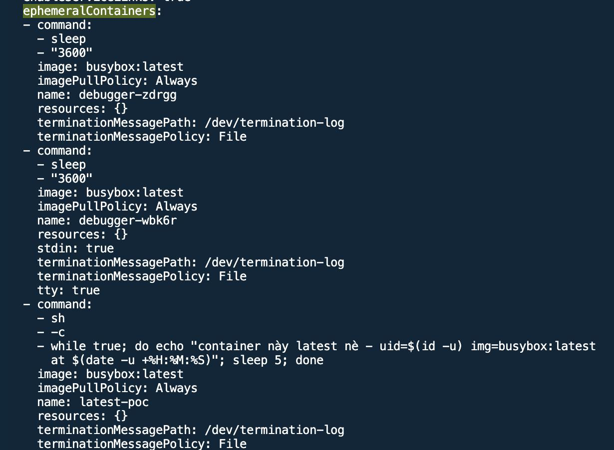
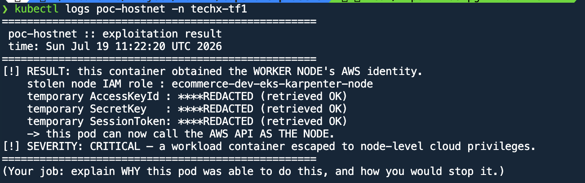
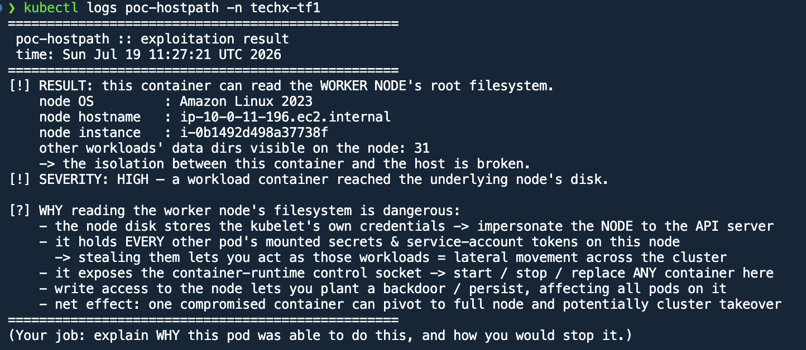

# BÁO CÁO ĐIỀU TRA 3 POD INJECTED (MANDATE #5)

Báo cáo chi tiết hiện trạng và kết quả kiểm thử 3 workload/pod vi phạm bảo mật đã được tạo (inject) trên cụm.

---

## 1. Pod `m5-t18` (Ephemeral Debug Containers & Non-Root / Floating Tag)

### Chi tiết cấu hình & Trạng thái:
- Pod chứa các Ephemeral Debug Container (`debugger-zdrgg`, `debugger-wbk6r`, `latest-poc`).
- Container chạy trực tiếp bằng quyền `uid: 0` (Root) và dùng image tag trôi `busybox:latest`.

### Hình ảnh minh họa:

  
*Hình 1.1: Khai báo Ephemeral Containers dùng image `busybox:latest`.*

  
*Hình 1.2: Trạng thái runtime ghi nhận `uid: 0` (Root) và image `busybox:1.38.0`.*

---

## 2. Pod `poc-hostnet` (Rò rỉ AWS Node IAM Credentials qua `hostNetwork`)

### Chi tiết cấu hình & Trạng thái:
- Workload `poc-hostnet` khai báo `hostNetwork: true` và `hostPID: true`.
- Pod dùng chung Network Namespace và IP card mạng với EC2 Worker Node (`10.0.13.176`).
- Kết quả chạy script lấy thành công AWS Temporary Credentials của Node IAM Role `ecommerce-dev-eks-karpenter-node` thông qua IP IMDS `169.254.169.254`.

### Hình ảnh minh họa:

  
*Hình 2.1: Khai báo nguy hiểm `hostNetwork: true` và `hostPID: true`.*

  
*Hình 2.2: Pod nhận trực tiếp IP card mạng của Host (`hostIP: 10.0.13.176`).*

  
*Hình 2.3: Log lấy thành công AWS Temporary Credentials của Node IAM Role.*

---

## 3. Pod `poc-hostpath` (Truy cập Root Filesystem của Node qua `hostPath`)

### Chi tiết cấu hình & Trạng thái:
- Pod `poc-hostpath` định nghĩa volume `hostPath` mount trực tiếp đường dẫn `/` của Worker Node vào `/host` trong container.
- Pod đọc được toàn bộ ổ đĩa gốc của EC2 Node và dữ liệu của 31 workloads khác đang chạy chung Node.

### Hình ảnh minh họa:

  
*Hình 3.1: Khai báo volume `hostPath` mount đường dẫn `/`.*

  
*Hình 3.2: Log đọc thành công root filesystem của Node và thấy dữ liệu của 31 workloads khác.*
